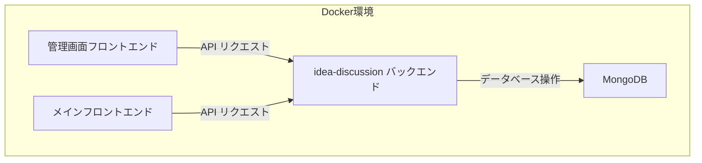

# 管理画面実装タスク

## 概要

このドキュメントでは、idea-discussion アプリケーションのテーマを管理するための管理画面インターフェースを実装する手順を説明します。管理画面は既存のアプリケーションと並んで docker-compose.yml に追加される別のアプリケーションとなります。

## 要件

- ルートディレクトリに新しいディレクトリ `admin` を作成
- docker-compose.yml に他のアプリケーションと同列で配置
- 技術スタックを合わせるためになるべく frontend と似たスタックで作る
- PC 向けのみで OK
- 上にヘッダー、左側にナビゲーション、それ以外の部分がメイン画面

## 完了時点でできること

- idea-discussion の theme を新規作成
- idea-discussion の theme の一覧を閲覧
- idea-discussion の theme を編集

## ページ一覧

- / - ダッシュボード/ホームページ
- /themes - すべてのテーマの一覧
- /themes/new - 新しいテーマ作成フォーム
- /themes/{themeId} - 既存のテーマ編集フォーム

## アーキテクチャ

管理画面フロントエンド（React/TypeScript/Vite）は既存の idea-discussion バックエンドと通信します。既存のテーマ API エンドポイントを使用してテーマの管理を行います。



## 技術スタック

- **フロントエンド**: React 19, TypeScript, Vite 6
- **スタイリング**: Tailwind CSS
- **状態管理**: React Context API
- **ルーティング**: React Router v7
- **HTTP クライアント**: Fetch API + neverthrow

## 実装手順

### 1. プロジェクト構造の作成

ルートディレクトリに `admin` ディレクトリを作成し、以下のような構造を設定します：

```
admin/
├── public/
│   └── vite.svg
├── src/
│   ├── assets/
│   ├── components/
│   │   ├── layout/
│   │   │   ├── Header.tsx
│   │   │   ├── Sidebar.tsx
│   │   │   └── MainContent.tsx
│   │   ├── theme/
│   │   │   ├── ThemeForm.tsx
│   │   │   └── ThemeTable.tsx
│   │   └── ui/
│   │       ├── Button.tsx
│   │       ├── Input.tsx
│   │       └── Alert.tsx
│   ├── pages/
│   │   ├── Dashboard.tsx
│   │   ├── ThemeList.tsx
│   │   ├── ThemeCreate.tsx
│   │   └── ThemeEdit.tsx
│   ├── services/
│   │   └── api/
│   │       ├── apiClient.ts
│   │       ├── apiError.ts
│   │       └── types.ts
│   ├── App.tsx
│   ├── main.tsx
│   ├── index.css
│   └── vite-env.d.ts
├── index.html
├── package.json
├── tsconfig.json
├── vite.config.ts
├── tailwind.config.js
└── postcss.config.js
```

### 2. プロジェクトの初期化

以下のコマンドを実行して、Vite プロジェクトを初期化します：

```bash
# adminディレクトリを作成
mkdir admin
cd admin

# Viteプロジェクトを初期化
npm create vite@latest . -- --template react-ts

# 必要なパッケージをインストール
npm install react-router-dom@7 tailwindcss postcss autoprefixer neverthrow
npm install -D @types/node

# Tailwind CSSを初期化
npx tailwindcss init -p
```

### 3. Docker 設定の更新

`docker-compose.yml` に以下のサービスを追加します：

```yaml
admin:
  container_name: admin-dev
  image: node:20-alpine
  working_dir: /app
  volumes:
    - ./admin:/app
    - /app/node_modules
  ports:
    - "5175:5173" # 他のサービスとポートが重複しないようにする
  command: sh -c "npm install && npm run dev -- --host 0.0.0.0"
  env_file:
    - .env
  environment:
    - NODE_ENV=development
    - VITE_API_BASE_URL=http://localhost:3000 # idea-discussionバックエンドを指す
```

### 4. API クライアントの実装（neverthrow を使用）

#### apiError.ts

```typescript
// src/services/api/apiError.ts
export enum ApiErrorType {
  NETWORK_ERROR = "NETWORK_ERROR",
  NOT_FOUND = "NOT_FOUND",
  VALIDATION_ERROR = "VALIDATION_ERROR",
  SERVER_ERROR = "SERVER_ERROR",
  UNAUTHORIZED = "UNAUTHORIZED",
  FORBIDDEN = "FORBIDDEN",
  UNKNOWN_ERROR = "UNKNOWN_ERROR",
}

export class ApiError extends Error {
  type: ApiErrorType;
  status?: number;

  constructor(type: ApiErrorType, message: string, status?: number) {
    super(message);
    this.type = type;
    this.status = status;
    this.name = "ApiError";
  }
}
```

#### types.ts

```typescript
// src/services/api/types.ts
export interface Theme {
  _id: string;
  title: string;
  description?: string;
  slug: string;
  isActive: boolean;
  createdAt?: string;
  updatedAt?: string;
}

export interface CreateThemePayload {
  title: string;
  description?: string;
  slug: string;
  isActive?: boolean;
}

export interface UpdateThemePayload {
  title?: string;
  description?: string;
  slug?: string;
  isActive?: boolean;
}
```

#### apiClient.ts (neverthrow を使用)

```typescript
// src/services/api/apiClient.ts
import { err, ok, Result } from "neverthrow";
import { ApiError, ApiErrorType } from "./apiError";
import type { Theme, CreateThemePayload, UpdateThemePayload } from "./types";

export type ApiResult<T> = Result<T, ApiError>;

export class ApiClient {
  private baseUrl: string;

  constructor() {
    this.baseUrl = `${import.meta.env.VITE_API_BASE_URL}/api`;
  }

  private async request<T>(
    endpoint: string,
    options: RequestInit = {}
  ): Promise<ApiResult<T>> {
    const url = `${this.baseUrl}${endpoint}`;
    const headers = {
      "Content-Type": "application/json",
      ...options.headers,
    };

    const config = {
      ...options,
      headers,
    };

    try {
      const response = await fetch(url, config);

      if (!response.ok) {
        const errorData = await response.json().catch(() => ({}));
        const message =
          errorData.message ||
          `API request failed with status ${response.status}`;

        let errorType: ApiErrorType;
        switch (response.status) {
          case 400:
            errorType = ApiErrorType.VALIDATION_ERROR;
            break;
          case 401:
            errorType = ApiErrorType.UNAUTHORIZED;
            break;
          case 403:
            errorType = ApiErrorType.FORBIDDEN;
            break;
          case 404:
            errorType = ApiErrorType.NOT_FOUND;
            break;
          case 500:
          case 502:
          case 503:
            errorType = ApiErrorType.SERVER_ERROR;
            break;
          default:
            errorType = ApiErrorType.UNKNOWN_ERROR;
        }

        return err(new ApiError(errorType, message, response.status));
      }

      const data = await response.json();
      return ok(data);
    } catch (error) {
      return err(
        new ApiError(
          ApiErrorType.NETWORK_ERROR,
          error instanceof Error ? error.message : "Network error occurred"
        )
      );
    }
  }

  // テーマ関連のAPI
  async getAllThemes(): Promise<ApiResult<Theme[]>> {
    return this.request<Theme[]>("/themes");
  }

  async getThemeById(id: string): Promise<ApiResult<Theme>> {
    return this.request<Theme>(`/themes/${id}`);
  }

  async createTheme(theme: CreateThemePayload): Promise<ApiResult<Theme>> {
    return this.request<Theme>("/themes", {
      method: "POST",
      body: JSON.stringify(theme),
    });
  }

  async updateTheme(
    id: string,
    theme: UpdateThemePayload
  ): Promise<ApiResult<Theme>> {
    return this.request<Theme>(`/themes/${id}`, {
      method: "PUT",
      body: JSON.stringify(theme),
    });
  }

  async deleteTheme(id: string): Promise<ApiResult<{ message: string }>> {
    return this.request<{ message: string }>(`/themes/${id}`, {
      method: "DELETE",
    });
  }
}

// シングルトンインスタンスをエクスポート
export const apiClient = new ApiClient();
```

### 5. コンポーネントの実装例（neverthrow を使用）

#### ThemeList.tsx

```typescript
// src/pages/ThemeList.tsx
import React, { useState, useEffect } from "react";
import { Link } from "react-router-dom";
import Button from "../components/ui/Button";
import ThemeTable from "../components/theme/ThemeTable";
import { apiClient } from "../services/api/apiClient";
import { ApiErrorType } from "../services/api/apiError";
import type { Theme } from "../services/api/types";

const ThemeList: React.FC = () => {
  const [themes, setThemes] = useState<Theme[]>([]);
  const [loading, setLoading] = useState(true);
  const [error, setError] = useState<string | null>(null);

  const fetchThemes = async () => {
    setLoading(true);

    const result = await apiClient.getAllThemes();

    result.match(
      (data) => {
        setThemes(data);
        setError(null);
      },
      (error) => {
        console.error("Failed to fetch themes:", error);
        setError("テーマの取得に失敗しました。");
      }
    );

    setLoading(false);
  };

  useEffect(() => {
    fetchThemes();
  }, []);

  const handleDelete = async (id: string) => {
    const result = await apiClient.deleteTheme(id);

    result.match(
      () => {
        // 成功したら一覧を更新
        fetchThemes();
      },
      (error) => {
        console.error("Failed to delete theme:", error);
        alert("テーマの削除に失敗しました。");
      }
    );
  };

  return (
    <div>
      <div className="flex justify-between items-center mb-6">
        <h1 className="text-2xl font-bold">テーマ一覧</h1>
        <Link to="/themes/new">
          <Button>新規テーマ作成</Button>
        </Link>
      </div>

      {loading ? (
        <div className="text-center py-4">読み込み中...</div>
      ) : error ? (
        <div className="bg-red-100 text-red-700 p-4 rounded mb-4">{error}</div>
      ) : (
        <ThemeTable themes={themes} onDelete={handleDelete} />
      )}
    </div>
  );
};

export default ThemeList;
```

#### ThemeForm.tsx

```typescript
// src/components/theme/ThemeForm.tsx
import React, { useState, useEffect } from "react";
import { useNavigate } from "react-router-dom";
import Button from "../ui/Button";
import Input from "../ui/Input";
import { apiClient } from "../../services/api/apiClient";
import { ApiErrorType } from "../../services/api/apiError";
import type {
  Theme,
  CreateThemePayload,
  UpdateThemePayload,
} from "../../services/api/types";

interface ThemeFormProps {
  theme?: Theme;
  isEdit?: boolean;
}

const ThemeForm: React.FC<ThemeFormProps> = ({ theme, isEdit = false }) => {
  const navigate = useNavigate();
  const [formData, setFormData] = useState<
    CreateThemePayload | UpdateThemePayload
  >({
    title: "",
    description: "",
    slug: "",
    isActive: true,
  });
  const [errors, setErrors] = useState<Record<string, string>>({});
  const [isSubmitting, setIsSubmitting] = useState(false);

  useEffect(() => {
    if (isEdit && theme) {
      setFormData({
        title: theme.title,
        description: theme.description || "",
        slug: theme.slug,
        isActive: theme.isActive,
      });
    }
  }, [isEdit, theme]);

  const handleChange = (
    e: React.ChangeEvent<HTMLInputElement | HTMLTextAreaElement>
  ) => {
    const { name, value, type } = e.target;

    setFormData((prev) => ({
      ...prev,
      [name]:
        type === "checkbox" ? (e.target as HTMLInputElement).checked : value,
    }));

    // エラーをクリア
    if (errors[name]) {
      setErrors((prev) => ({ ...prev, [name]: "" }));
    }
  };

  const validate = (): boolean => {
    const newErrors: Record<string, string> = {};

    if (!formData.title) {
      newErrors.title = "タイトルは必須です";
    }

    if (!formData.slug) {
      newErrors.slug = "スラッグは必須です";
    } else if (!/^[a-z0-9-]+$/.test(formData.slug as string)) {
      newErrors.slug = "スラッグは小文字、数字、ハイフンのみ使用できます";
    }

    setErrors(newErrors);
    return Object.keys(newErrors).length === 0;
  };

  const handleSubmit = async (e: React.FormEvent) => {
    e.preventDefault();

    if (!validate()) {
      return;
    }

    setIsSubmitting(true);

    if (isEdit && theme) {
      const result = await apiClient.updateTheme(theme._id, formData);

      result.match(
        () => {
          navigate("/themes");
        },
        (error) => {
          console.error("Form submission error:", error);

          if (error.type === ApiErrorType.VALIDATION_ERROR) {
            setErrors({ form: error.message });
          } else {
            alert(`エラーが発生しました: ${error.message}`);
          }
        }
      );
    } else {
      const result = await apiClient.createTheme(
        formData as CreateThemePayload
      );

      result.match(
        () => {
          navigate("/themes");
        },
        (error) => {
          console.error("Form submission error:", error);

          if (error.type === ApiErrorType.VALIDATION_ERROR) {
            setErrors({ form: error.message });
          } else {
            alert(`エラーが発生しました: ${error.message}`);
          }
        }
      );
    }

    setIsSubmitting(false);
  };

  return (
    <form onSubmit={handleSubmit} className="max-w-2xl">
      {errors.form && (
        <div className="bg-red-100 text-red-700 p-4 rounded mb-4">
          {errors.form}
        </div>
      )}

      <Input
        label="タイトル"
        name="title"
        value={formData.title}
        onChange={handleChange}
        error={errors.title}
        required
      />

      <div className="mb-4">
        <label className="block text-gray-700 font-medium mb-2">説明</label>
        <textarea
          name="description"
          value={formData.description}
          onChange={handleChange}
          className="w-full px-3 py-2 border border-gray-300 rounded focus:outline-none focus:ring-2 focus:ring-blue-500"
          rows={4}
        />
      </div>

      <Input
        label="スラッグ"
        name="slug"
        value={formData.slug}
        onChange={handleChange}
        error={errors.slug}
        required
        placeholder="例: my-theme-slug"
      />

      <div className="mb-4 flex items-center">
        <input
          type="checkbox"
          id="isActive"
          name="isActive"
          checked={formData.isActive as boolean}
          onChange={handleChange}
          className="mr-2"
        />
        <label htmlFor="isActive" className="text-gray-700">
          アクティブ
        </label>
      </div>

      <div className="flex space-x-4">
        <Button type="submit" disabled={isSubmitting}>
          {isSubmitting ? "送信中..." : isEdit ? "更新" : "作成"}
        </Button>
        <Button
          type="button"
          variant="secondary"
          onClick={() => navigate("/themes")}
        >
          キャンセル
        </Button>
      </div>
    </form>
  );
};

export default ThemeForm;
```

### 6. 起動と動作確認

1. docker-compose.yml を更新した後、以下のコマンドでサービスを起動します：

```bash
docker-compose up -d
```

2. ブラウザで http://localhost:5175 にアクセスして管理画面を表示します。

3. 以下の機能を確認します：
   - ダッシュボードの表示
   - テーマ一覧の表示
   - 新規テーマの作成
   - 既存テーマの編集

## まとめ

この実装計画に従って、idea-discussion アプリケーションのテーマを管理するための管理画面を作成します。管理画面は既存のバックエンド API を利用し、フロントエンドは React、TypeScript、Vite、Tailwind CSS を使用して実装します。エラーハンドリングには neverthrow ライブラリを使用し、Result 型を活用した堅牢なエラー処理を実現します。
