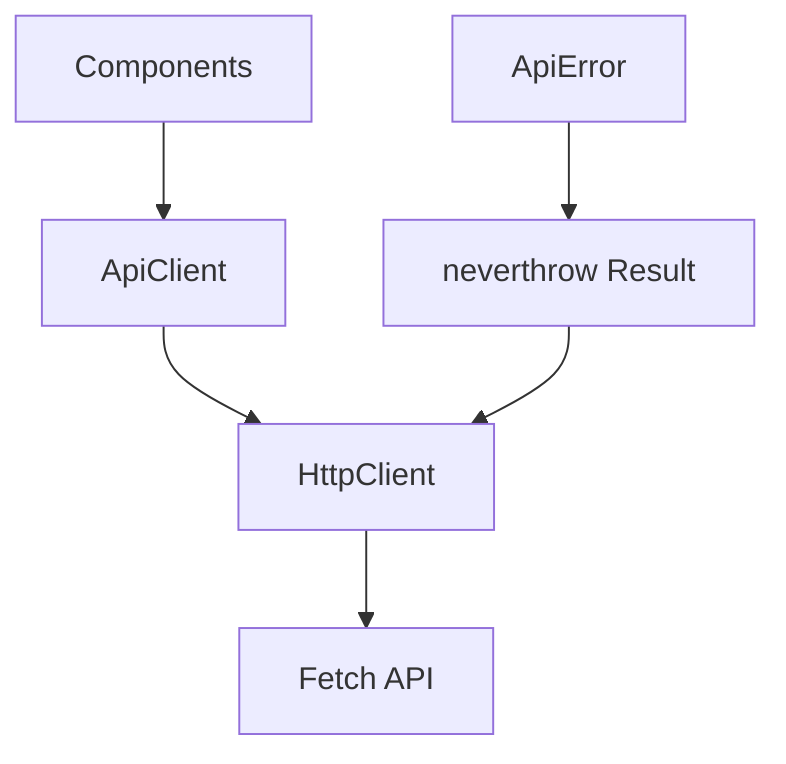

# ApiClient リファクタリング手順書

## 1. 現状分析

現在のアプリケーションでは、API呼び出しが複数のコンポーネントに散在しています：

- **ThemeContext.tsx**: テーマデータを取得
- **AdminPanel.tsx**: 質問、課題、解決策、政策ドラフト、ダイジェストドラフトを取得
- **DataList.tsx**: AdminPanelと同様だが、テーマ固有のエンドポイントを使用
- **ThreadExtractions.tsx**: 特定のスレッドの抽出データを取得
- **VisualizationArea.tsx**: 可視化のための様々なデータを取得

共通のパターン：
- API ベースURLが各コンポーネントで定義されている
- 類似したエラーハンドリングとローディング状態管理
- 繰り返されるフェッチロジック
- 一部のエンドポイントはテーマ固有、他はそうでない

## 2. 提案するアーキテクチャ



## 3. 実装手順

### ステップ1: ベースHTTPクライアントの作成

共通機能を処理するベースHTTPクライアントを作成します：
- 適切なヘッダーでリクエストをセットアップ
- neverthrowを使用した堅牢なエラーハンドリング
- レスポンスのパース
- タイムアウト管理

### ステップ2: カスタムApiErrorクラスの作成

構造化されたエラー情報を提供するカスタムエラークラスを作成します：
- エラーコード
- エラーメッセージ
- 元のエラー情報
- レスポンスステータス（存在する場合）

### ステップ3: ApiClientクラスの作成

すべてのAPIエンドポイントを処理する単一のApiClientクラスを作成します：
- 各エンティティタイプ（テーマ、質問、課題など）のメソッドを提供
- HttpClientを使用してリクエストを実行
- neverthrowのResultタイプを使用したエラーハンドリングとリトライロジックを実装

### ステップ4: コンポーネントのリファクタリング

各コンポーネントを直接のfetch呼び出しの代わりにApiClientを使用するようにリファクタリングします。
- neverthrowのResultタイプを処理するためのパターンを実装

## 4. 詳細実装計画

### ステップ1: neverthrowのインストール

```bash
npm install neverthrow
```

### ステップ2: カスタムApiErrorクラスの作成

```typescript
// src/services/api/apiError.ts
export enum ApiErrorType {
  NETWORK_ERROR = 'NETWORK_ERROR',
  TIMEOUT_ERROR = 'TIMEOUT_ERROR',
  SERVER_ERROR = 'SERVER_ERROR',
  NOT_FOUND = 'NOT_FOUND',
  VALIDATION_ERROR = 'VALIDATION_ERROR',
  UNAUTHORIZED = 'UNAUTHORIZED',
  FORBIDDEN = 'FORBIDDEN',
  UNKNOWN_ERROR = 'UNKNOWN_ERROR'
}

export class ApiError extends Error {
  public readonly type: ApiErrorType;
  public readonly statusCode?: number;
  public readonly originalError?: unknown;
  public readonly data?: unknown;

  constructor(
    type: ApiErrorType,
    message: string,
    options?: {
      statusCode?: number;
      originalError?: unknown;
      data?: unknown;
    }
  ) {
    super(message);
    this.name = 'ApiError';
    this.type = type;
    this.statusCode = options?.statusCode;
    this.originalError = options?.originalError;
    this.data = options?.data;

    // Ensures proper prototype chain for instanceof checks
    Object.setPrototypeOf(this, ApiError.prototype);
  }

  static fromHttpError(response: Response, data?: unknown): ApiError {
    const statusCode = response.status;
    let type: ApiErrorType;
    let message: string;

    switch (statusCode) {
      case 400:
        type = ApiErrorType.VALIDATION_ERROR;
        message = 'Invalid request data';
        break;
      case 401:
        type = ApiErrorType.UNAUTHORIZED;
        message = 'Authentication required';
        break;
      case 403:
        type = ApiErrorType.FORBIDDEN;
        message = 'Access forbidden';
        break;
      case 404:
        type = ApiErrorType.NOT_FOUND;
        message = 'Resource not found';
        break;
      case 500:
      case 502:
      case 503:
      case 504:
        type = ApiErrorType.SERVER_ERROR;
        message = 'Server error occurred';
        break;
      default:
        type = ApiErrorType.UNKNOWN_ERROR;
        message = `HTTP error! status: ${statusCode}`;
    }

    return new ApiError(type, message, { statusCode, data });
  }

  static fromNetworkError(error: Error): ApiError {
    return new ApiError(
      ApiErrorType.NETWORK_ERROR,
      'Network error occurred',
      { originalError: error }
    );
  }

  static fromTimeoutError(): ApiError {
    return new ApiError(
      ApiErrorType.TIMEOUT_ERROR,
      'Request timed out'
    );
  }

  static fromUnknownError(error: unknown): ApiError {
    const message = error instanceof Error ? error.message : 'Unknown error occurred';
    return new ApiError(
      ApiErrorType.UNKNOWN_ERROR,
      message,
      { originalError: error }
    );
  }
}
```

### ステップ3: ベースHTTPクライアントの作成

```typescript
// src/services/api/httpClient.ts
import { Result, ok, err } from 'neverthrow';
import { ApiError, ApiErrorType } from './apiError';

export type HttpResult<T> = Result<T, ApiError>;

export interface HttpClientOptions {
  baseUrl: string;
  timeout?: number;
  headers?: Record<string, string>;
}

export class HttpClient {
  private baseUrl: string;
  private timeout: number;
  private defaultHeaders: Record<string, string>;

  constructor(options: HttpClientOptions) {
    this.baseUrl = options.baseUrl;
    this.timeout = options.timeout || 30000; // デフォルトタイムアウト: 30秒
    this.defaultHeaders = {
      'Content-Type': 'application/json',
      ...options.headers
    };
  }

  async get<T>(endpoint: string, headers?: Record<string, string>): Promise<HttpResult<T>> {
    return this.request<T>(endpoint, 'GET', undefined, headers);
  }

  async post<T>(endpoint: string, data?: any, headers?: Record<string, string>): Promise<HttpResult<T>> {
    return this.request<T>(endpoint, 'POST', data, headers);
  }

  async put<T>(endpoint: string, data?: any, headers?: Record<string, string>): Promise<HttpResult<T>> {
    return this.request<T>(endpoint, 'PUT', data, headers);
  }

  async delete<T>(endpoint: string, headers?: Record<string, string>): Promise<HttpResult<T>> {
    return this.request<T>(endpoint, 'DELETE', undefined, headers);
  }

  private async request<T>(
    endpoint: string,
    method: string,
    data?: any,
    headers?: Record<string, string>
  ): Promise<HttpResult<T>> {
    const url = `${this.baseUrl}${endpoint}`;
    const options: RequestInit = {
      method,
      headers: {
        ...this.defaultHeaders,
        ...headers
      },
    };

    if (data) {
      options.body = JSON.stringify(data);
    }

    try {
      // タイムアウト処理を実装
      const controller = new AbortController();
      const timeoutId = setTimeout(() => controller.abort(), this.timeout);
      options.signal = controller.signal;

      const response = await fetch(url, options);
      clearTimeout(timeoutId);

      if (!response.ok) {
        // レスポンスボディがある場合は解析を試みる
        let responseData;
        try {
          responseData = await response.json();
        } catch (e) {
          // JSONでない場合は無視
        }

        return err(ApiError.fromHttpError(response, responseData));
      }

      // 204 No Content または他の空レスポンスの処理
      if (response.status === 204 || response.headers.get('content-length') === '0') {
        return ok({} as T);
      }

      const responseData = await response.json();
      return ok(responseData as T);
    } catch (error) {
      if (error instanceof Error) {
        if (error.name === 'AbortError') {
          return err(ApiError.fromTimeoutError());
        }

        if (error instanceof TypeError && error.message.includes('fetch')) {
          return err(ApiError.fromNetworkError(error));
        }
      }

      return err(ApiError.fromUnknownError(error));
    }
  }
}
```

### ステップ4: ApiClientクラスの作成

```typescript
// src/services/api/apiClient.ts
import { Result, ok, err, ResultAsync } from 'neverthrow';
import { HttpClient, HttpResult } from './httpClient';
import { ApiError, ApiErrorType } from './apiError';
import {
  Theme,
  Question,
  QuestionDetails,
  Problem,
  Solution,
  PolicyDraft,
  DigestDraft
} from '../../types';

// 再試行設定
interface RetryOptions {
  maxRetries: number;
  delayMs: number;
  shouldRetry: (error: ApiError) => boolean;
}

const defaultRetryOptions: RetryOptions = {
  maxRetries: 3,
  delayMs: 1000,
  shouldRetry: (error: ApiError) => {
    // ネットワークエラーとサーバーエラー（5xx）のみ再試行
    return (
      error.type === ApiErrorType.NETWORK_ERROR ||
      error.type === ApiErrorType.SERVER_ERROR
    );
  }
};

export class ApiClient {
  private httpClient: HttpClient;
  private retryOptions: RetryOptions;

  constructor() {
    const baseUrl = `${import.meta.env.VITE_API_BASE_URL}/api`;
    this.httpClient = new HttpClient({
      baseUrl,
      timeout: 30000
    });
    this.retryOptions = defaultRetryOptions;
  }

  // 再試行ロジックを実装したヘルパーメソッド
  private async withRetry<T>(
    operation: () => Promise<HttpResult<T>>,
    options: Partial<RetryOptions> = {}
  ): Promise<HttpResult<T>> {
    const retryOpts = { ...this.retryOptions, ...options };
    let lastError: ApiError | null = null;

    for (let attempt = 0; attempt <= retryOpts.maxRetries; attempt++) {
      const result = await operation();

      if (result.isOk()) {
        return result;
      }

      lastError = result.error;

      // 最大再試行回数に達したか、再試行すべきでないエラーの場合は終了
      if (attempt >= retryOpts.maxRetries || !retryOpts.shouldRetry(lastError)) {
        return err(lastError);
      }

      // 再試行前に遅延
      await new Promise(resolve => setTimeout(resolve, retryOpts.delayMs));
    }

    // ここには到達しないはずだが、TypeScriptの型チェックを満たすために必要
    return err(lastError || new ApiError(ApiErrorType.UNKNOWN_ERROR, 'Unknown error occurred'));
  }

  // テーマ関連のAPI
  async getAllThemes(): Promise<HttpResult<Theme[]>> {
    return this.withRetry(() => this.httpClient.get<Theme[]>('/themes'));
  }

  async getThemeById(id: string): Promise<HttpResult<Theme>> {
    return this.withRetry(() => this.httpClient.get<Theme>(`/themes/${id}`));
  }

  async getDefaultTheme(): Promise<HttpResult<Theme>> {
    const themesResult = await this.getAllThemes();

    return themesResult.andThen(themes => {
      const defaultTheme = themes.find(theme => theme.slug === 'default') || themes[0];
      if (!defaultTheme) {
        return err(new ApiError(ApiErrorType.NOT_FOUND, 'Default theme not found'));
      }
      return ok(defaultTheme);
    });
  }

  // 質問関連のAPI
  async getAllQuestions(): Promise<HttpResult<Question[]>> {
    return this.withRetry(() => this.httpClient.get<Question[]>('/questions'));
  }

  async getQuestionsByTheme(themeId: string): Promise<HttpResult<Question[]>> {
    return this.withRetry(() =>
      this.httpClient.get<Question[]>(`/themes/${themeId}/questions`)
    );
  }

  async getQuestionDetails(questionId: string, themeId?: string): Promise<HttpResult<QuestionDetails>> {
    const endpoint = themeId
      ? `/themes/${themeId}/questions/${questionId}/details`
      : `/questions/${questionId}/details`;

    return this.withRetry(() => this.httpClient.get<QuestionDetails>(endpoint));
  }

  async generateQuestions(themeId?: string): Promise<HttpResult<void>> {
    const endpoint = themeId
      ? `/themes/${themeId}/generate-questions`
      : `/admin/generate-questions`;

    return this.withRetry(() => this.httpClient.post<void>(endpoint));
  }

  // 課題関連のAPI
  async getAllProblems(): Promise<HttpResult<Problem[]>> {
    return this.withRetry(() => this.httpClient.get<Problem[]>('/admin/problems'));
  }

  async getProblemsByTheme(themeId: string): Promise<HttpResult<Problem[]>> {
    return this.withRetry(() =>
      this.httpClient.get<Problem[]>(`/themes/${themeId}/problems`)
    );
  }

  // 解決策関連のAPI
  async getAllSolutions(): Promise<HttpResult<Solution[]>> {
    return this.withRetry(() => this.httpClient.get<Solution[]>('/admin/solutions'));
  }

  async getSolutionsByTheme(themeId: string): Promise<HttpResult<Solution[]>> {
    return this.withRetry(() =>
      this.httpClient.get<Solution[]>(`/themes/${themeId}/solutions`)
    );
  }

  // 政策ドラフト関連のAPI
  async getAllPolicyDrafts(): Promise<HttpResult<PolicyDraft[]>> {
    return this.withRetry(() => this.httpClient.get<PolicyDraft[]>('/policy-drafts'));
  }

  async getPolicyDraftsByTheme(themeId: string): Promise<HttpResult<PolicyDraft[]>> {
    return this.withRetry(() =>
      this.httpClient.get<PolicyDraft[]>(`/themes/${themeId}/policy-drafts`)
    );
  }

  // ダイジェストドラフト関連のAPI
  async getAllDigestDrafts(): Promise<HttpResult<DigestDraft[]>> {
    return this.withRetry(() => this.httpClient.get<DigestDraft[]>('/digest-drafts'));
  }

  async getDigestDraftsByTheme(themeId: string): Promise<HttpResult<DigestDraft[]>> {
    return this.withRetry(() =>
      this.httpClient.get<DigestDraft[]>(`/themes/${themeId}/digest-drafts`)
    );
  }

  // チャット関連のAPI
  async getThreadExtractions(threadId: string): Promise<HttpResult<{ problems: Problem[], solutions: Solution[] }>> {
    return this.withRetry(() =>
      this.httpClient.get<{ problems: Problem[], solutions: Solution[] }>(`/chat/threads/${threadId}/extractions`)
    );
  }
}

// シングルトンインスタンスを作成
export const apiClient = new ApiClient();
```

### ステップ5: コンポーネントのリファクタリング例

ThemeContextのリファクタリング例：

```typescript
// src/ThemeContext.tsx (リファクタリング後)
import { createContext, useContext, useState, useEffect, ReactNode } from 'react';
import { Theme } from './types';
import { apiClient } from './services/api/apiClient';

interface ThemeContextType {
  defaultThemeId: string | null;
  isLoading: boolean;
  error: string | null;
}

const ThemeContext = createContext<ThemeContextType>({
  defaultThemeId: null,
  isLoading: false,
  error: null,
});

export const useTheme = () => useContext(ThemeContext);

interface ThemeProviderProps {
  children?: ReactNode;
}

export const ThemeProvider = ({ children }: ThemeProviderProps) => {
  const [defaultThemeId, setDefaultThemeId] = useState<string | null>(null);
  const [isLoading, setIsLoading] = useState<boolean>(true);
  const [error, setError] = useState<string | null>(null);

  useEffect(() => {
    const fetchDefaultTheme = async () => {
      setIsLoading(true);

      const result = await apiClient.getDefaultTheme();

      // 早期リターンを使用した手続き的アプローチ
      if (result.isErr()) {
        // エラーケース - 早期リターンパターン
        const apiError = result.error;
        console.error('Failed to fetch default theme:', apiError);

        // キャッシュされたテーマIDがあれば使用
        const cachedThemeId = localStorage.getItem('defaultThemeId');
        if (cachedThemeId) {
          setDefaultThemeId(cachedThemeId);
          setError(null);
        } else {
          // エラータイプに基づいてユーザーフレンドリーなメッセージを表示
          let errorMessage = 'テーマの取得に失敗しました。しばらく経ってからリロードしてください。';

          if (apiError.type === ApiErrorType.NETWORK_ERROR) {
            errorMessage = 'ネットワーク接続を確認してください。';
          } else if (apiError.type === ApiErrorType.SERVER_ERROR) {
            errorMessage = 'サーバーエラーが発生しました。しばらく経ってからリロードしてください。';
          }

          setError(errorMessage);
        }
        setIsLoading(false);
        return;
      }

      // 成功ケース - ネストなし
      const defaultTheme = result.value;
      setDefaultThemeId(defaultTheme._id);
      localStorage.setItem('defaultThemeId', defaultTheme._id);
      setError(null);

      setIsLoading(false);
    };

    const cachedThemeId = localStorage.getItem('defaultThemeId');
    if (cachedThemeId) {
      setDefaultThemeId(cachedThemeId);
      setIsLoading(false);
    } else {
      fetchDefaultTheme();
    }
  }, []);

  return (
    <ThemeContext.Provider value={{ defaultThemeId, isLoading, error }}>
      {children}
    </ThemeContext.Provider>
  );
};
```

DataListコンポーネントのリファクタリング例：

```typescript
// src/components/DataList.tsx (リファクタリング後の一部)
import { useState, useEffect } from 'react';
import { Problem, Solution, Question, PolicyDraft, TabType } from '../types';
import { apiClient } from '../services/api/apiClient';
import { ApiError, ApiErrorType } from '../services/api/apiError';

function DataList() {
  const [problems, setProblems] = useState<Problem[]>([]);
  const [solutions, setSolutions] = useState<Solution[]>([]);
  const [questions, setQuestions] = useState<Question[]>([]);
  const [policyDrafts, setPolicyDrafts] = useState<PolicyDraft[]>([]);
  const [isLoadingProblems, setIsLoadingProblems] = useState<boolean>(false);
  const [isLoadingSolutions, setIsLoadingSolutions] = useState<boolean>(false);
  const [isLoadingQuestions, setIsLoadingQuestions] = useState<boolean>(false);
  const [isLoadingPolicyDrafts, setIsLoadingPolicyDrafts] = useState<boolean>(false);
  const [isGeneratingQuestions, setIsGeneratingQuestions] = useState<boolean>(false);
  const [activeTab, setActiveTab] = useState<TabType>('questions');
  const [error, setError] = useState<string | null>(null);
  const [successMessage, setSuccessMessage] = useState<string | null>(null);

  // Fetch questions on component mount and when questions are generated
  useEffect(() => {
    fetchQuestions();
    fetchPolicyDrafts();
  }, []);

  // Fetch problems and solutions when those tabs are selected
  useEffect(() => {
    if (activeTab === 'problems' && problems.length === 0) {
      fetchProblems();
    } else if (activeTab === 'solutions' && solutions.length === 0) {
      fetchSolutions();
    }
  }, [activeTab]);

  const fetchQuestions = async (): Promise<void> => {
    setIsLoadingQuestions(true);
    setError(null);

    const themeId = localStorage.getItem('defaultThemeId');
    if (!themeId) {
      setError('デフォルトテーマが見つかりません。');
      setIsLoadingQuestions(false);
      return;
    }

    const result = await apiClient.getQuestionsByTheme(themeId);

    if (result.isErr()) {
      // エラーケース - 早期リターン
      const apiError = result.error;
      console.error('Failed to fetch questions:', apiError);

      let errorMessage = '問いの読み込みに失敗しました。';
      if (apiError.type === ApiErrorType.NETWORK_ERROR) {
        errorMessage = 'ネットワーク接続を確認してください。';
      }

      setError(errorMessage);
      setIsLoadingQuestions(false);
      return;
    }

    // 成功ケース - ネストなし
    const data = result.value;
    setQuestions(data);

    setIsLoadingQuestions(false);
  };

  const fetchProblems = async (): Promise<void> => {
    setIsLoadingProblems(true);
    setError(null);

    const themeId = localStorage.getItem('defaultThemeId');
    if (!themeId) {
      setError('デフォルトテーマが見つかりません。');
      setIsLoadingProblems(false);
      return;
    }

    const result = await apiClient.getProblemsByTheme(themeId);

    if (result.isErr()) {
      // エラーケース - 早期リターン
      const apiError = result.error;
      console.error('Failed to fetch problems:', apiError);
      setError('課題の読み込みに失敗しました。');
      setIsLoadingProblems(false);
      return;
    }

    // 成功ケース - ネストなし
    const data = result.value;
    setProblems(data);

    setIsLoadingProblems(false);
  };

  const fetchSolutions = async (): Promise<void> => {
    setIsLoadingSolutions(true);
    setError(null);

    const themeId = localStorage.getItem('defaultThemeId');
    if (!themeId) {
      setError('デフォルトテーマが見つかりません。');
      setIsLoadingSolutions(false);
      return;
    }

    const result = await apiClient.getSolutionsByTheme(themeId);

    if (result.isErr()) {
      // エラーケース - 早期リターン
      const apiError = result.error;
      console.error('Failed to fetch solutions:', apiError);
      setError('解決策の読み込みに失敗しました。');
      setIsLoadingSolutions(false);
      return;
    }

    // 成功ケース - ネストなし
    const data = result.value;
    setSolutions(data);

    setIsLoadingSolutions(false);
  };

  const fetchPolicyDrafts = async (): Promise<void> => {
    setIsLoadingPolicyDrafts(true);
    setError(null);

    const themeId = localStorage.getItem('defaultThemeId');
    if (!themeId) {
      setError('デフォルトテーマが見つかりません。');
      setIsLoadingPolicyDrafts(false);
      return;
    }

    const result = await apiClient.getPolicyDraftsByTheme(themeId);

    if (result.isErr()) {
      // エラーケース - 早期リターン
      const apiError = result.error;
      console.error('Failed to fetch policy drafts:', apiError);
      setError('政策ドラフトの読み込みに失敗しました。');
      setIsLoadingPolicyDrafts(false);
      return;
    }

    // 成功ケース - ネストなし
    const data = result.value;
    setPolicyDrafts(data);

    setIsLoadingPolicyDrafts(false);
  };

  const handleGenerateQuestions = async (): Promise<void> => {
    setIsGeneratingQuestions(true);
    setError(null);
    setSuccessMessage(null);

    const themeId = localStorage.getItem('defaultThemeId');
    if (!themeId) {
      setError('デフォルトテーマが見つかりません。');
      setIsGeneratingQuestions(false);
      return;
    }

    const result = await apiClient.generateQuestions(themeId);

    if (result.isErr()) {
      // エラーケース - 早期リターン
      const apiError = result.error;
      console.error('Failed to generate questions:', apiError);
      setError('問いの生成に失敗しました。');
      setIsGeneratingQuestions(false);
      return;
    }

    // 成功ケース - ネストなし
    setSuccessMessage(
      'シャープな問いの生成を開始しました。しばらくすると問いリストに表示されます。'
    );

    // Fetch questions after a delay to allow time for generation
    setTimeout(() => {
      fetchQuestions();
    }, 5000);

    setIsGeneratingQuestions(false);
  };

  // 残りのコンポーネントコード...
}
```

ThreadExtractionsコンポーネントのリファクタリング例：

```typescript
// src/components/ThreadExtractions.tsx (リファクタリング後の一部)
import { useState, useEffect } from 'react';
import { Problem, Solution } from '../types';
import { apiClient } from '../services/api/apiClient';
import { ApiError } from '../services/api/apiError';

interface ThreadExtractionsProps {
  threadId: string | null;
}

const ThreadExtractions = ({ threadId }: ThreadExtractionsProps) => {
  const [problems, setProblems] = useState<Problem[]>([]);
  const [solutions, setSolutions] = useState<Solution[]>([]);
  const [error, setError] = useState<string | null>(null);

  useEffect(() => {
    // Don't fetch if threadId is not available (e.g., before first message)
    if (!threadId) {
      setProblems([]);
      setSolutions([]);
      return;
    }

    const fetchExtractions = async (): Promise<void> => {
      setError(null);

      const result = await apiClient.getThreadExtractions(threadId);

      if (result.isErr()) {
        // エラーケース - 早期リターン
        const apiError = result.error;
        console.error('Failed to fetch extractions:', apiError);
        setError('抽出結果の読み込みに失敗しました。');
        return;
      }

      // 成功ケース - ネストなし
      const data = result.value;
      setProblems(data.problems || []);
      setSolutions(data.solutions || []);
    };

    // Fetch immediately on threadId change
    fetchExtractions();

    // Set up interval for periodic fetching (e.g., every 5 seconds)
    const intervalId = setInterval(fetchExtractions, 5000);

    // Cleanup function to clear the interval when the component unmounts or threadId changes
    return () => clearInterval(intervalId);
  }, [threadId]); // Re-run effect when threadId changes

  // 残りのコンポーネントコード...
}
```

## 5. 移行戦略

スムーズな移行を確保するために、以下の手順に従います：

1. neverthrowパッケージをインストールする
2. ApiErrorクラスを作成する
3. HttpClientをResult型を返すように更新する
4. ApiClientをResult型を返すように更新する
5. 一度に1つのコンポーネントをリファクタリングする
6. 各リファクタリングされたコンポーネントを徹底的にテストする
7. すべてのコンポーネントがリファクタリングされたら、未使用のコードを削除する

## 6. テスト戦略

1. HttpClientとApiClientクラスの単体テストを作成する
2. Result型の処理を含むリファクタリングされた各コンポーネントが新しいApiClientで動作することをテストする
3. エラーケースのテストを追加して、エラーハンドリングが適切に機能することを確認する

## 7. neverthrowを使用したエラーハンドリング戦略

neverthrowを使用することで、以下の利点があります：

1. **型安全なエラーハンドリング**: TypeScriptの型システムを活用して、エラーハンドリングの漏れを防止します。
2. **明示的なエラーフロー**: エラーが発生する可能性のある箇所が明示的になり、コードの可読性が向上します。
3. **構造化されたエラー情報**: ApiErrorクラスを使用して、エラーの種類や詳細情報を構造化して提供します。
4. **エラー変換の簡素化**: 低レベルのエラー（HTTPエラーなど）を、アプリケーション固有のエラーに簡単に変換できます。
5. **再試行メカニズム**: 特定の種類のエラー（ネットワークエラーやサーバーエラーなど）に対して、自動的に再試行するロジックを実装します。

### 手続き的アプローチと関数型アプローチ

neverthrowのResultタイプは、2つの異なる方法で処理できます：

#### 関数型アプローチ（match）
```typescript
result.match(
  (data) => {
    // 成功ケースの処理
    setData(data);
  },
  (error) => {
    // エラーケースの処理
    setError(error.message);
  }
);
```

#### 手続き的アプローチ（早期リターン）
```typescript
if (result.isErr()) {
  // エラーケース - 早期リターン
  const error = result.error;
  setError(error.message);
  return;
}

// 成功ケース - ネストなし
const data = result.value;
setData(data);
```

手続き的アプローチには、従来のif/else文と早期リターンパターンの2つのバリエーションがあります。早期リターンパターンは、エラーケースを先に処理して早期に関数から抜けることで、コードのネストを減らし、メインの処理フローをより明確にします。これはJavaScript/TypeScriptでよく使われるパターンで、「ハッピーパス」（正常系の処理フロー）をより目立たせることができます。

関数型アプローチはコードの簡潔さを重視する場合に有用です。プロジェクトの要件や開発チームの好みに応じて、適切なアプローチを選択してください。

## 8. パフォーマンスの考慮事項

1. 頻繁にアクセスされるデータのためのリクエストキャッシングを実装する
2. 高速なUI操作のためのリクエストデバウンシングを追加する
3. より良いUXのための楽観的な更新を検討する

## 9. 実装タイムライン

1. 1日目: neverthrowのインストール、ApiErrorクラスの作成、HttpClientとApiClientの構造を作成
2. 2-3日目: コンポーネントをリファクタリングしてResult型を処理するように更新
3. 4日目: テストとバグ修正
