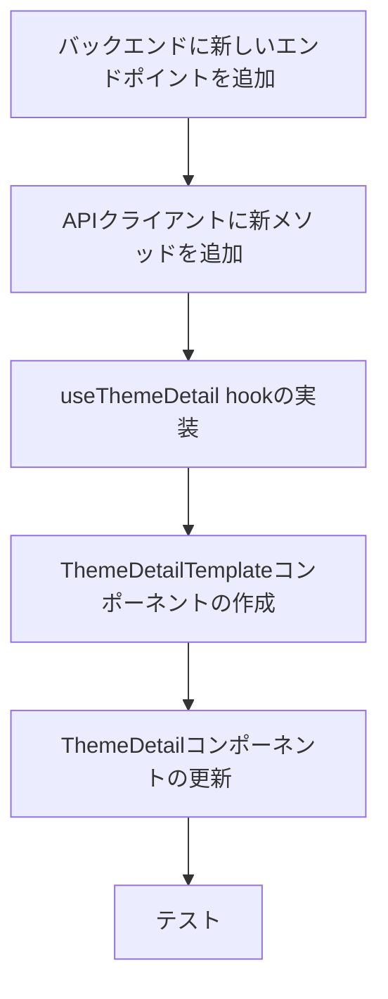

# ThemeDetail.tsx の API 連携実装計画

## 概要

`ThemeDetail.tsx` ページを更新して、`Themes.tsx` と同様に API からテーマの詳細データを取得して表示するようにします。BFF（Backend For Frontend）アプローチを採用し、エンドポイント側でデータの形を最適化します。また、デザイン作業のために現在のモックデータを表示するページも残し、共通のテンプレートを使用します。

## 実装ステップ



### 1. バックエンドに新しいエンドポイントを追加

BFF アプローチに基づき、バックエンド側に新しいエンドポイントを追加して、テーマの詳細データを一度に取得できるようにします。

```javascript
// idea-discussion/backend/controllers/themeController.js に追加
// getThemeDetail メソッドを追加

exports.getThemeDetail = async (req, res) => {
  try {
    const themeId = req.params.id;

    // テーマの基本情報を取得
    const theme = await Theme.findById(themeId);
    if (!theme) {
      return res.status(404).json({ message: "Theme not found" });
    }

    // キークエスチョンを取得
    const keyQuestions = await SharpQuestion.find({ themeId });

    // 課題（問題点）を取得
    const problems = await Problem.find({ themeId });

    // 解決策を取得
    const solutions = await Solution.find({ themeId });

    // 各キークエスチョンに関連する課題と解決策の数を計算
    const keyQuestionsWithCounts = await Promise.all(
      keyQuestions.map(async (question) => {
        const questionId = question._id;

        // このキークエスチョンに関連する課題数を取得
        const issueCount = await QuestionLink.countDocuments({
          questionId,
          targetType: "problem",
        });

        // このキークエスチョンに関連する解決策数を取得
        const solutionCount = await QuestionLink.countDocuments({
          questionId,
          targetType: "solution",
        });

        // 投票数（仮実装 - 実際のデータモデルに合わせて調整が必要）
        const voteCount = question.voteCount || 0;

        return {
          ...question.toObject(),
          issueCount,
          solutionCount,
          voteCount,
        };
      })
    );

    // 最適化されたレスポンスを返す
    res.json({
      theme,
      keyQuestions: keyQuestionsWithCounts,
      issues: problems,
      solutions,
    });
  } catch (error) {
    console.error("Error fetching theme detail:", error);
    res.status(500).json({ message: "Server error" });
  }
};
```

```javascript
// idea-discussion/backend/routes/themeChatRoutes.js に追加
// 新しいルートを追加

router.get("/themes/:id/detail", themeController.getThemeDetail);
```

### 2. API クライアントに新メソッドを追加

フロントエンドの API クライアントに、新しいエンドポイントを呼び出すメソッドを追加します。

```typescript
// frontend/src/services/api/apiClient.ts に追加

// 新しい型定義を追加
export interface ThemeDetailResponse {
  theme: Theme;
  keyQuestions: (Question & {
    voteCount: number;
    issueCount: number;
    solutionCount: number;
  })[];
  issues: Problem[];
  solutions: Solution[];
}

// 新しいメソッドを追加
async getThemeDetail(id: string): Promise<HttpResult<ThemeDetailResponse>> {
  return this.withRetry(() =>
    this.httpClient.get<ThemeDetailResponse>(`/themes/${id}/detail`)
  );
}
```

### 3. useThemeDetail hook の実装

テーマ詳細データを取得するためのカスタムフックを実装します。

```typescript
// frontend/src/hooks/useThemeDetail.ts

import { useEffect, useState } from "react";
import { apiClient } from "../services/api/apiClient";
import type { ThemeDetailResponse } from "../services/api/apiClient";

export function useThemeDetail(themeId: string) {
  const [themeDetail, setThemeDetail] = useState<ThemeDetailResponse | null>(
    null
  );
  const [isLoading, setIsLoading] = useState(true);
  const [error, setError] = useState<string | null>(null);

  useEffect(() => {
    const fetchThemeDetail = async () => {
      setIsLoading(true);
      setError(null);

      // 一回のリクエストですべてのデータを取得
      const result = await apiClient.getThemeDetail(themeId);

      if (!result.isOk()) {
        setError(`テーマの取得に失敗しました: ${result.error.message}`);
        console.error("Error fetching theme detail:", result.error);
        setIsLoading(false);
        return;
      }

      setThemeDetail(result.value);
      setIsLoading(false);
    };

    fetchThemeDetail();
  }, [themeId]);

  return { themeDetail, isLoading, error };
}
```

### 4. ThemeDetailTemplate コンポーネントの作成

モックデータと API データの両方で使用できる共有テンプレートコンポーネントを作成します。

```typescript
// frontend/src/components/theme/ThemeDetailTemplate.tsx
import { useRef, useState } from "react";
import { FloatingChat, type FloatingChatRef } from "../chat/FloatingChat";
import BreadcrumbView from "../common/BreadcrumbView";
import CommentCard from "./CommentCard";
import KeyQuestionCard from "./KeyQuestionCard";

interface ThemeDetailTemplateProps {
  theme: {
    id: string;
    title: string;
    description: string;
  };
  keyQuestions: {
    id: number | string;
    question: string;
    voteCount: number;
    issueCount: number;
    solutionCount: number;
  }[];
  issues: {
    id: number | string;
    text: string;
  }[];
  solutions: {
    id: number | string;
    text: string;
  }[];
}

const ThemeDetailTemplate = ({
  theme,
  keyQuestions,
  issues,
  solutions,
}: ThemeDetailTemplateProps) => {
  const [activeTab, setActiveTab] = useState<"issues" | "solutions">("issues");
  const chatRef = useRef<FloatingChatRef>(null);

  const handleSendMessage = (message: string) => {
    console.log("Message sent:", message);

    setTimeout(() => {
      chatRef.current?.addMessage("メッセージを受け取りました。", "system");
    }, 500);
  };

  const breadcrumbItems = [
    { label: "TOP", href: "/" },
    { label: "テーマ一覧", href: "/themes" },
    { label: theme.title, href: `/themes/${theme.id}` },
  ];

  return (
    <div className="container mx-auto px-4 py-8">
      <BreadcrumbView items={breadcrumbItems} />

      <h1 className="text-2xl md:text-3xl font-bold mb-4">{theme.title}</h1>

      <p className="text-sm text-neutral-600 mb-8">{theme.description}</p>

      <div className="mb-8">
        <h2 className="text-xl font-semibold mb-4">
          キークエスチョン ({keyQuestions.length})
        </h2>
        <div className="space-y-4">
          {keyQuestions.map((question) => (
            <KeyQuestionCard
              key={question.id}
              question={question.question}
              voteCount={question.voteCount}
              issueCount={question.issueCount}
              solutionCount={question.solutionCount}
            />
          ))}
        </div>
      </div>

      <div className="mb-12">
        <h2 className="text-xl font-semibold mb-4">寄せられた意見</h2>

        <div className="flex border-b border-neutral-200 mb-4">
          <button
            className={`py-2 px-4 text-sm font-medium ${
              activeTab === "issues"
                ? "border-b-2 border-purple-500 text-purple-700"
                : "text-neutral-500"
            }`}
            onClick={() => setActiveTab("issues")}
            type="button"
          >
            課題点 ({issues.length})
          </button>
          <button
            className={`py-2 px-4 text-sm font-medium ${
              activeTab === "solutions"
                ? "border-b-2 border-purple-500 text-purple-700"
                : "text-neutral-500"
            }`}
            onClick={() => setActiveTab("solutions")}
            type="button"
          >
            解決策 ({solutions.length})
          </button>
        </div>

        <div className="space-y-3">
          {activeTab === "issues"
            ? issues.map((issue) => (
                <CommentCard key={issue.id} text={issue.text} type="issue" />
              ))
            : solutions.map((solution) => (
                <CommentCard
                  key={solution.id}
                  text={solution.text}
                  type="solution"
                />
              ))}
        </div>
      </div>

      <FloatingChat ref={chatRef} onSendMessage={handleSendMessage} />
    </div>
  );
};

export default ThemeDetailTemplate;
```

### 5. ThemeDetail コンポーネントの更新

ThemeDetail コンポーネントを更新して、URL クエリパラメータに基づいてモックデータまたは API データを使用するようにします。

```typescript
// frontend/src/pages/ThemeDetail.tsx
import { useParams, useLocation } from "react-router-dom";
import ThemeDetailTemplate from "../components/theme/ThemeDetailTemplate";
import { useThemeDetail } from "../hooks/useThemeDetail";

const ThemeDetail = () => {
  const { themeId } = useParams<{ themeId: string }>();
  const location = useLocation();
  const useMockData = location.search.includes("mock=true");

  // モックデータを使用する場合は API を呼び出さない
  const { themeDetail, isLoading, error } = useMockData
    ? { themeDetail: null, isLoading: false, error: null }
    : useThemeDetail(themeId || "");

  // モックデータ
  const mockThemeData = {
    id: themeId || "",
    title: "若者の雇用とキャリア支援",
    description:
      "若者の雇用不安や将来への不安を解消し、安心してキャリアを築ける社会の実現について議論します。新卒一括採用や終身雇用の変化、フリーランスの増加など、働き方の多様化に対応した支援策を考えます。",
  };

  const mockKeyQuestions = [
    {
      id: 1,
      question:
        "どうすれば若者が安心して多様な働き方を選択できる社会になるか？",
      voteCount: 42,
      issueCount: 15,
      solutionCount: 23,
    },
    {
      id: 2,
      question: "新卒一括採用に代わる、若者の能力を活かせる採用の仕組みとは？",
      voteCount: 38,
      issueCount: 12,
      solutionCount: 18,
    },
    {
      id: 3,
      question: "若者のキャリア教育はどのように改善すべきか？",
      voteCount: 35,
      issueCount: 10,
      solutionCount: 16,
    },
  ];

  const mockIssues = [
    {
      id: 1,
      text: "新卒一括採用の仕組みが、若者のキャリア選択の幅を狭めている",
    },
    { id: 2, text: "大学教育と実社会で求められるスキルにギャップがある" },
    { id: 3, text: "若者の非正規雇用が増加し、将来設計が立てにくい" },
    {
      id: 4,
      text: "キャリア教育が不十分で、自分に合った仕事を見つけられない若者が多い",
    },
    { id: 5, text: "地方の若者は都市部に比べて就職機会が限られている" },
  ];

  const mockSolutions = [
    { id: 1, text: "インターンシップ制度の拡充と単位認定の推進" },
    { id: 2, text: "職業体験プログラムを中高生から段階的に導入する" },
    { id: 3, text: "若者向けのキャリアカウンセリングサービスの無料提供" },
    { id: 4, text: "リモートワークの推進による地方在住若者の就業機会拡大" },
    { id: 5, text: "若者の起業支援と失敗しても再チャレンジできる制度の整備" },
  ];

  // ローディング状態
  if (!useMockData && isLoading) {
    return (
      <div className="container mx-auto px-4 py-8">
        <div className="text-center py-8">
          <p>テーマの詳細を読み込み中...</p>
        </div>
      </div>
    );
  }

  // エラー状態
  if (!useMockData && error) {
    return (
      <div className="container mx-auto px-4 py-8">
        <div className="bg-red-100 border border-red-400 text-red-700 px-4 py-3 rounded mb-4">
          <p>{error}</p>
        </div>
      </div>
    );
  }

  // モックデータまたは API データが利用可能な場合、テンプレートをレンダリング
  if (useMockData || themeDetail) {
    // テンプレートの props にデータをマッピング
    const templateProps = useMockData
      ? {
          theme: mockThemeData,
          keyQuestions: mockKeyQuestions,
          issues: mockIssues,
          solutions: mockSolutions,
        }
      : {
          theme: {
            id: themeDetail!.theme._id,
            title: themeDetail!.theme.title,
            description: themeDetail!.theme.description || "",
          },
          keyQuestions: themeDetail!.keyQuestions.map((q) => ({
            id: q._id,
            question: q.questionText,
            voteCount: q.voteCount || 0,
            issueCount: q.issueCount || 0,
            solutionCount: q.solutionCount || 0,
          })),
          issues: themeDetail!.issues.map((issue) => ({
            id: issue._id,
            text: issue.statement,
          })),
          solutions: themeDetail!.solutions.map((solution) => ({
            id: solution._id,
            text: solution.statement,
          })),
        };

    return <ThemeDetailTemplate {...templateProps} />;
  }

  // 予期しない状態の場合のフォールバック
  return (
    <div className="container mx-auto px-4 py-8">
      <div className="text-center py-8">
        <p>テーマの詳細を表示できません。</p>
      </div>
    </div>
  );
};

export default ThemeDetail;
```

## BFF アプローチの利点

この実装では、以下の BFF アプローチの利点を活かしています：

1. **ネットワークリクエストの削減**: 複数の API コールを 1 つに統合することで、ネットワークオーバーヘッドを削減します。
2. **データの最適化**: バックエンドでデータを整形し、フロントエンドに必要な形式で提供します。
3. **エラーハンドリングの簡素化**: 複数のリクエストのエラーハンドリングではなく、単一のリクエストのエラーハンドリングだけを考慮すればよくなります。
4. **パフォーマンスの向上**: データ取得が高速化され、ユーザー体験が向上します。

## モックデータと実データの切り替え方法

この実装では、URL クエリパラメータ（`?mock=true`）を使用してモックデータと実データを切り替えています。これにより、開発中に簡単に切り替えることができます。

例：

- 実データ表示: `/themes/123`
- モックデータ表示: `/themes/123?mock=true`

## エラーハンドリング

neverthrow ライブラリを使用してエラーハンドリングを行っています。API クライアントは Result 型を返し、成功時は `isOk()` が true、失敗時は `isOk()` が false になります。エラーメッセージは `error.message` から取得できます。

## テスト方法

実装後は以下の方法でテストします：

1. 通常のテーマ詳細ページにアクセス: `/themes/{themeId}`

   - API からデータが正しく取得され、表示されることを確認
   - ローディング状態が正しく表示されることを確認
   - エラー状態が正しく表示されることを確認

2. モックデータバージョンにアクセス: `/themes/{themeId}?mock=true`
   - モックデータが正しく表示されることを確認
   - API コールが行われないことを確認

## 注意点

1. バックエンドの実装は、既存のデータモデルやコントローラーに合わせて調整が必要な場合があります。
2. キークエスチョンの投票数、課題数、解決策数などのデータは、実際のデータモデルに合わせて取得方法を調整する必要があります。
3. フロントエンドの型定義は、バックエンドから返されるデータ構造に合わせて調整が必要な場合があります。
