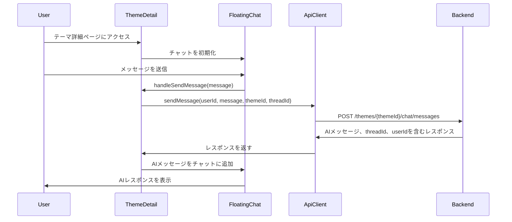

# ThemeDetail チャット機能実装計画

## 概要

現在、`ThemeDetail.tsx` ページのチャット機能はモックデータを使用しており、実際の AI レスポンスを返していません。この計画では、`MainPage.tsx` で使用されているのと同様の方法で、実際の AI レスポンスを返すように実装を変更します。

## 現状分析

### ThemeDetail.tsx

- `ThemeDetailTemplate` コンポーネントをレンダリングしています
- URL に `mock=true` が含まれている場合はモックデータを使用し、そうでない場合は `useThemeDetail` フックを使用して実際のデータを取得しています

### ThemeDetailTemplate.tsx

- `FloatingChat` コンポーネントを使用しています
- 現在の `handleSendMessage` 実装:
  ```javascript
  const handleSendMessage = (message: string) => {
    console.log("Message sent:", message);
    setTimeout(() => {
      chatRef.current?.addMessage("メッセージを受け取りました。", "system");
    }, 500);
  };
  ```
- これは単なるモック実装で、静的なレスポンスを返すだけです

### AppLayout.tsx

- `apiClient.sendMessage` を使用した実際のチャット実装があります
- スレッド状態、ユーザー状態を管理し、実際の AI レスポンスを処理しています

### apiClient.ts

- `sendMessage` メソッドがあり、以下のパラメータを受け取ります:
  - userId
  - message
  - themeId
  - threadId (オプション)
- 以下を含むレスポンスを返します:
  - AI のレスポンステキスト
  - threadId
  - userId

## 実装手順

### 1. ThemeDetailTemplate.tsx の更新

1. threadId と userId を管理するための状態を追加:

   ```typescript
   const [threadId, setThreadId] = useState<string | null>(null);
   const [userId, setUserId] = useState<string>(
     localStorage.getItem("userId") || crypto.randomUUID()
   );
   ```

2. `handleSendMessage` 関数を更新して `apiClient.sendMessage` を使用:

   ```typescript
   const handleSendMessage = async (message: string) => {
     console.log("Message sent:", message);

     // ユーザーメッセージをチャットに追加
     chatRef.current?.addMessage(message, "user");

     // APIにメッセージを送信
     const result = await apiClient.sendMessage(
       userId,
       message,
       theme._id,
       threadId || undefined
     );

     if (result.isErr()) {
       console.error("Failed to send message:", result.error);
       chatRef.current?.addMessage(
         `メッセージ送信エラー: ${result.error.message}`,
         "system"
       );
       return;
     }

     const responseData = result.value;

     // AIレスポンスをチャットに追加
     chatRef.current?.addMessage(responseData.response, "system");

     // threadIdが提供されている場合は更新
     if (responseData.threadId) {
       setThreadId(responseData.threadId);
     }

     // userIdが提供され、現在のものと異なる場合は更新
     if (responseData.userId && responseData.userId !== userId) {
       setUserId(responseData.userId);
       localStorage.setItem("userId", responseData.userId);
     }
   };
   ```

3. userId を localStorage に保存するための useEffect を追加:
   ```typescript
   useEffect(() => {
     // userIdがlocalStorageにまだない場合は保存
     if (!localStorage.getItem("userId")) {
       localStorage.setItem("userId", userId);
     }
   }, [userId]);
   ```

### 2. テストと検証

1. ThemeDetail ページでチャット機能をテスト:

   - メッセージがバックエンドに送信されることを確認
   - AI レスポンスがチャットに表示されることを確認
   - メッセージ間で threadId が維持されることを確認
   - userId が localStorage に保存されることを確認

2. MainPage の機能と比較:
   - MainPage のチャットと動作が一貫していることを確認
   - 同じ AI レスポンスが受信されることを確認

## 実装フロー図



## 考慮事項

1. **エラーハンドリング**:

   - API 呼び出しの適切なエラーハンドリングを実装
   - チャットにユーザーフレンドリーなエラーメッセージを表示

2. **ローディング状態**:

   - AI レスポンスを待っている間にローディングインジケータを表示
   - API 呼び出し中は入力フィールドを無効化

3. **スレッド管理**:

   - メッセージ間でスレッドコンテキストを維持
   - セッションの継続性のために threadId を localStorage に保存するかどうかを検討

4. **ユーザーエクスペリエンス**:
   - チャット UI が応答性があり、操作中にフィードバックを提供することを確認
   - AI レスポンスのタイピングインジケータの追加を検討

この実装により、ThemeDetail のモックチャット機能が実際の AI レスポンスに置き換えられ、MainPage のチャット機能と一貫性が保たれます。
