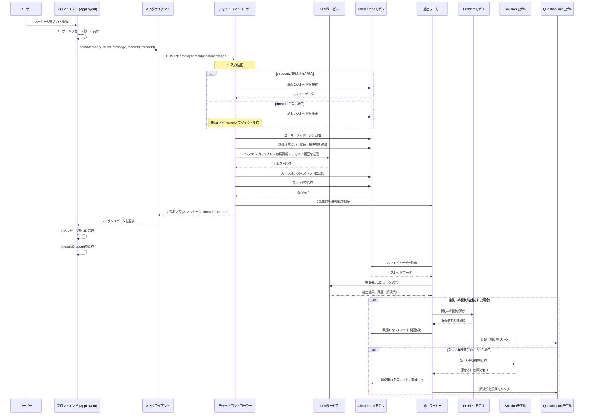

# idobataの/legacy ページにてユーザーがチャットに投稿した時のバックエンドの挙動

このドキュメントでは、idobataの/legacy ページでユーザーがチャットに投稿した際のバックエンドの挙動を詳細に説明します。各処理ステップでのプロンプト、生成されるドメインオブジェクト、保存されるレコードなどを含めて解説します。

## シーケンス図



## 詳細な処理フロー

### 1. フロントエンドでのユーザー入力処理

**処理内容:**
- ユーザーが `/legacy` ページでメッセージを入力し送信ボタンをクリック
- `AppLayout` コンポーネントの `handleSendMessage` 関数が呼び出される
- ユーザーメッセージをUIに表示し、APIクライアントを通じてバックエンドにリクエスト

**ドメインオブジェクト:**
```typescript
// フロントエンドで生成されるユーザーメッセージオブジェクト
const newUserMessage = {
  role: "user",
  content: newMessageContent, // ユーザーが入力したテキスト
  timestamp: new Date(),
};
```

**APIリクエスト:**
```typescript
// APIクライアントを通じて送信されるデータ
apiClient.sendMessage(
  currentUserId,        // ユーザーID（ない場合は自動生成される）
  newUserMessage.content, // メッセージ内容
  currentThemeId || "", // テーマID
  currentThreadId || undefined // スレッドID（新規会話の場合はundefined）
);
```

### 2. バックエンドでのメッセージ処理（ChatController）

**処理内容:**
- `handleNewMessageByTheme` 関数がリクエストを受け取る
- 入力を検証（themeId、message）
- threadIdがある場合は既存のスレッドを検索、ない場合は新規作成
- ユーザーメッセージをスレッドに追加

**ドメインオブジェクト:**
```javascript
// 新規スレッド作成時に生成されるChatThreadオブジェクト
const chatThread = new ChatThread({
  userId: userId,
  messages: [],
  extractedProblemIds: [],
  extractedSolutionIds: [],
  themeId: themeId,
});

// スレッドに追加されるユーザーメッセージ
chatThread.messages.push({
  role: "user",
  content: message,
  timestamp: new Date(),
});
```

**データベースレコード:**
- `ChatThread` コレクションに新規スレッドが作成される（新規会話の場合）
- 既存のスレッドにユーザーメッセージが追加される（継続会話の場合）

### 3. 参照情報の取得

**処理内容:**
- テーマに関連する「問い」（SharpQuestion）を取得
- 各「問い」に関連する課題（Problem）と解決策（Solution）を取得
- 関連度が高い（relevanceScore >= 0.8）項目を最大10件ずつ取得

**ドメインオブジェクト:**
```javascript
// 参照情報として構築されるテキスト
let referenceOpinions = "参考情報として、システム内で議論されている主要な「問い」と、それに関連する意見の一部を紹介します:\n\n";
// 各問いと関連する課題・解決策が追加される
```

**データベースクエリ:**
- `SharpQuestion` コレクションから特定のテーマに関連する問いを取得
- `QuestionLink` コレクションを使用して関連する課題と解決策を取得（relevanceScore >= 0.8）

### 4. LLMサービスの呼び出し

**処理内容:**
- システムプロンプト、参照情報、チャット履歴を組み合わせてLLMに送信
- LLMからの応答を受け取る

**システムプロンプト:**
```
あなたは、ユーザーが抱える課題やその解決策についての考えを深めるための、対話型アシスタントです。以下の点を意識して応答してください。

1.  **思考の深掘り:** ユーザーの発言から、具体的な課題や解決策のアイデアを引き出すことを目指します。曖昧な点や背景が不明な場合は、「いつ」「どこで」「誰が」「何を」「なぜ」「どのように」といった質問（5W1H）を自然な会話の中で投げかけ、具体的な情報を引き出してください。
2.  **簡潔な応答:** あなたの応答は、最大でも4文以内にまとめてください。
3.  **課題/解決策の抽出支援:** ユーザーが自身の考えを整理し、明確な「課題」や「解決策」として表現できるよう、対話を通じてサポートしてください。
課題の表現は、主語を明確にし、具体的な状況と影響を記述することで、問題の本質を捉えやすくする必要があります。現状と理想の状態を明確に記述し、そのギャップを課題として定義する。解決策の先走りや抽象的な表現を避け、「誰が」「何を」「なぜ」という構造で課題を定義することで、問題の範囲を明確にし、多様な視点からの議論を促します。感情的な表現や主観的な解釈を排し、客観的な事実に基づいて課題を記述することが重要です。
解決策の表現は、具体的な行動や機能、そしてそれがもたらす価値を明確に記述する必要があります。実現可能性や費用対効果といった制約条件も考慮し、曖昧な表現や抽象的な概念を避けることが重要です。解決策は、課題に対する具体的な応答として提示され、その効果やリスク、そして実装に必要なステップを明確にすべき。
4.  **心理的安全性の確保:** ユーザーのペースを尊重し、急かさないこと。論理的な詰め寄りや過度な質問攻めを避けること。ユーザーが答えられない質問には固執せず、別の角度からアプローチすること。完璧な回答を求めず、ユーザーの部分的な意見も尊重すること。対話は協力的な探索であり、試験や審査ではないことを意識すること。
5.  **話題の誘導:** ユーザーの発言が曖昧で、特に話したいトピックが明確でない場合、参考情報として提示された既存の問いのどれかをピックアップしてそれについて議論することを優しく提案してください。（問いを一字一句読み上げるのではなく、文脈や相手に合わせて言い換えて分かりやすく伝える）
```

**LLMへの入力:**
```javascript
const llmMessages = [
  { role: "system", content: systemPrompt },
  { role: "system", content: referenceOpinions }, // 参照情報
  ...chatThread.messages.map((msg) => ({
    role: msg.role,
    content: msg.content,
  }))
];
```

**ドメインオブジェクト:**
```javascript
// AIレスポンスメッセージ
chatThread.messages.push({
  role: "assistant",
  content: aiResponseContent, // LLMからの応答
  timestamp: new Date(),
});
```

### 5. レスポンスの保存とクライアントへの返信

**処理内容:**
- AIレスポンスをスレッドに追加
- スレッドをデータベースに保存
- クライアントにレスポンスを返す

**データベースレコード:**
- `ChatThread` コレクションの該当スレッドが更新される（AIメッセージが追加される）

**クライアントへのレスポンス:**
```javascript
const responsePayload = {
  response: aiResponseContent, // AIの応答内容
  threadId: chatThread._id,    // スレッドID
  userId: userId,              // ユーザーID（新規生成された場合のみ）
};
```

### 6. 非同期抽出処理（ExtractionWorker）

**処理内容:**
- バックグラウンドで実行される非同期処理
- チャットスレッドから問題と解決策を抽出
- 抽出された問題と解決策をデータベースに保存
- スレッドと抽出された項目を関連付け

**抽出プロンプト:**
```
Conversation History:
---
[チャット履歴]
---

Existing Extracted Problems (for context, focus on user turns below for *new* problems):
---
[既存の抽出済み問題]
---

Existing Extracted Solutions (for context, focus on user turns below for *new* solutions):
---
[既存の抽出済み解決策]
---

Latest User Message:
---
[最新のユーザーメッセージ]
---

Instructions:
Analyze the **latest user message** (marked with [LATEST USER MESSAGE]) in the Conversation History above.
Identify and extract the following, ensuring the output is in **Japanese**:
1.  **New Problems:** If a user message introduces a new problem (an unmet need or challenge), describe it. Provide:
    *   statement (A concise description of the problem, Japanese)
2.  **New Solutions:** If a user message proposes a specific solution or approach, describe it. Provide:
    *   statement (The core solution, Japanese)
3.  **Updates to Existing Items:** If a user message refines or clarifies an *existing* problem or solution (listed above), provide its ID and the updated Japanese statement.

[問題と解決策の効果的な記述に関するガイドライン]

Rules:
- Focus *only* on the contributions from the 'user' role marked with [LATEST USER MESSAGE] in the conversation history for identifying *new* problems or solutions.
- The message marked with [LATEST USER MESSAGE] is the most recent user message that you should analyze.
- Ensure all generated statements are in **Japanese**.
- If no new problems/solutions or updates are found, return empty arrays.
- Refer to existing items by their provided IDs when suggesting updates.
- **重要**: 情報が不足している場合は、無理に問題や解決策を生成しないでください。良質なstatementを作成するための十分な情報がない場合は、空の配列を返してください。不確かな推測や曖昧な表現は避け、明確に表現できる場合のみ抽出してください。

Output Format: Respond ONLY in JSON format with the following structure:
{
  "additions": [
    { "type": "problem", "statement": "課題の説明..." },
    { "type": "solution", "statement": "具体的な解決策..." }
  ],
  "updates": [
    { "id": "existing_problem_id", "type": "problem", "statement": "更新された課題の説明..." },
    { "id": "existing_solution_id", "type": "solution", "statement": "更新された解決策..." }
  ]
}
```

**ドメインオブジェクト:**
```javascript
// 抽出された問題
const newProblem = new Problem({
  statement: itemData.statement,
  sourceOriginId: sourceOriginId, // チャットスレッドID
  sourceType: sourceType,         // "chat"
  sourceMetadata: sourceMetadata || {},
  version: 1,
  themeId: themeId,
});

// 抽出された解決策
const newSolution = new Solution({
  statement: itemData.statement,
  sourceOriginId: sourceOriginId, // チャットスレッドID
  sourceType: sourceType,         // "chat"
  sourceMetadata: sourceMetadata || {},
  version: 1,
  themeId: themeId,
});
```

**データベースレコード:**
- `Problem` コレクションに新しい問題が保存される
- `Solution` コレクションに新しい解決策が保存される
- `ChatThread` コレクションの該当スレッドが更新される（extractedProblemIds, extractedSolutionIdsに新しいIDが追加される）
- `QuestionLink` コレクションに問題/解決策と質問の関連付けが保存される

## フロントエンドでの通知処理

**処理内容:**
- フロントエンドは定期的に（5秒ごとに）抽出結果を確認
- 新しい問題や解決策が抽出された場合、ユーザーに通知を表示

**ドメインオブジェクト:**
```typescript
// 通知オブジェクト
const notification = {
  message: `ありがとうございます！新しい課題「${problem.statement.substring(0, 30)}${problem.statement.length > 30 ? "..." : ""}」についてのあなたの声が追加されました。`,
  type: "problem",
  id: problem._id,
};
```

## まとめ

idobataの/legacy ページでのチャット機能は、フロントエンドとバックエンドの連携により、以下の主要な処理を実行しています：

1. ユーザーメッセージの受信と保存
2. 関連する既存の「問い」「課題」「解決策」の参照
3. LLMを使用したAIレスポンスの生成
4. AIレスポンスの保存とクライアントへの返信
5. 非同期での問題・解決策の抽出と保存
6. 抽出された問題・解決策の通知

この一連の処理により、ユーザーとの対話から価値ある情報を抽出し、構造化されたデータとして保存することで、テーマに関する議論を深め、政策立案のための基盤を構築しています。
