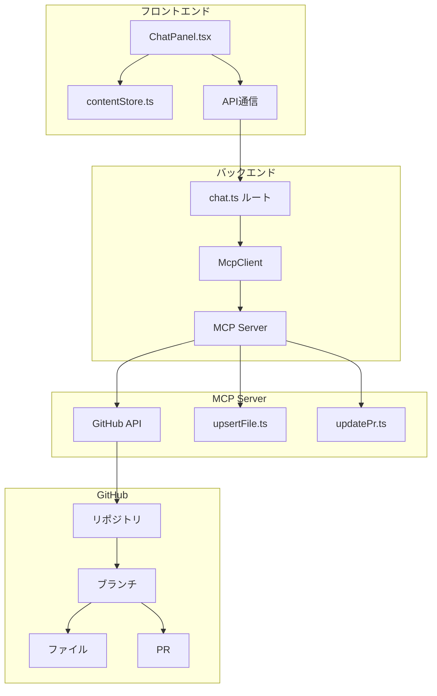
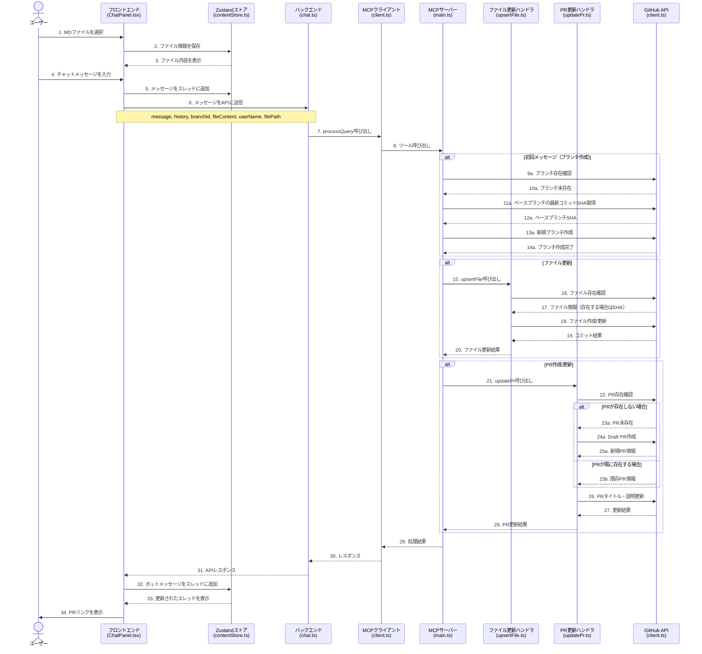
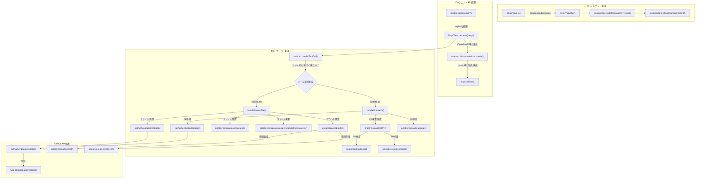

# ユーザーチャットからPR作成までの詳細フロー

このドキュメントでは、policy-editシステムにおいて、ユーザーがチャットを行ってから、PRが作成されるまでの詳細なフローを説明します。

## システム概要

policy-editシステムは、ユーザーが政策文書に対する改善提案をチャットインターフェースを通じて行い、その提案が自動的にGitHub PRとして作成される仕組みを提供しています。

## コンポーネント構成

## 詳細フロー

以下は、ユーザーがチャットを行ってからPRが作成されるまでの詳細なフローチャートです。

## クラスとファイルの詳細フロー

以下は、各処理ステップにおける具体的なクラスとメソッドの呼び出しフローです。

## 処理の詳細説明

1. **ユーザーインタラクション**
   - ユーザーはフロントエンドのChatPanelコンポーネントでMDファイルを選択し、チャットメッセージを入力します
   - 入力されたメッセージはZustandストア（contentStore.ts）に保存され、APIに送信されます

2. **バックエンド処理**
   - chat.tsのルートハンドラがリクエストを受け取り、McpClientのprocessQueryメソッドを呼び出します
   - processQueryメソッドはOpenAI APIを使用してメッセージを処理し、必要に応じてMCPツールを呼び出します

3. **MCPサーバー処理**
   - MCPサーバーはツール呼び出しを受け取り、適切なハンドラ（upsertFile.tsまたはupdatePr.ts）に振り分けます
   - ハンドラはGitHub APIを使用して、ブランチ、ファイル、PRの作成/更新を行います

4. **GitHub操作**
   - GitHub APIを通じて、ブランチの作成、ファイルの更新、PRの作成/更新が行われます
   - 各操作の結果はMCPサーバーからバックエンド、そしてフロントエンドに返されます

5. **結果表示**
   - 処理結果はフロントエンドに返され、ユーザーにPRリンクが表示されます

## 主要なクラスと役割

| コンポーネント | ファイル | 主な役割 |
|--------------|---------|---------|
| ChatPanel | frontend/src/components/ChatPanel.tsx | ユーザーインターフェース、チャット入力処理 |
| contentStore | frontend/src/store/contentStore.ts | チャットスレッド、ファイル内容の状態管理 |
| chat routes | backend/src/routes/chat.ts | APIエンドポイント、リクエスト処理 |
| McpClient | backend/src/mcp/client.ts | MCPサーバーとの通信、クエリ処理 |
| upsertFile | mcp/src/handlers/upsertFile.ts | ファイル作成/更新処理 |
| updatePr | mcp/src/handlers/updatePr.ts | PR作成/更新処理 |
| GitHub utils | mcp/src/github/utils.ts | ブランチ、PR作成のユーティリティ関数 |
| GitHub client | mcp/src/github/client.ts | GitHub API認証、Octokit初期化 |

## 処理フローの特徴

1. **非同期処理チェーン**
   - フロントエンドからバックエンド、MCPサーバー、GitHub APIまで、一連の非同期処理として実行されます

2. **状態管理**
   - フロントエンドではZustandストアを使用して、チャットスレッドやファイル内容の状態を管理しています

3. **エラーハンドリング**
   - 各レイヤーでエラーハンドリングが実装されており、エラーメッセージがユーザーに表示されます

4. **認証フロー**
   - GitHub APIへのアクセスはGitHub Appの認証を使用しており、インストールトークンを取得して操作を行います

5. **インテリジェントファイルルーティング**
   - ユーザーの提案内容に基づいて、最適なファイルを自動選択する機能が実装されています
