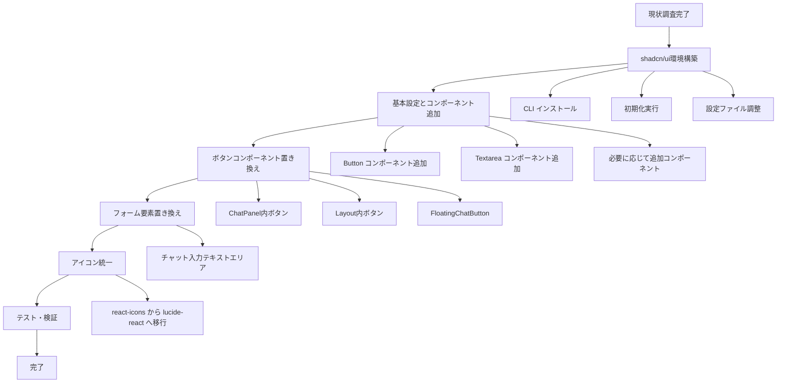

# shadcn/ui導入手順書

## 概要

フロントエンドプロジェクトにshadcn/uiを導入し、主要なインタラクティブコンポーネント（ボタン、フォーム要素）をshadcn/uiコンポーネントに置き換える作業の手順書です。

## 現状分析

### 技術スタック
- **フレームワーク**: React 19 + TypeScript + Vite
- **スタイリング**: Tailwind CSS v4.1.3
- **アイコン**: react-icons/fa
- **状態管理**: Zustand

### 現在のUIコンポーネント
- **ボタン**: 接続ボタン、送信ボタン、閉じるボタン、フローティングチャットボタン
- **フォーム要素**: テキストエリア（チャット入力）
- **レイアウト**: レスポンシブ対応（モバイル・デスクトップ）

### 対象ファイル
- `frontend/src/components/ChatPanel.tsx` - チャット機能のメインコンポーネント
- `frontend/src/components/Layout.tsx` - レイアウトコンポーネント
- `frontend/src/components/FloatingChatButton.tsx` - フローティングボタン

## 導入計画



## 詳細手順

### Phase 1: 環境構築

#### 1.1 shadcn/ui CLI インストールと初期化
```bash
cd frontend
npx shadcn@latest init
```

#### 1.2 初期化時の設定選択
- **TypeScript**: Yes
- **Style**: Default
- **Base color**: Slate
- **CSS variables**: Yes
- **Tailwind config**: tailwind.config.js
- **Components directory**: src/components
- **Utils directory**: src/lib
- **React Server Components**: No
- **Write configuration files**: Yes

#### 1.3 設定ファイル確認・調整
- `components.json` の設定確認
- `tailwind.config.js` の調整（Tailwind CSS v4との整合性）
- `src/lib/utils.ts` の作成確認

### Phase 2: 基本コンポーネント追加

#### 2.1 必要なコンポーネントの追加
```bash
# Button コンポーネント
npx shadcn@latest add button

# Textarea コンポーネント
npx shadcn@latest add textarea
```

#### 2.2 アイコンライブラリの追加
```bash
npm install lucide-react
```

### Phase 3: コンポーネント置き換え

#### 3.1 ChatPanel.tsx の更新

**置き換え対象:**
1. **接続ボタン** (line 380-419)
   - 現在: `<button className="bg-green-500 text-white px-3 py-1 rounded-md...">`
   - 変更後: shadcn/ui Button with variant="default"

2. **送信ボタン** (line 485-497)
   - 現在: `<button className="bg-blue-500 text-white px-4 py-2 rounded-r-md...">`
   - 変更後: shadcn/ui Button with variant="default"

3. **テキストエリア** (line 472-484)
   - 現在: `<textarea className="flex-grow border border-gray-300...">`
   - 変更後: shadcn/ui Textarea

**実装例:**
```tsx
import { Button } from "@/components/ui/button"
import { Textarea } from "@/components/ui/textarea"

// 接続ボタン
<Button
  onClick={connectHandler}
  disabled={isLoading}
  variant="default"
  size="sm"
  className="bg-green-500 hover:bg-green-600"
>
  {isLoading ? "接続中..." : "サーバーに接続"}
</Button>

// 送信ボタン
<Button
  onClick={handleSendMessage}
  disabled={isLoading || !isConnected || !isMdFileActive || inputValue.trim() === ""}
  variant="default"
  size="default"
>
  {isLoading ? "..." : "送信"}
</Button>

// テキストエリア
<Textarea
  value={inputValue}
  onChange={handleInputChange}
  onKeyDown={handleKeyDown}
  placeholder={isMdFileActive ? "メッセージを入力してください（Shift+Enterで改行）..." : "MDファイルを選択"}
  disabled={isLoading || !isConnected || !isMdFileActive}
  rows={3}
  className="resize-none"
/>
```

#### 3.2 Layout.tsx の更新

**置き換え対象:**
1. **閉じるボタン** (line 56-77)
   - 現在: `<button className="absolute top-2 right-2 bg-gray-200...">`
   - 変更後: shadcn/ui Button with variant="ghost" + lucide-react X icon

**実装例:**
```tsx
import { Button } from "@/components/ui/button"
import { X } from "lucide-react"

<Button
  onClick={toggleChat}
  variant="ghost"
  size="sm"
  className="absolute top-2 right-2 rounded-full"
  aria-label="チャットを閉じる"
>
  <X className="h-5 w-5" />
</Button>
```

#### 3.3 FloatingChatButton.tsx の更新

**置き換え対象:**
1. **フローティングボタン** (line 14-23)
   - 現在: `<button className="fixed bottom-4 right-4 bg-blue-500...">`
   - 変更後: shadcn/ui Button + lucide-react MessageCircle icon

**実装例:**
```tsx
import { Button } from "@/components/ui/button"
import { MessageCircle } from "lucide-react"

<Button
  onClick={onClick}
  variant="default"
  size="lg"
  className={`fixed bottom-4 right-4 rounded-full shadow-lg transition-all duration-300 z-50 ${
    isVisible ? "opacity-100" : "opacity-0 pointer-events-none"
  }`}
  aria-label="チャットを開く"
>
  <MessageCircle className="h-6 w-6" />
</Button>
```

### Phase 4: スタイル調整

#### 4.1 Tailwind設定の調整
- `tailwind.config.js` でshadcn/uiのカスタムカラーパレット確認
- 既存のカスタムCSSとの競合確認

#### 4.2 既存スタイルの調整
- `src/index.css` のチャットバブルスタイルとの整合性確認
- レスポンシブ対応の維持

### Phase 5: テスト・検証

#### 5.1 機能テスト
- [ ] チャット機能の動作確認
- [ ] ボタンクリック・フォーム送信の動作確認
- [ ] キーボードナビゲーション確認
- [ ] モバイル・デスクトップでの表示確認

#### 5.2 UI/UXテスト
- [ ] デザインの一貫性確認
- [ ] アクセシビリティ確認（ARIA属性、フォーカス管理）
- [ ] ローディング状態の表示確認
- [ ] エラー状態の表示確認

## 影響範囲

### 変更対象ファイル
- `frontend/package.json` - 依存関係追加
- `frontend/tailwind.config.js` - shadcn/ui設定追加
- `frontend/src/components/ui/` - 新規ディレクトリ・コンポーネント
- `frontend/src/lib/utils.ts` - 新規作成
- `frontend/src/components/ChatPanel.tsx` - ボタン・テキストエリア置き換え
- `frontend/src/components/Layout.tsx` - 閉じるボタン置き換え
- `frontend/src/components/FloatingChatButton.tsx` - フローティングボタン置き換え

### 追加される依存関係
- `@radix-ui/*` - shadcn/uiの基盤UI primitives
- `lucide-react` - アイコンライブラリ
- `class-variance-authority` - スタイルバリアント管理
- `clsx` - 条件付きクラス名
- `tailwind-merge` - Tailwindクラス結合

### 削除可能な依存関係
- `react-icons` - lucide-reactに置き換え後

## リスク・注意点

### 1. 既存スタイルとの競合
- **リスク**: 現在のカスタムCSSとshadcn/uiスタイルの競合
- **対策**: 段階的な置き換えとテスト実施

### 2. Tailwind CSS v4対応
- **リスク**: shadcn/uiがTailwind CSS v4に完全対応していない可能性
- **対策**: 公式ドキュメント確認と必要に応じて設定調整

### 3. アイコン移行
- **リスク**: react-iconsからlucide-reactへの移行時、同等のアイコンが存在しない
- **対策**: 事前にアイコンマッピング確認

### 4. アクセシビリティ
- **リスク**: 既存のARIA属性やフォーカス管理の変更
- **対策**: shadcn/uiのアクセシビリティ機能活用

## 成果物

### 導入後の利点
- **統一されたデザインシステム**: 一貫したUI/UX
- **アクセシビリティ向上**: Radix UIベースの高品質なアクセシビリティ
- **メンテナンス性向上**: 標準化されたコンポーネント
- **開発効率向上**: 再利用可能なコンポーネント
- **将来的な機能拡張**: shadcn/uiエコシステムの活用

### 品質指標
- **パフォーマンス**: バンドルサイズの最適化
- **アクセシビリティ**: WCAG 2.1 AA準拠
- **ブラウザ対応**: モダンブラウザ対応
- **レスポンシブ**: モバイルファースト対応

## 次のステップ

1. **承認確認**: この手順書の内容確認・承認
2. **実装開始**: Phase 1から順次実装
3. **レビュー**: 各Phaseでのコードレビュー実施
4. **テスト**: 機能・UI/UXテストの実施
5. **デプロイ**: 段階的なデプロイとモニタリング

---

**作成日**: 2025年5月31日 11:50
**作成者**: Architect Mode
**バージョン**: 1.0
