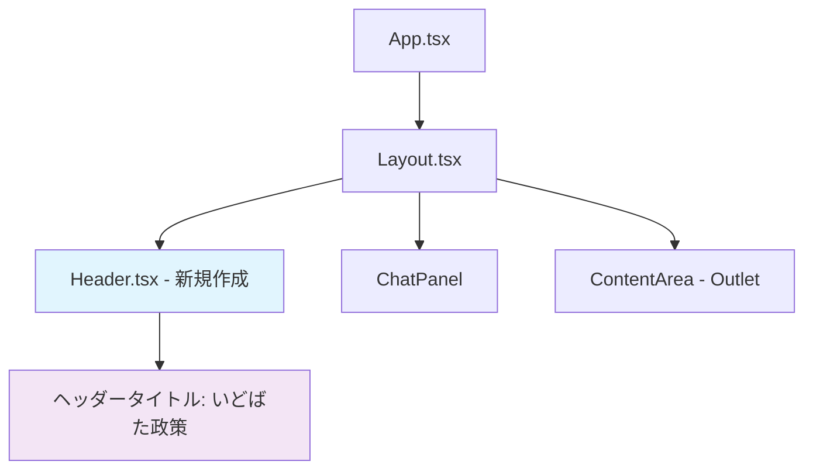

# ヘッダーコンポーネント実装手順書

## 概要
- **目的**: 「いどばた政策」を表示するシンプルなヘッダーコンポーネントを実装
- **配置**: Layoutコンポーネントの最上部に固定ヘッダーとして全画面幅で表示
- **デザイン**: 既存のshadcn/uiスタイルに合わせた標準的なデザイン

## 要件
- レスポンシブ対応
- 左寄せで「いどばた政策」と表示
- shadcn/uiのデザインシステムに準拠

## アーキテクチャ図



## 実装計画

### 1. Headerコンポーネントの作成
- **ファイル**: `frontend/src/components/Header.tsx`
- **機能**:
  - 「いどばた政策」テキストを左寄せで表示
  - レスポンシブ対応
  - shadcn/uiのスタイルガイドに準拠

### 2. Layoutコンポーネントの修正
- **ファイル**: `frontend/src/components/Layout.tsx`
- **変更内容**:
  - Headerコンポーネントをインポート
  - レイアウト構造を修正してヘッダーを最上部に配置
  - 既存のチャットパネルとコンテンツエリアの高さ調整

## 詳細設計

### Headerコンポーネント仕様
```typescript
// Header.tsx の構造
interface HeaderProps {
  className?: string;
}

function Header({ className }: HeaderProps) {
  // shadcn/ui スタイルに準拠したヘッダー実装
}
```

### スタイル仕様
- **高さ**: 64px (`h-16`)
- **背景色**: 白 (`bg-background`)
- **ボーダー**: 下部にライトグレーのボーダー (`border-b border-border`)
- **パディング**: 水平方向に適切な余白 (`px-4 md:px-6`)
- **タイポグラフィ**: shadcn/uiの標準的なヘッダーフォント
- **レスポンシブ**: モバイルとデスクトップで適切な表示

### レイアウト構造の変更
```
現在の構造:
┌─────────────────────────────────────┐
│ Layout (flex-row)                   │
│ ┌─────────────┬─────────────────────┐ │
│ │ ChatPanel   │ ContentArea         │ │
│ │ (1/3)       │ (2/3)               │ │
│ │             │                     │ │
│ └─────────────┴─────────────────────┘ │
└─────────────────────────────────────┘

変更後の構造:
┌─────────────────────────────────────┐
│ Layout (flex-col)                   │
│ ┌─────────────────────────────────────┐ │
│ │ Header (full width, h-16)           │ │
│ └─────────────────────────────────────┘ │
│ ┌─────────────┬─────────────────────┐ │
│ │ ChatPanel   │ ContentArea         │ │
│ │ (1/3)       │ (2/3)               │ │
│ │             │                     │ │
│ └─────────────┴─────────────────────┘ │
└─────────────────────────────────────┘
```

## 実装手順

### 1. Headerコンポーネントの作成

#### ファイル: `frontend/src/components/Header.tsx`

```typescript
import type React from "react";
import { cn } from "@/lib/utils";

interface HeaderProps {
  className?: string;
}

function Header({ className }: HeaderProps): React.ReactElement {
  return (
    <header
      className={cn(
        "w-full h-16 bg-background border-b border-border",
        "flex items-center px-4 md:px-6",
        "sticky top-0 z-50",
        className
      )}
    >
      <h1 className="text-xl font-semibold text-foreground">
        いどばた政策
      </h1>
    </header>
  );
}

export default Header;
```

### 2. Layoutコンポーネントの修正

#### ファイル: `frontend/src/components/Layout.tsx`

既存のLayoutコンポーネントを以下のように修正：

1. **インポートの追加**
```typescript
import Header from "./Header";
```

2. **レイアウト構造の変更**
```typescript
return (
  <div className="flex flex-col h-screen">
    {/* Header - 全画面幅で最上部に配置 */}
    <Header />

    {/* Main Content Area - ヘッダー下に配置 */}
    <div className="flex flex-col md:flex-row flex-1">
      {/* Content Area - 右側 */}
      <div
        className={`${isMobile && isChatVisible ? "h-1/2" : "flex-1"} md:flex-1 md:w-2/3 overflow-y-auto p-4 order-1 md:order-2`}
      >
        <Outlet />
      </div>

      {/* Chat Panel - 左側 */}
      <div
        className={`${
          isMobile
            ? isChatVisible
              ? "h-1/2 translate-y-0 opacity-100 pointer-events-auto"
              : "h-1/2 translate-y-full opacity-0 pointer-events-none"
            : "flex-1 md:w-1/3"
        } md:translate-y-0 md:opacity-100 md:pointer-events-auto border-t md:border-t-0 md:border-r border-gray-300 overflow-y-auto fixed bottom-0 left-0 right-0 md:static md:order-1 transition-all duration-300 ease-in-out z-40 bg-white`}
      >
        {/* Close button - モバイルでチャットが表示されている時のみ表示 */}
        {isMobile && isChatVisible && (
          <Button
            variant="ghost"
            size="sm"
            onClick={toggleChat}
            className="absolute top-2 right-2 bg-gray-200 text-gray-600 rounded-full p-1 hover:bg-gray-300 z-50"
            aria-label="チャットを閉じる"
          >
            <X className="h-5 w-5" />
          </Button>
        )}
        <ChatPanel />
      </div>

      {/* Floating Chat Button - モバイルのみ表示 */}
      <FloatingChatButton
        onClick={toggleChat}
        isVisible={isMobile && !isChatVisible}
      />
    </div>
  </div>
);
```

### 3. 動作確認手順

1. **開発サーバーの起動**
```bash
cd frontend
npm run dev
```

2. **表示確認項目**
- ヘッダーが最上部に固定表示されること
- 「いどばた政策」が左寄せで表示されること
- レスポンシブ動作（モバイル・デスクトップ）が正常であること
- 既存のチャット機能が正常に動作すること

3. **レスポンシブテスト**
- デスクトップ表示（1280px以上）
- タブレット表示（768px-1024px）
- モバイル表示（768px未満）

## 技術的考慮事項

### shadcn/uiとの整合性
- 既存のボタンコンポーネントで使用されているスタイルパターンを踏襲
- `cn`ユーティリティ関数を使用したクラス名の結合
- shadcn/uiのカラーシステム（`bg-background`, `text-foreground`, `border-border`）を使用

### レスポンシブ対応
- Tailwind CSSのブレークポイント（md: 768px）を活用
- モバイルとデスクトップで適切なパディング調整

### アクセシビリティ
- 適切なセマンティックHTML要素（`<header>`, `<h1>`）の使用
- 適切なz-indexの設定でレイヤー管理

### パフォーマンス
- 軽量なコンポーネント設計
- 不要な再レンダリングを避ける実装

## 完成イメージ

```
┌─────────────────────────────────────────────────────────┐
│ Header: いどばた政策                                      │
├─────────────────────────────────────────────────────────┤
│ ┌─────────────────┬─────────────────────────────────────┐ │
│ │ Chat Panel      │ Content Area                        │ │
│ │                 │                                     │ │
│ │ [チャット内容]   │ [メインコンテンツ]                   │ │
│ │                 │                                     │ │
│ │                 │                                     │ │
│ └─────────────────┴─────────────────────────────────────┘ │
└─────────────────────────────────────────────────────────┘
```

## 実装完了後の確認事項

- [ ] Headerコンポーネントが正常に作成されている
- [ ] Layoutコンポーネントが正常に修正されている
- [ ] ヘッダーが最上部に固定表示されている
- [ ] 「いどばた政策」が左寄せで表示されている
- [ ] レスポンシブ動作が正常である
- [ ] 既存のチャット機能に影響がない
- [ ] shadcn/uiのスタイルに準拠している
