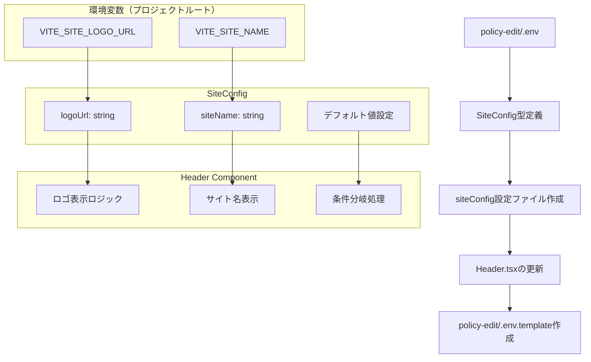

# サイト設定の環境変数対応実装計画

## 概要
policy-edit/frontend/src/components/Layout.tsx に対して、.env からサイト名とサイトロゴURLを設定できるようにする実装計画。

## 要件
- サイト名のデフォルト値：「いどばた政策」
- サイトロゴURLのデフォルト値：空文字列
- サイトロゴURLが空の場合は表示しない
- UIコンポーネントが直接環境変数を読まず、siteconfigの概念を導入
- 環境変数はプロジェクトルートで一元管理

## 現状分析
- **現在のHeader.tsx**: サイト名「いどばた政策」がハードコーディングされている
- **Layout.tsx**: Headerコンポーネントを使用している
- **技術スタック**: React + TypeScript + Vite + Zustand
- **環境変数**: Viteの`VITE_`プレフィックスを使用

## アーキテクチャ図



## 詳細実装手順

### 1. 環境変数ファイルの作成（プロジェクトルート）

**ファイル**: `policy-edit/.env`
```env
# サイト設定
VITE_SITE_NAME=いどばた政策
VITE_SITE_LOGO_URL=

# 既存の設定（あれば保持）
VITE_POLICY_FRONTEND_ALLOWED_HOSTS=
```

**ファイル**: `policy-edit/.env.template`
```env
# サイト設定
VITE_SITE_NAME=いどばた政策
VITE_SITE_LOGO_URL=

# 既存の設定（あれば保持）
VITE_POLICY_FRONTEND_ALLOWED_HOSTS=
```

### 2. 型定義の作成

**ファイル**: `frontend/src/types/siteConfig.ts`
```typescript
export interface SiteConfig {
  siteName: string;
  logoUrl: string;
}
```

### 3. サイト設定ファイルの作成

**ファイル**: `frontend/src/config/siteConfig.ts`
```typescript
import type { SiteConfig } from '../types/siteConfig';

const DEFAULT_SITE_NAME = 'いどばた政策';
const DEFAULT_LOGO_URL = '';

export const siteConfig: SiteConfig = {
  siteName: import.meta.env.VITE_SITE_NAME || DEFAULT_SITE_NAME,
  logoUrl: import.meta.env.VITE_SITE_LOGO_URL || DEFAULT_LOGO_URL,
};
```

### 4. TypeScript型定義の拡張

**ファイル**: `frontend/src/vite-env.d.ts`（既存ファイルに追加）
```typescript
/// <reference types="vite/client" />

interface ImportMetaEnv {
  readonly VITE_SITE_NAME: string;
  readonly VITE_SITE_LOGO_URL: string;
  readonly VITE_POLICY_FRONTEND_ALLOWED_HOSTS: string;
}

interface ImportMeta {
  readonly env: ImportMetaEnv;
}
```

### 5. Header.tsxの更新

**変更内容**:
- siteConfigをインポート
- ロゴ表示の条件分岐ロジック追加
- サイト名を動的に表示
- レスポンシブ対応

**更新後のHeader.tsx構造**:
```typescript
import { siteConfig } from '@/config/siteConfig';

// ロゴがある場合:  + サイト名
// ロゴがない場合: サイト名のみ
// レスポンシブ対応（モバイルでロゴサイズ調整）
```

### 6. ロゴ表示仕様

#### デスクトップ表示
- ロゴサイズ: 高さ32px（h-8）
- ロゴとサイト名の間隔: 8px（ml-2）
- サイト名: text-xl font-semibold

#### モバイル表示
- ロゴサイズ: 高さ24px（h-6）
- ロゴとサイト名の間隔: 6px（ml-1.5）
- サイト名: text-lg font-semibold

#### 条件分岐
- `logoUrl`が空文字列または未定義の場合: ロゴを表示しない
- `logoUrl`が設定されている場合: ロゴとサイト名を両方表示

## ファイル構成

```
policy-edit/
├── .env                          # 環境変数（新規作成）
├── .env.template                 # 環境変数テンプレート（新規作成）
└── frontend/
    └── src/
        ├── types/
        │   └── siteConfig.ts     # 型定義（新規作成）
        ├── config/
        │   └── siteConfig.ts     # 設定ファイル（新規作成）
        ├── components/
        │   └── Header.tsx        # 更新
        └── vite-env.d.ts        # 型定義拡張（更新）
```

## 実装の特徴

1. **分離された設定管理**: UIコンポーネントが直接環境変数にアクセスしない
2. **型安全性**: TypeScriptによる型チェック
3. **デフォルト値**: 環境変数が設定されていない場合の安全な動作
4. **条件分岐**: ロゴURLが空の場合は表示しない仕様
5. **保守性**: 設定変更が容易
6. **一元管理**: 環境変数をプロジェクトルートで管理

## テスト項目

1. **デフォルト表示**: 環境変数未設定時に「いどばた政策」が表示される
2. **ロゴなし**: `VITE_SITE_LOGO_URL`が空の場合、ロゴが表示されない
3. **ロゴあり**: `VITE_SITE_LOGO_URL`が設定されている場合、ロゴとサイト名が表示される
4. **レスポンシブ**: デスクトップとモバイルで適切なサイズで表示される
5. **カスタム設定**: 環境変数でサイト名とロゴURLを変更できる

## 実装後の使用例

### 環境変数設定例
```env
# デフォルト設定
VITE_SITE_NAME=いどばた政策
VITE_SITE_LOGO_URL=

# カスタム設定
VITE_SITE_NAME=カスタム政策サイト
VITE_SITE_LOGO_URL=/images/custom-logo.png
```

### 表示パターン
1. **ロゴなし**: [いどばた政策]
2. **ロゴあり**: [🏛️ いどばた政策]（ロゴ画像 + サイト名）
