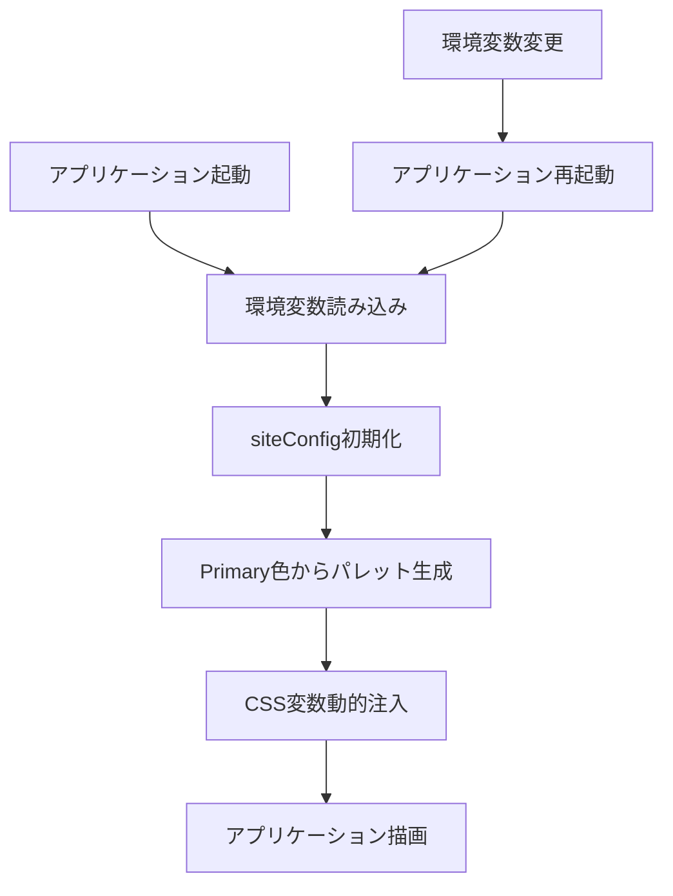

# カラーパレット動的生成設計書

## 概要
現在のCSS色定義を環境変数で管理可能にし、chroma.jsを使用してカラーパレットを動的生成する仕組みを構築します。

## 要件
- **Primary色**: 環境変数 `VITE_PRIMARY_COLOR` で設定可能（デフォルト: `#00aaff`）
- **Secondary色**: グレースケール固定
- **Accent色**: 現在の緑系で固定
- **カラーパレット**: 5段階（very light, light, base, dark, very dark）にミニマム化

## 設計詳細

### 1. 依存関係の追加
```bash
npm install chroma-js
npm install --save-dev @types/chroma-js
```

### 2. 型定義の拡張
`frontend/src/types/siteConfig.ts`を拡張し、カラー設定を追加：

```typescript
export interface ColorPalette {
  50: string;   // very light
  200: string;  // light
  500: string;  // base
  700: string;  // dark
  900: string;  // very dark
}

export interface SiteConfig {
  siteName: string;
  logoUrl: string;
  colors: {
    primary: ColorPalette;
    secondary: ColorPalette;
    accent: ColorPalette;
  };
}
```

### 3. カラー生成ユーティリティ
新しいファイル `frontend/src/utils/colorUtils.ts` を作成：

```typescript
import chroma from 'chroma-js';
import type { ColorPalette } from '../types/siteConfig';

export function generatePrimaryPalette(baseColor: string): ColorPalette {
  const base = chroma(baseColor);
  return {
    50: base.brighten(2).hex(),   // very light
    200: base.brighten(1).hex(),  // light
    500: base.hex(),              // base
    700: base.darken(1).hex(),    // dark
    900: base.darken(2).hex(),    // very dark
  };
}

export function getFixedSecondaryPalette(): ColorPalette {
  return {
    50: '#f9fafb',
    200: '#e5e7eb',
    500: '#6b7280',
    700: '#374151',
    900: '#111827',
  };
}

export function getFixedAccentPalette(): ColorPalette {
  return {
    50: '#a7f3d0',   // hsl(170 64.3% 83.5%) 相当
    200: '#6ee7b7',  // light
    500: '#10b981',  // base (emerald-500相当)
    700: '#047857',  // dark
    900: '#064e3b',  // very dark
  };
}
```

### 4. siteConfig の更新
`frontend/src/config/siteConfig.ts`を更新：

```typescript
import type { SiteConfig } from "../types/siteConfig";
import { generatePrimaryPalette, getFixedSecondaryPalette, getFixedAccentPalette } from "../utils/colorUtils";

const DEFAULT_SITE_NAME = "いどばた政策";
const DEFAULT_LOGO_URL = "";
const DEFAULT_PRIMARY_COLOR = "#00aaff";

export const siteConfig: SiteConfig = {
  siteName: import.meta.env.VITE_SITE_NAME || DEFAULT_SITE_NAME,
  logoUrl: import.meta.env.VITE_SITE_LOGO_URL || DEFAULT_LOGO_URL,
  colors: {
    primary: generatePrimaryPalette(import.meta.env.VITE_PRIMARY_COLOR || DEFAULT_PRIMARY_COLOR),
    secondary: getFixedSecondaryPalette(),
    accent: getFixedAccentPalette(),
  },
};
```

### 5. CSS変数の動的生成
新しいファイル `frontend/src/utils/cssVariables.ts` を作成：

```typescript
import { siteConfig } from '../config/siteConfig';

export function generateCSSVariables(): string {
  const { colors } = siteConfig;

  return `
    :root {
      --color-primary-50: ${colors.primary[50]};
      --color-primary-200: ${colors.primary[200]};
      --color-primary-500: ${colors.primary[500]};
      --color-primary-700: ${colors.primary[700]};
      --color-primary-900: ${colors.primary[900]};

      --color-secondary-50: ${colors.secondary[50]};
      --color-secondary-200: ${colors.secondary[200]};
      --color-secondary-500: ${colors.secondary[500]};
      --color-secondary-700: ${colors.secondary[700]};
      --color-secondary-900: ${colors.secondary[900]};

      --color-accent-50: ${colors.accent[50]};
      --color-accent-200: ${colors.accent[200]};
      --color-accent-500: ${colors.accent[500]};
      --color-accent-700: ${colors.accent[700]};
      --color-accent-900: ${colors.accent[900]};
    }
  `;
}

export function injectCSSVariables(): void {
  const styleElement = document.createElement('style');
  styleElement.textContent = generateCSSVariables();
  document.head.appendChild(styleElement);
}
```

### 6. アプリケーション初期化の更新
`frontend/src/main.tsx`でCSS変数を注入：

```typescript
import { injectCSSVariables } from './utils/cssVariables';

// CSS変数を動的に注入
injectCSSVariables();
```

### 7. index.css の更新
`frontend/src/index.css`の`@theme`セクションを削除し、動的に生成されるCSS変数を使用。

## 処理フロー図



## 使用例
```bash
# 環境変数でPrimary色を設定
VITE_PRIMARY_COLOR="#ff6b35" npm run dev

# デフォルト色（#00aaff）で起動
npm run dev
```

## 実装手順

1. chroma.jsの依存関係追加
2. 型定義の拡張
3. カラー生成ユーティリティの作成
4. siteConfigの更新
5. CSS変数生成ユーティリティの作成
6. main.tsxの更新
7. index.cssの@themeセクション削除

この設計により、環境変数でPrimary色を変更するだけで、アプリケーション全体のカラーテーマが動的に変更されます。
