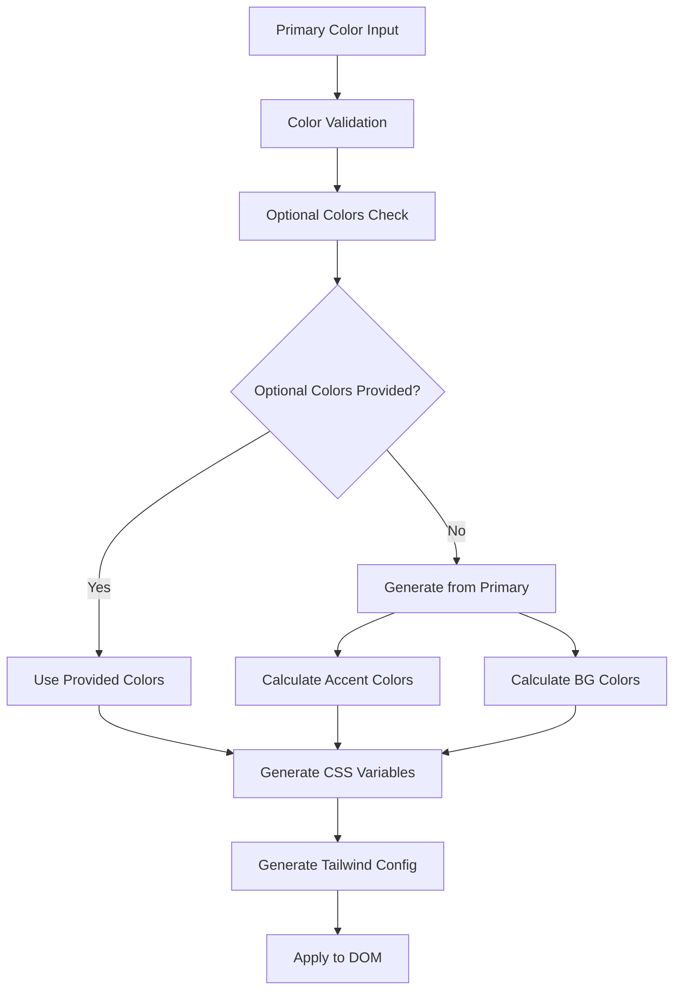

# カラーパレット動的生成システム実装手順書

## 概要
primaryカラーを必須とし、その他のカラー（bg-sub、accent系）をオプショナルにして、指定がない場合はprimaryカラーからモノクロマティック配色で自動生成するシステムを実装します。

## 現状分析
- 既存のColorPaletteシステム（Tailwind風の50-950段階）が存在
- chroma-jsライブラリが導入済み
- 環境変数経由でprimaryカラーを設定可能

## 実装計画



## 1. 型定義の拡張

**ファイル**: `policy-edit/frontend/src/types/siteConfig.ts`

```typescript
// 既存のColorPaletteに加えて、CSS変数用の型を追加
export interface CSSColorVariables {
  primary: string;
  bgSub?: string;
  accent?: string;
  accentLight?: string;
  accentSuperLight?: string;
  accentDark?: string;
  secondary?: string;
}

export interface GeneratedColorScheme {
  cssVariables: Record<string, string>;
  tailwindColors: Record<string, string>;
}
```

## 2. カラー生成ユーティリティの拡張

**ファイル**: `policy-edit/frontend/src/utils/colorUtils.ts`

新しい関数を追加：

```typescript
/**
 * primaryカラーからCSS変数用のカラーセットを生成
 * @param primaryColor - ベースとなるprimaryカラー（例: "#089781"）
 * @param optionalColors - オプショナルで指定するカラー
 * @returns CSS変数とTailwindカラーのセット
 */
export function generateCSSColorVariables(
  primaryColor: string,
  optionalColors?: Partial<CSSColorVariables>
): GeneratedColorScheme {
  const baseColor = chroma(primaryColor);

  // オプショナルカラーが指定されていない場合は自動生成
  const colors = {
    primary: primaryColor,
    bgSub: optionalColors?.bgSub || generateBgSubColor(baseColor),
    accent: optionalColors?.accent || generateAccentColor(baseColor),
    accentLight: optionalColors?.accentLight || generateAccentLightColor(baseColor),
    accentSuperLight: optionalColors?.accentSuperLight || generateAccentSuperLightColor(baseColor),
    accentDark: optionalColors?.accentDark || generateAccentDarkColor(baseColor),
    secondary: optionalColors?.secondary || generateSecondaryColor(baseColor),
  };

  return {
    cssVariables: {
      '--color-primary': colors.primary,
      '--color-bg-sub': colors.bgSub,
      '--color-accent': colors.accent,
      '--color-accent-light': colors.accentLight,
      '--color-accent-super-light': colors.accentSuperLight,
      '--color-accent-dark': colors.accentDark,
      '--color-secondary': colors.secondary,
    },
    tailwindColors: {
      'primary': 'var(--color-primary)',
      'bg-sub': 'var(--color-bg-sub)',
      'accent': 'var(--color-accent)',
      'accent-light': 'var(--color-accent-light)',
      'accent-super-light': 'var(--color-accent-super-light)',
      'accent-dark': 'var(--color-accent-dark)',
      'secondary': 'var(--color-secondary)',
    }
  };
}

/**
 * モノクロマティック配色でaccentカラーを生成
 */
export function generateAccentColors(primaryColor: string): {
  accent: string;
  accentLight: string;
  accentSuperLight: string;
  accentDark: string;
} {
  const baseColor = chroma(primaryColor);

  return {
    accent: baseColor.brighten(0.3).hex(),
    accentLight: baseColor.brighten(0.8).hex(),
    accentSuperLight: baseColor.brighten(1.5).alpha(0.3).css(),
    accentDark: baseColor.darken(0.5).hex(),
  };
}

/**
 * 背景色を生成
 */
export function generateBackgroundColors(primaryColor: string): {
  bgSub: string;
  secondary: string;
} {
  const baseColor = chroma(primaryColor);

  return {
    bgSub: '#f8f8f8', // 固定の明るいグレー
    secondary: baseColor.brighten(2.5).alpha(0.1).css(), // primaryの非常に薄い版
  };
}

// 個別のカラー生成関数
function generateBgSubColor(baseColor: chroma.Color): string {
  return '#f8f8f8'; // 固定の明るいグレー
}

function generateAccentColor(baseColor: chroma.Color): string {
  return baseColor.brighten(0.3).hex();
}

function generateAccentLightColor(baseColor: chroma.Color): string {
  return baseColor.brighten(0.8).hex();
}

function generateAccentSuperLightColor(baseColor: chroma.Color): string {
  return baseColor.brighten(1.5).alpha(0.3).css();
}

function generateAccentDarkColor(baseColor: chroma.Color): string {
  return baseColor.darken(0.5).hex();
}

function generateSecondaryColor(baseColor: chroma.Color): string {
  return baseColor.brighten(2.5).alpha(0.1).css();
}
```

## 3. CSS変数管理システム

**新規ファイル**: `policy-edit/frontend/src/utils/cssVariableManager.ts`

```typescript
/**
 * CSS変数をDOMに適用
 * @param variables - CSS変数のオブジェクト
 */
export function applyCSSVariables(variables: Record<string, string>): void {
  const root = document.documentElement;

  Object.entries(variables).forEach(([property, value]) => {
    root.style.setProperty(property, value);
  });
}

/**
 * CSS変数からTailwindカスタムカラーを生成
 * @param variables - CSS変数のオブジェクト
 * @returns Tailwindで使用可能なカラー設定
 */
export function generateTailwindCustomColors(variables: Record<string, string>): Record<string, string> {
  const tailwindColors: Record<string, string> = {};

  Object.entries(variables).forEach(([property, value]) => {
    // --color-primary -> primary のように変換
    const colorName = property.replace('--color-', '').replace(/-/g, '-');
    tailwindColors[colorName] = `var(${property})`;
  });

  return tailwindColors;
}

/**
 * 現在のCSS変数値を取得
 * @param variableName - CSS変数名（例: '--color-primary'）
 * @returns CSS変数の現在値
 */
export function getCSSVariableValue(variableName: string): string {
  return getComputedStyle(document.documentElement).getPropertyValue(variableName).trim();
}

/**
 * カラーパレット全体を初期化
 * @param primaryColor - ベースとなるprimaryカラー
 * @param optionalColors - オプショナルカラー
 */
export function initializeColorPalette(
  primaryColor: string,
  optionalColors?: Partial<CSSColorVariables>
): void {
  const colorScheme = generateCSSColorVariables(primaryColor, optionalColors);
  applyCSSVariables(colorScheme.cssVariables);
}
```

## 4. 設定システムの更新

**ファイル**: `policy-edit/frontend/src/config/siteConfig.ts`

```typescript
import type { SiteConfig } from "../types/siteConfig";
import {
  generatePrimaryPalette,
  getFixedAccentPalette,
  getFixedSecondaryPalette,
  generateCSSColorVariables,
} from "../utils/colorUtils";
import { initializeColorPalette } from "../utils/cssVariableManager";

const DEFAULT_SITE_NAME = "いどばた政策";
const DEFAULT_LOGO_URL = "";
const DEFAULT_PRIMARY_COLOR = "#0086cc";

// 環境変数からカラー設定を読み込み
const colorConfig = {
  primary: import.meta.env.VITE_PRIMARY_COLOR || DEFAULT_PRIMARY_COLOR,
  bgSub: import.meta.env.VITE_BG_SUB_COLOR,
  accent: import.meta.env.VITE_ACCENT_COLOR,
  accentLight: import.meta.env.VITE_ACCENT_LIGHT_COLOR,
  accentSuperLight: import.meta.env.VITE_ACCENT_SUPER_LIGHT_COLOR,
  accentDark: import.meta.env.VITE_ACCENT_DARK_COLOR,
  secondary: import.meta.env.VITE_SECONDARY_COLOR,
};

// CSS変数を初期化
initializeColorPalette(colorConfig.primary, {
  bgSub: colorConfig.bgSub,
  accent: colorConfig.accent,
  accentLight: colorConfig.accentLight,
  accentSuperLight: colorConfig.accentSuperLight,
  accentDark: colorConfig.accentDark,
  secondary: colorConfig.secondary,
});

export const siteConfig: SiteConfig = {
  siteName: import.meta.env.VITE_SITE_NAME || DEFAULT_SITE_NAME,
  logoUrl: import.meta.env.VITE_SITE_LOGO_URL || DEFAULT_LOGO_URL,
  colors: {
    primary: generatePrimaryPalette(colorConfig.primary),
    secondary: getFixedSecondaryPalette(),
    accent: getFixedAccentPalette(),
  },
};
```

## 5. Tailwind設定の動的更新

**ファイル**: `policy-edit/frontend/tailwind.config.js`

```javascript
/** @type {import('tailwindcss').Config} */
module.exports = {
  content: [
    "./index.html",
    "./src/**/*.{js,ts,jsx,tsx}",
  ],
  theme: {
    extend: {
      colors: {
        // CSS変数を参照するカスタムカラー
        'primary': 'var(--color-primary)',
        'bg-sub': 'var(--color-bg-sub)',
        'accent': {
          DEFAULT: 'var(--color-accent)',
          'light': 'var(--color-accent-light)',
          'super-light': 'var(--color-accent-super-light)',
          'dark': 'var(--color-accent-dark)',
        },
        'secondary': 'var(--color-secondary)',
      }
    }
  },
  plugins: [],
}
```

## 6. 実装順序

### Phase 1: 基盤整備 (1時間)
1. **型定義の拡張** (30分)
   - `CSSColorVariables`型の追加
   - `GeneratedColorScheme`型の追加

2. **CSS変数管理システム** (30分)
   - `cssVariableManager.ts`の作成
   - DOM操作関数の実装

### Phase 2: カラー生成ロジック (2時間)
3. **カラー生成ロジック実装** (2時間)
   - `generateCSSColorVariables`関数
   - `generateAccentColors`関数
   - `generateBackgroundColors`関数
   - 個別のカラー生成関数群

### Phase 3: 統合とテスト (1.5時間)
4. **設定システム更新** (30分)
   - `siteConfig.ts`の更新
   - 環境変数対応の追加

5. **Tailwind設定更新** (30分)
   - `tailwind.config.js`の更新
   - CSS変数参照の設定

6. **テスト実装** (30分)
   - 各関数のユニットテスト
   - 統合テスト

## 7. 使用例

### 基本的な使用方法
```typescript
// primaryカラーのみ指定（他は自動生成）
const colorScheme = generateCSSColorVariables('#089781');
applyCSSVariables(colorScheme.cssVariables);
```

### オプショナルカラーを一部指定
```typescript
const customColorScheme = generateCSSColorVariables('#089781', {
  accent: '#ff6b6b',
  bgSub: '#f8f9fa'
});
applyCSSVariables(customColorScheme.cssVariables);
```

### Tailwindクラスでの使用
```html
<div class="bg-primary text-white">Primary Background</div>
<div class="bg-bg-sub text-primary">Sub Background</div>
<div class="bg-accent text-white">Accent Background</div>
<div class="bg-accent-light text-accent-dark">Light Accent</div>
```

## 8. 期待される出力

primaryカラー `#089781` から生成される例：

```css
:root {
  --color-primary: #089781;
  --color-bg-sub: #f8f8f8;
  --color-accent: #30bca7;
  --color-accent-light: #64d8c6;
  --color-accent-super-light: rgba(188, 236, 211, 0.3);
  --color-accent-dark: #0f8472;
  --color-secondary: rgba(8, 151, 129, 0.1);
}
```

## 9. テスト戦略

### ユニットテスト
- `generateCSSColorVariables`関数のテスト
- 各カラー生成関数のテスト
- CSS変数操作関数のテスト

### 統合テスト
- 環境変数からの設定読み込みテスト
- Tailwindクラスの動作確認
- ブラウザでの表示確認

### テストケース例
```typescript
describe('generateCSSColorVariables', () => {
  test('primaryカラーのみ指定時の自動生成', () => {
    const result = generateCSSColorVariables('#089781');
    expect(result.cssVariables['--color-primary']).toBe('#089781');
    expect(result.cssVariables['--color-bg-sub']).toBe('#f8f8f8');
    // ... 他のカラーのテスト
  });

  test('オプショナルカラー指定時の動作', () => {
    const result = generateCSSColorVariables('#089781', {
      accent: '#ff6b6b'
    });
    expect(result.cssVariables['--color-accent']).toBe('#ff6b6b');
  });
});
```

## 10. 注意事項

- chroma-jsライブラリのバージョン互換性を確認
- CSS変数のブラウザサポート状況を考慮
- カラーアクセシビリティ（コントラスト比）の確認
- パフォーマンスへの影響を最小限に抑制

## 11. 今後の拡張可能性

- カラーテーマの保存・読み込み機能
- ダークモード対応
- カラーパレットのプリセット機能
- リアルタイムカラープレビュー機能

この実装により、primaryカラーのみを指定すれば、調和の取れたカラーパレット全体が自動生成され、Tailwindクラス経由で使用できるようになります。
