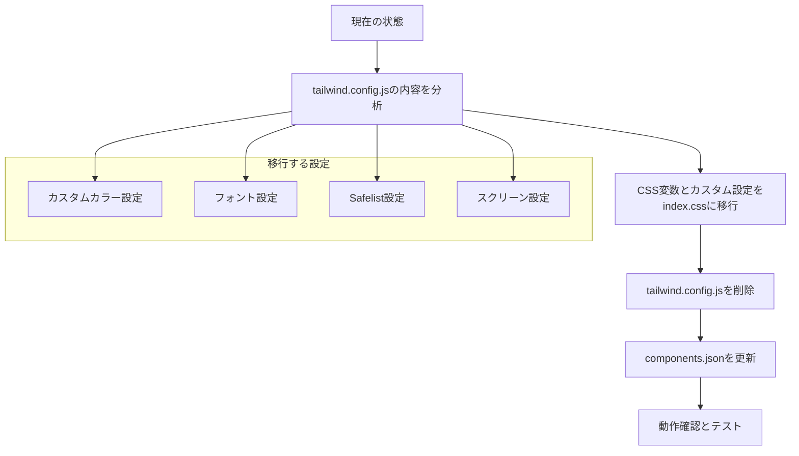

# Tailwind CSS v4 統一化計画

## 概要

policy-edit/frontendにおいて、Tailwind CSS v4の推奨方法であるVite Plugin方式に統一し、重複した設定を解消する。

## 現状分析

### 現在の重複した設定

1. **Vite Plugin方式** (`vite.config.ts`)
   - `@tailwindcss/vite`プラグインを使用
   - Tailwind CSS v4の推奨方法

2. **従来の設定ファイル方式** (`tailwind.config.js`)
   - 詳細なカスタムカラー設定
   - フォント設定
   - Safelist設定

### 問題点

- 設定が2箇所に分散している
- Tailwind CSS v4の最新機能を十分に活用できていない
- 保守性が低下している

## 移行計画



## 詳細実装手順

### 1. 現在のtailwind.config.jsの設定内容

#### カスタムカラー設定
```javascript
// Primary (11段階)
primary: {
  50: "var(--color-primary-50)",
  100: "var(--color-primary-100)",
  // ... 950まで
  DEFAULT: "var(--color-primary-500)",
}

// Secondary (11段階)
secondary: {
  50: "var(--color-secondary-50)",
  // ... 950まで
  DEFAULT: "var(--color-secondary-500)",
}

// Accent (4段階)
accent: {
  DEFAULT: "var(--color-accent)",
  light: "var(--color-accent-light)",
  "super-light": "var(--color-accent-super-light)",
  dark: "var(--color-accent-dark)",
}
```

#### フォント設定
```javascript
fontFamily: {
  sans: [
    '"Inter"',
    '"BIZ UDGothic"',
    "system-ui",
    // ... その他のフォールバック
  ],
}
```

#### Safelist設定
```javascript
safelist: [
  // Accent colors
  'border-accent-light',
  'border-accent-dark',
  'bg-accent-light',
  // ... その他の動的クラス
]
```

### 2. Tailwind CSS v4への移行

#### index.cssの更新

```css
@import "tailwindcss";

@theme {
  /* フォント設定 */
  --font-family-sans: "Inter", "BIZ UDGothic", system-ui, -apple-system, BlinkMacSystemFont, "Segoe UI", Roboto, "Helvetica Neue", Arial, sans-serif;

  /* レスポンシブブレークポイント */
  --breakpoint-sm: 640px;
  --breakpoint-md: 768px;
  --breakpoint-lg: 1024px;
  --breakpoint-xl: 1280px;
  --breakpoint-2xl: 1536px;

  /* カスタムカラー - CSS変数を直接参照 */
  --color-background: hsl(var(--background));
  --color-foreground: hsl(var(--foreground));
  --color-destructive: hsl(var(--destructive));
  --color-ring: hsl(var(--ring));

  /* Primary colors */
  --color-primary-50: var(--color-primary-50);
  --color-primary-100: var(--color-primary-100);
  --color-primary-200: var(--color-primary-200);
  --color-primary-300: var(--color-primary-300);
  --color-primary-400: var(--color-primary-400);
  --color-primary-500: var(--color-primary-500);
  --color-primary-600: var(--color-primary-600);
  --color-primary-700: var(--color-primary-700);
  --color-primary-800: var(--color-primary-800);
  --color-primary-900: var(--color-primary-900);
  --color-primary-950: var(--color-primary-950);
  --color-primary: var(--color-primary-500);

  /* Secondary colors */
  --color-secondary-50: var(--color-secondary-50);
  --color-secondary-100: var(--color-secondary-100);
  --color-secondary-200: var(--color-secondary-200);
  --color-secondary-300: var(--color-secondary-300);
  --color-secondary-400: var(--color-secondary-400);
  --color-secondary-500: var(--color-secondary-500);
  --color-secondary-600: var(--color-secondary-600);
  --color-secondary-700: var(--color-secondary-700);
  --color-secondary-800: var(--color-secondary-800);
  --color-secondary-900: var(--color-secondary-900);
  --color-secondary-950: var(--color-secondary-950);
  --color-secondary: var(--color-secondary-500);

  /* Accent colors */
  --color-accent: var(--color-accent);
  --color-accent-light: var(--color-accent-light);
  --color-accent-super-light: var(--color-accent-super-light);
  --color-accent-dark: var(--color-accent-dark);

  /* 後方互換性 */
  --color-bg-sub: var(--color-secondary-50);
}

/* Safelist設定の代替 - 動的クラス名をコメントで明示 */
/*
動的に使用されるクラス名:
- border-accent-light, border-accent-dark, border-accent
- bg-accent-light, bg-accent-dark, bg-accent
- text-accent-light, text-accent-dark, text-accent
- border-primary-500, border-primary-600
- bg-primary-500, bg-primary-600
- text-primary-500, text-primary-600
- border-secondary-200, border-secondary-300
- bg-secondary-200, bg-secondary-300
- text-secondary-800, text-secondary-900
*/
```

### 3. components.jsonの更新

```json
{
  "$schema": "https://ui.shadcn.com/schema.json",
  "style": "default",
  "rsc": false,
  "tsx": true,
  "tailwind": {
    "config": null,
    "css": "src/index.css",
    "baseColor": "slate",
    "cssVariables": true,
    "prefix": ""
  },
  "aliases": {
    "components": "@/components",
    "utils": "@/lib/utils"
  }
}
```

### 4. 削除するファイル

- `tailwind.config.js`

## 実装順序

1. **バックアップ作成**
   - 現在のtailwind.config.jsをバックアップ

2. **index.cssの更新**
   - @themeディレクティブを追加
   - カスタム設定を移行

3. **components.jsonの更新**
   - configパスをnullに設定

4. **tailwind.config.jsの削除**

5. **動作確認**
   - ビルドが正常に動作するか確認
   - カスタムカラーが正しく適用されるか確認
   - レスポンシブデザインが正常に動作するか確認

## 利点

### 1. Tailwind CSS v4の最新機能を活用
- より高速なビルド
- 改善されたHMR（Hot Module Replacement）
- 簡潔な設定

### 2. 設定の一元化
- CSS内で全ての設定を管理
- 設定ファイルの重複を解消
- 設定の場所が明確

### 3. 保守性の向上
- Tailwind CSS v4の標準的な構成
- 将来のアップデートに対応しやすい

## 注意点

### 1. 既存のCSS変数との互換性
- 現在のカラーシステムとの整合性を保つ
- 動的カラー生成機能への影響を最小化

### 2. ShadCN/UIとの互換性
- components.jsonの適切な更新
- UIコンポーネントの動作確認

### 3. 動的クラス名の管理
- Safelistの代替として、コメントで明示
- 必要に応じて@utilityディレクティブで明示的に定義

## テスト項目

- [ ] ビルドが正常に完了する
- [ ] カスタムカラー（primary, secondary, accent）が正しく適用される
- [ ] フォント設定が正しく適用される
- [ ] レスポンシブブレークポイントが正常に動作する
- [ ] ShadCN/UIコンポーネントが正常に動作する
- [ ] 動的に生成されるクラス名が正しく適用される
- [ ] HMRが正常に動作する

## 完了条件

- tailwind.config.jsが削除されている
- index.cssに全ての設定が移行されている
- components.jsonが更新されている
- 全てのテスト項目がパスしている
- ビルドとHMRが正常に動作している
