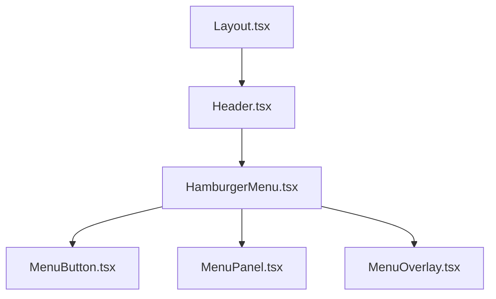

# ハンバーガーメニュー実装設計書

## 概要
フロントエンドにレスポンシブなハンバーガーメニューを実装する。PC版とスマートフォン版で異なる動作を提供する。

## 要件
- **PC版**: デフォルトでメニューがオープン状態、開閉ボタンは非表示
- **スマートフォン版**: ハンバーガーボタンでメニューの開閉を制御

## 現在の構造分析

### 既存のレイアウト構造
- `Layout.tsx`: メインレイアウトコンポーネント（チャットパネルの表示制御あり）
- `Header.tsx`: ヘッダーコンポーネント（ロゴとサイト名のみ）
- 既にモバイル対応の仕組みが存在（`isMobile`状態管理）

### 利用可能なライブラリ
- `lucide-react`: アイコンライブラリ（Menu, X アイコンが利用可能）
- `tailwindcss`: スタイリング
- `shadcn/ui`: UIコンポーネント（Button等）

## 設計方針

### 1. コンポーネント構成



### 2. 新規作成コンポーネント

#### HamburgerMenu.tsx
- メニューの状態管理（開閉状態）
- PC/モバイルの判定に基づく表示制御
- メニューボタン、パネル、オーバーレイの統合管理

#### MenuButton.tsx
- ハンバーガーアイコンボタン
- スマートフォン版でのみ表示
- アニメーション効果（ハンバーガー ↔ X）

#### MenuPanel.tsx
- メニューコンテンツの表示領域
- PC版: 常時表示、固定位置
- スマートフォン版: スライドイン/アウト

#### MenuOverlay.tsx
- スマートフォン版でのみ表示
- メニュー外クリックでメニューを閉じる

### 3. レスポンシブ動作

#### PC版（768px以上）
- メニューパネルが常時表示
- ハンバーガーボタンは非表示
- サイドバー形式でコンテンツと並列表示

#### スマートフォン版（768px未満）
- ハンバーガーボタンをヘッダーに表示
- メニューパネルは画面外から左側にスライドイン
- オーバーレイでメインコンテンツを暗くする
- メニュー外タップまたはXボタンでメニューを閉じる

### 4. 状態管理

```typescript
interface MenuState {
  isOpen: boolean;
  isMobile: boolean;
}
```

### 5. アニメーション

#### メニューパネル
- スマートフォン版: `transform: translateX(-100%)` ↔ `transform: translateX(0)`
- トランジション: `transition-transform duration-300 ease-in-out`

#### ハンバーガーボタン
- アイコン切り替え: Menu ↔ X
- 回転アニメーション: `transition-transform duration-200`

#### オーバーレイ
- 透明度: `opacity-0` ↔ `opacity-50`
- トランジション: `transition-opacity duration-300`

## 実装計画

### Phase 1: 基本コンポーネント作成
1. `HamburgerMenu.tsx` - メイン管理コンポーネント
2. `MenuButton.tsx` - ハンバーガーボタン
3. `MenuPanel.tsx` - メニューパネル
4. `MenuOverlay.tsx` - オーバーレイ

### Phase 2: レイアウト統合
1. `Header.tsx` にハンバーガーメニューを統合
2. `Layout.tsx` でメニューパネルの配置調整

### Phase 3: スタイリング・アニメーション
1. レスポンシブスタイルの適用
2. アニメーション効果の実装
3. アクセシビリティ対応

### Phase 4: テスト・調整
1. PC/モバイルでの動作確認
2. パフォーマンス最適化
3. ユーザビリティ調整

## ファイル構成

```
frontend/src/components/
├── layout/
│   ├── Header.tsx (修正)
│   ├── Layout.tsx (修正)
│   └── menu/
│       ├── HamburgerMenu.tsx (新規)
│       ├── MenuButton.tsx (新規)
│       ├── MenuPanel.tsx (新規)
│       └── MenuOverlay.tsx (新規)
```

## 技術仕様

### 使用技術
- React 19 (function component)
- TypeScript
- Tailwind CSS v4
- Lucide React (Menu, X アイコン)
- shadcn/ui Button コンポーネント

### ブレークポイント
- モバイル: `< 768px` (Tailwind の `md` ブレークポイント)
- PC: `>= 768px`

### アクセシビリティ
- `aria-label` でボタンの説明
- `aria-expanded` でメニューの開閉状態
- キーボードナビゲーション対応（Escape キーでメニューを閉じる）

## 注意事項
- 既存のチャットパネルの動作に影響しないよう配慮
- メニューコンテンツは空の状態で実装（後から追加可能）
- 既存の `isMobile` 状態管理ロジックを活用
