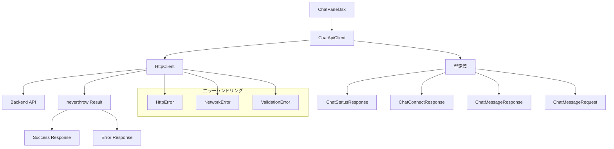

# HTTPクライアント実装手順書

## 概要

ChatPanel.tsxのHTTPリクエストを型安全で保守性の高いapiclient、httpclientクラスに分離し、neverthrowを使ったエラーハンドリングを実装する。

## 現在の状況分析

### 現在のHTTPリクエスト
- **GET** `/api/chat/status` - MCP接続状態確認
- **POST** `/api/chat/connect` - MCP接続
- **POST** `/api/chat` - チャットメッセージ送信

### 問題点
- 直接fetchを使用しており、型安全性が不十分
- エラーハンドリングがtry-catchで分散している
- HTTPクライアントの設定が重複している
- レスポンスの型定義が不明確

## アーキテクチャ設計



## 実装手順

### 1. 依存関係の追加

```bash
cd frontend
npm install neverthrow
npm install --save-dev @types/node
```

### 2. エラー型の定義

**ファイル**: `frontend/src/lib/errors.ts`

```typescript
export type HttpErrorType =
  | 'NETWORK_ERROR'
  | 'VALIDATION_ERROR'
  | 'SERVER_ERROR'
  | 'UNKNOWN_ERROR';

export interface HttpError {
  type: HttpErrorType;
  message: string;
  status?: number;
  details?: unknown;
}

export const createHttpError = (
  type: HttpErrorType,
  message: string,
  status?: number,
  details?: unknown
): HttpError => ({
  type,
  message,
  status,
  details,
});

export const createNetworkError = (message: string, details?: unknown): HttpError =>
  createHttpError('NETWORK_ERROR', message, undefined, details);

export const createValidationError = (message: string, details?: unknown): HttpError =>
  createHttpError('VALIDATION_ERROR', message, 400, details);

export const createServerError = (message: string, status: number, details?: unknown): HttpError =>
  createHttpError('SERVER_ERROR', message, status, details);

export const createUnknownError = (message: string, details?: unknown): HttpError =>
  createHttpError('UNKNOWN_ERROR', message, undefined, details);
```

### 3. 型定義の作成

**ファイル**: `frontend/src/types/api.ts`

```typescript
export interface OpenAIMessage {
  role: "user" | "assistant" | "system" | "function";
  content: string | null;
  name?: string;
  function_call?: {
    name: string;
    arguments: string;
  };
}

export interface ChatMessageRequest {
  message: string;
  history: OpenAIMessage[];
  branchId?: string | null;
  fileContent?: string | null;
  userName?: string | null;
  filePath?: string | null;
}

export interface ChatMessageResponse {
  response: string;
}

export interface ChatStatusResponse {
  initialized: boolean;
  tools: unknown[];
}

export interface ChatConnectResponse {
  success: boolean;
  message: string;
}

export interface ApiErrorResponse {
  error: string;
  details?: string;
}
```

### 4. HttpClientクラスの実装

**ファイル**: `frontend/src/lib/httpClient.ts`

```typescript
import { Result, ok, err } from 'neverthrow';
import type { HttpError } from './errors';
import {
  createNetworkError,
  createServerError,
  createUnknownError,
  createValidationError,
} from './errors';

export interface RequestOptions {
  method?: 'GET' | 'POST' | 'PUT' | 'DELETE' | 'PATCH';
  headers?: Record<string, string>;
  body?: unknown;
}

export class HttpClient {
  private baseUrl: string;
  private defaultHeaders: Record<string, string>;

  constructor(
    baseUrl: string,
    defaultHeaders: Record<string, string> = { 'Content-Type': 'application/json' }
  ) {
    this.baseUrl = baseUrl;
    this.defaultHeaders = defaultHeaders;
  }

  async request<T>(
    endpoint: string,
    options: RequestOptions = {}
  ): Promise<Result<T, HttpError>> {
    const url = `${this.baseUrl}${endpoint}`;

    const headers = {
      ...this.defaultHeaders,
      ...options.headers,
    };

    const requestInit: RequestInit = {
      method: options.method ?? 'GET',
      headers,
    };

    if (options.body && options.method !== 'GET') {
      requestInit.body = JSON.stringify(options.body);
    }

    try {
      const response = await fetch(url, requestInit);

      if (!response.ok) {
        const errorData = await this.parseErrorResponse(response);
        return err(createServerError(
          errorData.error || `HTTP ${response.status}: ${response.statusText}`,
          response.status,
          errorData
        ));
      }

      const data = await response.json();
      return ok(data as T);

    } catch (error) {
      if (error instanceof Error) {
        return err(createNetworkError('Network request failed', error));
      }
      return err(createUnknownError('Unknown error occurred', error));
    }
  }

  async get<T>(endpoint: string, options: Omit<RequestOptions, 'method' | 'body'> = {}): Promise<Result<T, HttpError>> {
    return this.request<T>(endpoint, { ...options, method: 'GET' });
  }

  async post<T>(endpoint: string, body?: unknown, options: Omit<RequestOptions, 'method' | 'body'> = {}): Promise<Result<T, HttpError>> {
    return this.request<T>(endpoint, { ...options, method: 'POST', body });
  }

  async put<T>(endpoint: string, body?: unknown, options: Omit<RequestOptions, 'method' | 'body'> = {}): Promise<Result<T, HttpError>> {
    return this.request<T>(endpoint, { ...options, method: 'PUT', body });
  }

  async delete<T>(endpoint: string, options: Omit<RequestOptions, 'method' | 'body'> = {}): Promise<Result<T, HttpError>> {
    return this.request<T>(endpoint, { ...options, method: 'DELETE' });
  }

  private async parseErrorResponse(response: Response): Promise<{ error: string; details?: string }> {
    try {
      const data = await response.json();
      return data;
    } catch {
      return { error: response.statusText };
    }
  }
}
```

### 5. ChatApiClientクラスの実装

**ファイル**: `frontend/src/lib/chatApiClient.ts`

```typescript
import { Result, ok, err } from 'neverthrow';
import { HttpClient } from './httpClient';
import type { HttpError } from './errors';
import { createValidationError } from './errors';
import type {
  ChatMessageRequest,
  ChatMessageResponse,
  ChatStatusResponse,
  ChatConnectResponse,
} from '../types/api';

export class ChatApiClient {
  private httpClient: HttpClient;

  constructor(baseUrl: string) {
    this.httpClient = new HttpClient(baseUrl);
  }

  async getStatus(): Promise<Result<ChatStatusResponse, HttpError>> {
    return this.httpClient.get<ChatStatusResponse>('/chat/status');
  }

  async connect(): Promise<Result<ChatConnectResponse, HttpError>> {
    return this.httpClient.post<ChatConnectResponse>('/chat/connect');
  }

  async sendMessage(request: ChatMessageRequest): Promise<Result<ChatMessageResponse, HttpError>> {
    const validationResult = this.validateChatMessageRequest(request);
    if (validationResult.isErr()) {
      return err(validationResult.error);
    }

    return this.httpClient.post<ChatMessageResponse>('/chat', request);
  }

  private validateChatMessageRequest(request: ChatMessageRequest): Result<void, HttpError> {
    if (!request.message || typeof request.message !== 'string') {
      return err(createValidationError('Message is required and must be a string'));
    }

    if (request.message.trim() === '') {
      return err(createValidationError('Message cannot be empty'));
    }

    if (request.history && !Array.isArray(request.history)) {
      return err(createValidationError('History must be an array'));
    }

    if (request.branchId && typeof request.branchId !== 'string') {
      return err(createValidationError('branchId must be a string if provided'));
    }

    if (request.fileContent && typeof request.fileContent !== 'string') {
      return err(createValidationError('fileContent must be a string if provided'));
    }

    if (request.userName && typeof request.userName !== 'string') {
      return err(createValidationError('userName must be a string if provided'));
    }

    if (request.filePath && typeof request.filePath !== 'string') {
      return err(createValidationError('filePath must be a string if provided'));
    }

    return ok(undefined);
  }
}
```

### 6. APIクライアントインスタンスの作成

**ファイル**: `frontend/src/lib/api.ts`

```typescript
import { ChatApiClient } from './chatApiClient';

const API_BASE_URL = import.meta.env.VITE_API_BASE_URL || "http://localhost:3001/api";

export const chatApiClient = new ChatApiClient(API_BASE_URL);
```

### 7. ChatPanel.tsxの修正

**修正対象**: `frontend/src/components/chat/ChatPanel.tsx`

#### 7.1 インポートの修正

```typescript
// 既存のインポートに追加
import { chatApiClient } from "../../lib/api";
import type { ChatMessageRequest, OpenAIMessage } from "../../types/api";
import type { HttpError } from "../../lib/errors";
```

#### 7.2 API_BASE_URLの削除

```typescript
// 削除
// const API_BASE_URL = import.meta.env.VITE_API_BASE_URL || "http://localhost:3001/api";
```

#### 7.3 OpenAIMessageインターフェースの削除

```typescript
// 削除（types/api.tsに移動済み）
// interface OpenAIMessage {
//   role: "user" | "assistant" | "system" | "function";
//   content: string | null;
//   name?: string;
//   function_call?: {
//     name: string;
//     arguments: string;
//   };
// }
```

#### 7.4 checkConnectionStatus関数の修正

```typescript
const checkConnectionStatus = async (): Promise<boolean> => {
  const result = await chatApiClient.getStatus();

  if (result.isErr()) {
    console.error("接続ステータスの確認に失敗しました:", result.error);
    setIsConnected(false);
    return false;
  }

  const status = result.value.initialized;
  setIsConnected(status);
  return status;
};
```

#### 7.5 connectToGithubContributionServer関数の修正

```typescript
const connectToGithubContributionServer = async () => {
  setIsLoading(true);
  setError(null);

  const result = await chatApiClient.connect();

  if (result.isErr()) {
    const errorMessage = result.error.message || "サーバーへの接続に失敗しました";
    setError(errorMessage);
    setIsConnected(false);
  } else {
    setIsConnected(true);
  }

  setIsLoading(false);
};
```

#### 7.6 handleSendMessage関数の修正

```typescript
const handleSendMessage = async () => {
  if (
    inputValue.trim() === "" ||
    !isMdFileActive ||
    !currentPath ||
    !currentThread
  )
    return;

  if (!userName) {
    const name = prompt(
      "お名前を入力してください（あなたの提案の記名に使用されます）："
    );
    if (name) {
      setUserName(name);
      localStorage.setItem("userName", name);
    } else {
      console.warn("ユーザーが名前を提供しませんでした。");
      setUserName("匿名ユーザー");
      localStorage.setItem("userName", "匿名ユーザー");
    }
  }

  const userMessageContent = {
    text: inputValue,
    sender: "user" as const,
  };

  addMessageToThread(currentPath, userMessageContent);

  const userInput = inputValue;
  setInputValue("");
  setIsLoading(true);
  setError(null);

  const historyForAPI: OpenAIMessage[] = currentThread.messages.map(
    (msg) => ({
      role: msg.sender === "user" ? "user" : "assistant",
      content: msg.text,
    })
  );
  historyForAPI.push({ role: "user", content: userInput });

  let fileContent: string | null = null;
  if (contentType === "file" && content && "content" in content) {
    try {
      fileContent = decodeBase64Content((content as GitHubFile).content);
    } catch (e) {
      console.error("ファイルコンテンツのデコードに失敗しました:", e);
    }
  }

  const request: ChatMessageRequest = {
    message: userInput,
    history: historyForAPI,
    branchId: currentBranchId,
    fileContent: fileContent,
    userName: userName,
    filePath: currentPath,
  };

  const result = await chatApiClient.sendMessage(request);

  if (result.isErr()) {
    const errorMessage = result.error.message || "応答の取得に失敗しました";
    setError(errorMessage);
    addMessageToThread(currentPath, {
      text: `エラー：${errorMessage}`,
      sender: "bot",
    });
    setIsLoading(false);
    return; // 早期リターン
  }

  // 成功時の処理
  addMessageToThread(currentPath, {
    text: result.value.response,
    sender: "bot"
  });
  console.log("ボットの応答を受信しました。コンテンツを再読み込みしています...");
  reloadCurrentContent();
  setIsLoading(false);
};
```

## エラーハンドリング戦略

### neverthrowの使用方針

1. **matchは使用しない**: 読み手の負荷を軽減するため
2. **早期リターンパターン**: `result.isErr()`でエラーチェック後、早期リターン
3. **階層化されたエラー**: HttpError型で統一されたエラー情報

### エラーハンドリングの例

```typescript
// 良い例：早期リターンパターン
const result = await chatApiClient.sendMessage(request);
if (result.isErr()) {
  console.error("エラー:", result.error);
  return; // 早期リターン
}

// 成功時の処理
const response = result.value;
console.log("成功:", response);

// 悪い例：matchの使用（避ける）
// result.match(
//   (success) => console.log("成功:", success),
//   (error) => console.error("エラー:", error)
// );
```

## テスト戦略

### 単体テスト

1. **HttpClient**のテスト
   - 正常なレスポンス
   - エラーレスポンス
   - ネットワークエラー
   - タイムアウト

2. **ChatApiClient**のテスト
   - バリデーション
   - APIコール
   - エラーハンドリング

### 統合テスト

1. **ChatPanel**との統合
2. **実際のAPI**との通信テスト

## 実装順序

1. ✅ 依存関係の追加
2. ✅ エラー型の定義
3. ✅ 型定義の作成
4. ✅ HttpClientクラスの実装
5. ✅ ChatApiClientクラスの実装
6. ✅ APIクライアントインスタンスの作成
7. ✅ ChatPanel.tsxの修正
8. 🔄 テストの実装
9. 🔄 動作確認

## 注意事項

1. **型安全性**: TypeScriptの型チェックを最大限活用
2. **エラーハンドリング**: neverthrowのResultを一貫して使用
3. **保守性**: 各クラスの責務を明確に分離
4. **テスタビリティ**: 依存性注入を考慮した設計
5. **パフォーマンス**: 不要なリクエストを避ける

## 期待される効果

1. **型安全性の向上**: コンパイル時のエラー検出
2. **保守性の向上**: 責務の分離とコードの整理
3. **エラーハンドリングの統一**: 一貫したエラー処理
4. **テスタビリティの向上**: 単体テストの容易性
5. **開発効率の向上**: 再利用可能なコンポーネント
