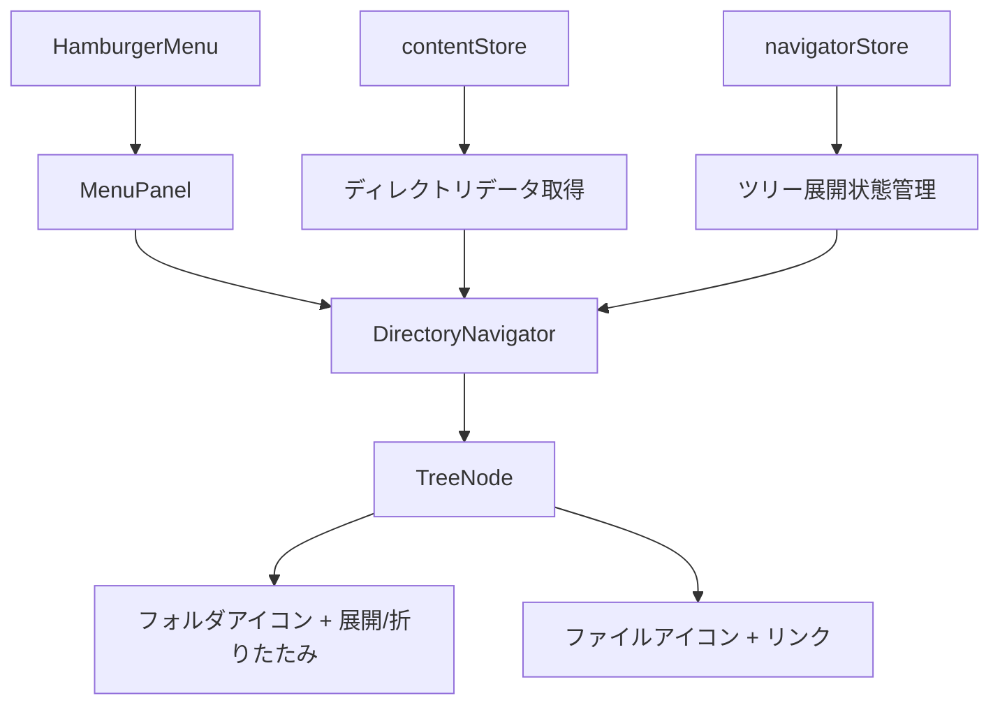

# ハンバーガーメニュー内ディレクトリナビゲーター実装手順書

## 概要
現在のContentExplorerのディレクトリ表示機能を参考に、ハンバーガーメニュー内に階層的なツリー表示ナビゲーターを実装します。フォルダのクリックで展開/折りたたみ、ファイルのクリックで表示切り替えを行います。

## 実装計画



## 必要なコンポーネント

1. **DirectoryNavigator** - メインのナビゲーターコンポーネント
2. **TreeNode** - 個別のツリーノード（フォルダ/ファイル）
3. **navigatorStore** - ツリーの展開状態を管理するZustandストア

## ファイル構成

```
frontend/src/
├── features/
│   └── navigation/
│       ├── components/
│       │   ├── DirectoryNavigator.tsx (新規)
│       │   └── TreeNode.tsx (新規)
│       ├── hooks/
│       │   └── useNavigatorStore.ts (新規)
│       └── types/
│           └── navigation.ts (新規)
├── store/
│   └── navigatorStore.ts (新規)
└── components/layout/menu/
    ├── HamburgerMenu.tsx (既存)
    └── MenuPanel.tsx (既存 - DirectoryNavigatorを統合)
```

## 実装手順

### 1. 型定義の作成

**`frontend/src/features/navigation/types/navigation.ts`**

```typescript
export interface TreeNodeData {
  name: string;
  path: string;
  type: "file" | "dir";
  children?: TreeNodeData[];
  isExpanded?: boolean;
  isLoaded?: boolean;
}

export interface NavigatorState {
  treeData: TreeNodeData[];
  expandedPaths: Set<string>;
  loadingPaths: Set<string>;
  toggleExpanded: (path: string) => void;
  loadDirectory: (path: string) => Promise<void>;
  initializeRoot: () => Promise<void>;
}
```

### 2. NavigatorStore の作成

**`frontend/src/store/navigatorStore.ts`**

```typescript
import { create } from "zustand";
import { devtools } from "zustand/middleware";
import useContentStore from "./contentStore";
import type { NavigatorState, TreeNodeData } from "../features/navigation/types/navigation";

const useNavigatorStore = create<NavigatorState>()(
  devtools(
    (set, get) => ({
      treeData: [],
      expandedPaths: new Set<string>(),
      loadingPaths: new Set<string>(),

      toggleExpanded: async (path: string) => {
        const { expandedPaths, loadDirectory } = get();
        const newExpandedPaths = new Set(expandedPaths);

        if (expandedPaths.has(path)) {
          // 折りたたみ
          newExpandedPaths.delete(path);
        } else {
          // 展開
          newExpandedPaths.add(path);
          // ディレクトリが未読み込みの場合は読み込み
          await loadDirectory(path);
        }

        set({ expandedPaths: newExpandedPaths });
      },

      loadDirectory: async (path: string) => {
        const { loadingPaths } = get();
        if (loadingPaths.has(path)) return; // 既に読み込み中

        const newLoadingPaths = new Set(loadingPaths);
        newLoadingPaths.add(path);
        set({ loadingPaths: newLoadingPaths });

        try {
          // contentStoreを使用してディレクトリ内容を取得
          const contentStore = useContentStore.getState();
          await contentStore.fetchContent(path);

          const content = contentStore.content;
          if (Array.isArray(content)) {
            // ツリーデータを更新
            set((state) => ({
              treeData: updateTreeData(state.treeData, path, content),
              loadingPaths: new Set([...state.loadingPaths].filter(p => p !== path))
            }));
          }
        } catch (error) {
          console.error(`Failed to load directory: ${path}`, error);
          set((state) => ({
            loadingPaths: new Set([...state.loadingPaths].filter(p => p !== path))
          }));
        }
      },

      initializeRoot: async () => {
        const { loadDirectory } = get();
        await loadDirectory("");
      }
    }),
    {
      name: "navigator-store",
    }
  )
);

// ツリーデータを更新するヘルパー関数
function updateTreeData(
  treeData: TreeNodeData[],
  targetPath: string,
  newChildren: any[]
): TreeNodeData[] {
  if (targetPath === "") {
    // ルートディレクトリの場合
    return newChildren.map(item => ({
      name: item.name,
      path: item.path,
      type: item.type,
      children: item.type === "dir" ? [] : undefined,
      isExpanded: false,
      isLoaded: item.type === "file"
    }));
  }

  // 再帰的に対象パスを見つけて更新
  return treeData.map(node => {
    if (node.path === targetPath && node.type === "dir") {
      return {
        ...node,
        children: newChildren.map(item => ({
          name: item.name,
          path: item.path,
          type: item.type,
          children: item.type === "dir" ? [] : undefined,
          isExpanded: false,
          isLoaded: item.type === "file"
        })),
        isLoaded: true
      };
    } else if (node.children) {
      return {
        ...node,
        children: updateTreeData(node.children, targetPath, newChildren)
      };
    }
    return node;
  });
}

export default useNavigatorStore;
```

### 3. TreeNode コンポーネントの作成

**`frontend/src/features/navigation/components/TreeNode.tsx`**

```typescript
import React from "react";
import { Link } from "react-router-dom";
import { ChevronRight, ChevronDown, Folder, FileText } from "lucide-react";
import useNavigatorStore from "../../../store/navigatorStore";
import type { TreeNodeData } from "../types/navigation";

interface TreeNodeProps {
  node: TreeNodeData;
  level: number;
}

function TreeNode({ node, level }: TreeNodeProps) {
  const { expandedPaths, loadingPaths, toggleExpanded } = useNavigatorStore();

  const isExpanded = expandedPaths.has(node.path);
  const isLoading = loadingPaths.has(node.path);
  const hasChildren = node.children && node.children.length > 0;

  const handleFolderClick = (e: React.MouseEvent) => {
    e.preventDefault();
    if (node.type === "dir") {
      toggleExpanded(node.path);
    }
  };

  const indentStyle = {
    paddingLeft: `${level * 16 + 8}px`
  };

  if (node.type === "file") {
    return (
      <div>
        <Link
          to={`/view/${node.path}`}
          className="flex items-center py-1 px-2 hover:bg-gray-100 text-sm text-gray-700 hover:text-gray-900 transition-colors"
          style={indentStyle}
        >
          <FileText className="w-4 h-4 mr-2 text-gray-500 flex-shrink-0" />
          <span className="truncate">
            {node.name.endsWith(".md") ? node.name.slice(0, -3) : node.name}
          </span>
        </Link>
      </div>
    );
  }

  return (
    <div>
      <div
        className="flex items-center py-1 px-2 hover:bg-gray-100 cursor-pointer text-sm text-gray-700 hover:text-gray-900 transition-colors"
        style={indentStyle}
        onClick={handleFolderClick}
      >
        <div className="w-4 h-4 mr-1 flex items-center justify-center flex-shrink-0">
          {isLoading ? (
            <div className="w-3 h-3 border border-gray-400 border-t-transparent rounded-full animate-spin" />
          ) : hasChildren || !node.isLoaded ? (
            isExpanded ? (
              <ChevronDown className="w-4 h-4" />
            ) : (
              <ChevronRight className="w-4 h-4" />
            )
          ) : null}
        </div>
        <Folder className="w-4 h-4 mr-2 text-blue-500 flex-shrink-0" />
        <span className="truncate">{node.name}</span>
      </div>

      {isExpanded && hasChildren && (
        <div>
          {node.children!.map((child) => (
            <TreeNode
              key={child.path}
              node={child}
              level={level + 1}
            />
          ))}
        </div>
      )}
    </div>
  );
}

export default TreeNode;
```

### 4. DirectoryNavigator コンポーネントの作成

**`frontend/src/features/navigation/components/DirectoryNavigator.tsx`**

```typescript
import React, { useEffect } from "react";
import useNavigatorStore from "../../../store/navigatorStore";
import TreeNode from "./TreeNode";

function DirectoryNavigator() {
  const { treeData, initializeRoot } = useNavigatorStore();

  useEffect(() => {
    // コンポーネントマウント時にルートディレクトリを初期化
    initializeRoot();
  }, [initializeRoot]);

  return (
    <div className="w-full">
      <div className="mb-3">
        <h3 className="text-sm font-semibold text-gray-700 px-2">
          ディレクトリ
        </h3>
      </div>

      <div className="max-h-96 overflow-y-auto">
        {treeData.length === 0 ? (
          <div className="px-2 py-4 text-sm text-gray-500 text-center">
            読み込み中...
          </div>
        ) : (
          <div>
            {treeData.map((node) => (
              <TreeNode
                key={node.path}
                node={node}
                level={0}
              />
            ))}
          </div>
        )}
      </div>
    </div>
  );
}

export default DirectoryNavigator;
```

### 5. カスタムフックの作成（オプション）

**`frontend/src/features/navigation/hooks/useNavigatorStore.ts`**

```typescript
import useNavigatorStore from "../../../store/navigatorStore";

// 必要に応じてナビゲーター専用のカスタムフックを作成
export function useDirectoryNavigation() {
  const {
    treeData,
    expandedPaths,
    loadingPaths,
    toggleExpanded,
    loadDirectory,
    initializeRoot
  } = useNavigatorStore();

  return {
    treeData,
    expandedPaths,
    loadingPaths,
    toggleExpanded,
    loadDirectory,
    initializeRoot
  };
}

export default useNavigatorStore;
```

### 6. MenuPanel への統合

**`frontend/src/components/layout/menu/MenuPanel.tsx`** を更新

```typescript
import React from "react";
import DirectoryNavigator from "../../../features/navigation/components/DirectoryNavigator";

interface MenuPanelProps {
  isOpen: boolean;
  isMobile: boolean;
  children?: React.ReactNode;
}

function MenuPanel({ isOpen, isMobile, children }: MenuPanelProps) {
  return (
    <nav
      className={`
        ${
          isMobile
            ? `fixed top-0 left-0 h-screen w-64 bg-white border-r border-gray-300 z-40 transition-transform duration-300 ease-in-out ${
                isOpen ? "translate-x-0" : "-translate-x-full"
              }`
            : "w-64 bg-white border-r border-gray-300 h-full"
        }
      `}
      aria-label="ナビゲーションメニュー"
    >
      {/* モバイル版でヘッダーエリア用の透明領域 */}
      {isMobile && <div className="h-16 bg-transparent pointer-events-none" />}

      <div className="p-4">
        {/* ディレクトリナビゲーター */}
        <DirectoryNavigator />

        {/* 区切り線 */}
        {children && <hr className="my-4 border-gray-200" />}

        {/* 既存のメニューコンテンツ */}
        {children || (
          <div className="text-gray-500 text-sm">
            その他のメニューコンテンツ
          </div>
        )}
      </div>
    </nav>
  );
}

export default MenuPanel;
```

## 技術仕様

### データフロー
1. DirectoryNavigator が初期化時に `initializeRoot()` を呼び出し
2. navigatorStore が contentStore を使用してルートディレクトリを取得
3. TreeNode がフォルダクリック時に `toggleExpanded()` を呼び出し
4. 必要に応じて新しいディレクトリデータを取得・更新

### パフォーマンス最適化
- 遅延読み込み：フォルダ展開時のみディレクトリ内容を取得
- React.memo：不要な再レンダリングを防止
- Set を使用した効率的な展開状態管理

### UI/UX 特徴
- lucide-react アイコンを使用
- ホバー効果とスムーズなトランジション
- 読み込み中のスピナー表示
- 適切なインデントによる階層表示
- .md ファイルの拡張子を非表示

### エラーハンドリング
- ディレクトリ読み込み失敗時のコンソールエラー出力
- 読み込み状態の適切な管理
- フォールバック表示

## 実装後の動作

1. ハンバーガーメニューを開くとディレクトリナビゲーターが表示
2. フォルダアイコンをクリックすると展開/折りたたみ
3. ファイルをクリックするとそのファイルに遷移
4. メニューが自動で閉じる（React Routerの標準動作）

## 今後の拡張可能性

- 検索機能の追加
- ファイルタイプ別のアイコン表示
- ドラッグ&ドロップ対応
- コンテキストメニュー
- お気に入り機能
