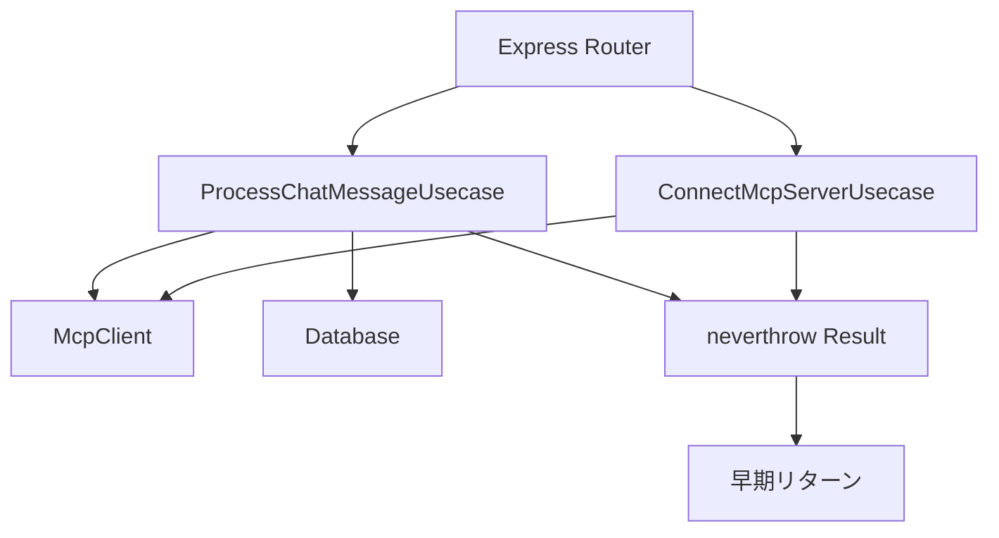

# neverthrowを用いたUsecaseパターン設計書

## 1. 概要
backend/src/routes/chat.ts の POST / と POST /connect エンドポイントを neverthrow を用いた Usecase パターンで書き直します。

## 2. 現状分析
- 現在のchat.tsには3つのエンドポイントが存在
  - POST / : チャットメッセージ処理
  - POST /connect : MCPサーバー接続
  - GET /status : ステータス確認（今回は対象外）
- try-catchによるエラーハンドリング
- ルーター内にビジネスロジックが混在

## 3. アーキテクチャ図



## 4. ディレクトリ構造
```
backend/src/
├── types/
│   ├── errors.ts
│   └── requests.ts
├── usecases/
│   ├── ProcessChatMessageUsecase.ts
│   └── ConnectMcpServerUsecase.ts
└── routes/
    └── chat.ts (リファクタリング)
```

## 5. 実装詳細

### 5.1 依存関係追加
- package.json に `neverthrow` を追加

### 5.2 エラー型定義 (types/errors.ts)
```typescript
export class ValidationError extends Error {
  constructor(message: string) {
    super(message);
    this.name = 'ValidationError';
  }
}

export class McpClientError extends Error {
  constructor(message: string) {
    super(message);
    this.name = 'McpClientError';
  }
}

export class DatabaseError extends Error {
  constructor(message: string) {
    super(message);
    this.name = 'DatabaseError';
  }
}

export class EnvironmentError extends Error {
  constructor(message: string) {
    super(message);
    this.name = 'EnvironmentError';
  }
}
```

### 5.3 リクエスト型定義 (types/requests.ts)
```typescript
export interface ChatMessageRequest {
  message: string;
  history?: any[];
  branchId?: string;
  fileContent?: string;
  userName?: string;
  filePath?: string;
}

export interface ChatMessageResponse {
  response: string;
}

export interface ConnectMcpServerResponse {
  success: boolean;
  message: string;
}
```

### 5.4 ProcessChatMessageUsecase
```typescript
import { Result, ok, err } from 'neverthrow';
import { db } from '../db/index.js';
import { interactionLogs } from '../db/schema.js';
import { McpClient } from '../mcp/client.js';
import { logger } from '../utils/logger.js';
import { ValidationError, McpClientError, DatabaseError } from '../types/errors.js';
import { ChatMessageRequest, ChatMessageResponse } from '../types/requests.js';

export class ProcessChatMessageUsecase {
  constructor(private mcpClient: McpClient | null) {}

  async execute(request: ChatMessageRequest): Promise<Result<ChatMessageResponse, ValidationError | McpClientError | DatabaseError>> {
    // 入力バリデーション
    const validationResult = this.validateInput(request);
    if (validationResult.isErr()) {
      return err(validationResult.error);
    }

    // MCPクライアント存在確認
    if (!this.mcpClient) {
      return err(new McpClientError('MCP client is not initialized'));
    }

    // MCPクエリ処理
    const mcpResult = await this.processMcpQuery(request);
    if (mcpResult.isErr()) {
      return err(mcpResult.error);
    }

    // インタラクションログ記録
    const logResult = await this.logInteraction(request, mcpResult.value);
    if (logResult.isErr()) {
      // ログ失敗は処理を止めない
      logger.error('Failed to log interaction:', logResult.error);
    }

    return ok({ response: mcpResult.value });
  }

  private validateInput(request: ChatMessageRequest): Result<ChatMessageRequest, ValidationError> {
    if (!request.message || typeof request.message !== 'string') {
      return err(new ValidationError('Message is required and must be a string'));
    }

    if (request.branchId && typeof request.branchId !== 'string') {
      return err(new ValidationError('branchId must be a string if provided'));
    }

    if (request.fileContent && typeof request.fileContent !== 'string') {
      return err(new ValidationError('fileContent must be a string if provided'));
    }

    if (request.userName && typeof request.userName !== 'string') {
      return err(new ValidationError('userName must be a string if provided'));
    }

    if (request.filePath && typeof request.filePath !== 'string') {
      return err(new ValidationError('filePath must be a string if provided'));
    }

    if (request.history && !Array.isArray(request.history)) {
      return err(new ValidationError('History must be an array of messages'));
    }

    return ok(request);
  }

  private async processMcpQuery(request: ChatMessageRequest): Promise<Result<string, McpClientError>> {
    try {
      const response = await this.mcpClient!.processQuery(
        request.message,
        request.history || [],
        request.branchId,
        request.fileContent,
        request.userName,
        request.filePath
      );
      return ok(response);
    } catch (error) {
      return err(new McpClientError(`Failed to process MCP query: ${error instanceof Error ? error.message : 'Unknown error'}`));
    }
  }

  private async logInteraction(request: ChatMessageRequest, response: string): Promise<Result<void, DatabaseError>> {
    try {
      const sessionIdToLog = request.userName || 'unknown_user';
      await db.insert(interactionLogs).values({
        sessionId: sessionIdToLog,
        userMessage: request.message,
        aiMessage: typeof response === 'string' ? response : JSON.stringify(response),
      });
      logger.info(`Interaction logged for session: ${sessionIdToLog}`);
      return ok(undefined);
    } catch (error) {
      return err(new DatabaseError(`Failed to log interaction: ${error instanceof Error ? error.message : 'Unknown error'}`));
    }
  }
}
```

### 5.5 ConnectMcpServerUsecase
```typescript
import { Result, ok, err } from 'neverthrow';
import { McpClient } from '../mcp/client.js';
import { logger } from '../utils/logger.js';
import { EnvironmentError, McpClientError } from '../types/errors.js';
import { ConnectMcpServerResponse } from '../types/requests.js';

export class ConnectMcpServerUsecase {
  constructor(private mcpClientRef: { current: McpClient | null }) {}

  async execute(): Promise<Result<ConnectMcpServerResponse, EnvironmentError | McpClientError>> {
    // 環境変数バリデーション
    const serverPath = process.env.MCP_SERVER_PATH;
    if (!serverPath || typeof serverPath !== 'string') {
      return err(new EnvironmentError('MCP_SERVER_PATH environment variable is not configured correctly'));
    }

    // 既存接続のクリーンアップ
    const cleanupResult = await this.cleanupExistingConnection();
    if (cleanupResult.isErr()) {
      return err(cleanupResult.error);
    }

    // 新規接続の確立
    const connectResult = await this.establishConnection(serverPath);
    if (connectResult.isErr()) {
      return err(connectResult.error);
    }

    return ok({
      success: true,
      message: `Connected to MCP server at ${serverPath}`
    });
  }

  private async cleanupExistingConnection(): Promise<Result<void, McpClientError>> {
    try {
      if (this.mcpClientRef.current) {
        await this.mcpClientRef.current.cleanup();
      }
      return ok(undefined);
    } catch (error) {
      return err(new McpClientError(`Failed to cleanup existing connection: ${error instanceof Error ? error.message : 'Unknown error'}`));
    }
  }

  private async establishConnection(serverPath: string): Promise<Result<void, McpClientError>> {
    try {
      this.mcpClientRef.current = new McpClient();
      await this.mcpClientRef.current.connectToServer(serverPath);
      logger.info(`MCP client connected to server at ${serverPath}`);
      return ok(undefined);
    } catch (error) {
      logger.error('Failed to initialize MCP client:', error);
      this.mcpClientRef.current = null;
      return err(new McpClientError(`Failed to connect to MCP server: ${error instanceof Error ? error.message : 'Unknown error'}`));
    }
  }
}
```

### 5.6 ルーターのリファクタリング
```typescript
import express from "express";
import { ProcessChatMessageUsecase } from "../usecases/ProcessChatMessageUsecase.js";
import { ConnectMcpServerUsecase } from "../usecases/ConnectMcpServerUsecase.js";
import { McpClient } from "../mcp/client.js";
import { ValidationError, McpClientError, DatabaseError, EnvironmentError } from "../types/errors.js";

const router = express.Router();
let mcpClientRef = { current: null as McpClient | null };

// POST /api/chat - Process a chat message
router.post("/", async (req, res) => {
  const usecase = new ProcessChatMessageUsecase(mcpClientRef.current);
  const result = await usecase.execute(req.body);

  if (result.isErr()) {
    const error = result.error;
    if (error instanceof ValidationError) {
      return res.status(400).json({ error: error.message });
    }
    if (error instanceof McpClientError) {
      return res.status(500).json({ error: error.message });
    }
    if (error instanceof DatabaseError) {
      return res.status(500).json({ error: 'Internal server error' });
    }
    return res.status(500).json({ error: 'Unknown error' });
  }

  return res.json(result.value);
});

// POST /api/chat/connect - Connect to the MCP server
router.post("/connect", async (req, res) => {
  const usecase = new ConnectMcpServerUsecase(mcpClientRef);
  const result = await usecase.execute();

  if (result.isErr()) {
    const error = result.error;
    if (error instanceof EnvironmentError) {
      return res.status(400).json({ error: error.message });
    }
    if (error instanceof McpClientError) {
      return res.status(500).json({ error: error.message });
    }
    return res.status(500).json({ error: 'Unknown error' });
  }

  return res.json(result.value);
});

// GET /api/chat/status - Check MCP client status (変更なし)
router.get("/status", (req, res) => {
  return res.json({
    initialized: mcpClientRef.current !== null,
    tools: mcpClientRef.current ? mcpClientRef.current.tools : [],
  });
});

export default router;
```

## 6. neverthrow使用パターン

### 6.1 早期リターンパターン
```typescript
const usecase = async (input: Input): Promise<Result<Output, Error>> => {
  const validationResult = validateInput(input);
  if (validationResult.isErr()) {
    return err(validationResult.error);
  }

  const businessResult = await businessLogic(validationResult.value);
  if (businessResult.isErr()) {
    return err(businessResult.error);
  }

  return ok(businessResult.value);
};
```

### 6.2 try-catchを使わない
- 全てのエラーハンドリングをResult型で統一
- 例外が発生する可能性のある箇所はtry-catchでキャッチしてResult型に変換

## 7. 実装手順
1. neverthrow依存関係追加
2. usecasesディレクトリ作成
3. エラー型・リクエスト型定義
4. ProcessChatMessageUsecase実装
5. ConnectMcpServerUsecase実装
6. ルーターのリファクタリング
7. テスト実行

## 8. メリット
- **責務の分離**: ルーターはHTTPハンドリングのみ、ビジネスロジックはUsecaseに集約
- **エラーハンドリングの統一**: neverthrowによる型安全なエラーハンドリング
- **テスタビリティの向上**: 依存関係の注入により単体テストが容易
- **保守性の向上**: 各Usecaseが独立しており、変更の影響範囲が限定的
- **型安全性**: Result型により実行時エラーを型レベルで防止

## 9. 注意点
- MCPServiceは将来的に作成予定だが、今回はベタ書きで実装
- データベースエラーは処理を止めずにログ出力のみ
- 環境変数の検証を強化
- エラーメッセージの統一化
