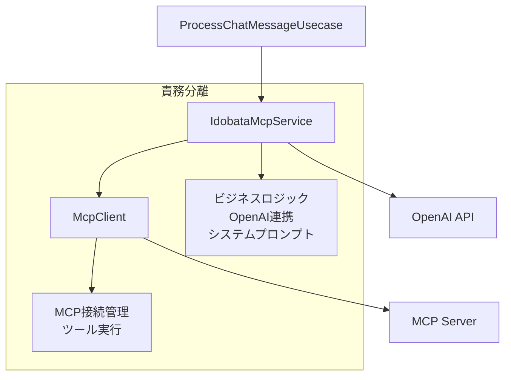

# MCP Client分離設計書

**作成日時**: 2025年6月1日 00:56
**対象ファイル**: `backend/src/mcp/client.ts`

## 概要

現在の`McpClient`クラスを、汎用的なMCP接続管理を行う`McpClient`と、Idobata固有のビジネスロジックを担当する`IdobataMcpService`に分離する。

## 現在の問題点

### 責務の混在
現在の`McpClient`クラスは以下の責務を混在させている：

1. **MCP接続管理** - サーバーへの接続、ツール一覧取得、ツール実行
2. **OpenAI API連携** - チャット補完API呼び出し、レスポンス処理
3. **Idobata固有ロジック** - システムプロンプト管理、コンテキスト構築
4. **エラーハンドリング** - try-catch による例外処理

### エラーハンドリングの問題
- try-catchを多用している
- neverthrowのmatchパターンを使用していない
- 早期リターンパターンが実装されていない

## 設計目標

### アーキテクチャ図



### 責務分離

#### McpClient（汎用MCPクライアント）
- **責務**: MCP接続管理、ツール実行のみ
- **特徴**: Idobataに依存しない汎用的な実装
- **エラーハンドリング**: neverthrowを使用、早期リターン

#### IdobataMcpService（Idobata固有サービス）
- **責務**:
  - OpenAI APIとの連携
  - システムプロンプト管理
  - ツール呼び出し制御
  - コンテキスト構築
  - Idobata固有のビジネスロジック
- **エラーハンドリング**: neverthrowを使用、早期リターン

## 実装手順

### Phase 1: McpClientの分離

#### 1.1 新しいMcpClientクラスの作成
- ファイル: `backend/src/mcp/client.ts`
- 責務: MCP接続とツール実行のみ
- neverthrowによるエラーハンドリング

```typescript
// 新しいMcpClientのインターface例
interface McpClientInterface {
  connectToServer(serverScriptPath: string): Promise<Result<void, McpClientError>>;
  listTools(): Result<McpTool[], McpClientError>;
  callTool(name: string, args: Record<string, unknown>): Promise<Result<unknown, McpClientError>>;
  isConnected(): boolean;
  cleanup(): Promise<Result<void, McpClientError>>;
}
```

#### 1.2 エラーハンドリングの変更
- try-catchを削除
- neverthrowの早期リターンパターンを採用

```typescript
// 早期リターンパターン例
async function connectToServer(serverScriptPath: string): Promise<Result<void, McpClientError>> {
  const validationResult = validateServerPath(serverScriptPath);
  if (validationResult.isErr()) return err(validationResult.error);

  const transportResult = await createTransport(serverScriptPath);
  if (transportResult.isErr()) return err(transportResult.error);

  const connectionResult = await establishConnection(transportResult.value);
  if (connectionResult.isErr()) return err(connectionResult.error);

  return ok(undefined);
}
```

### Phase 2: IdobataMcpServiceの作成

#### 2.1 新しいサービスクラスの作成
- ファイル: `backend/src/mcp/idobataMcpService.ts`
- McpClientを依存として受け取る

```typescript
// IdobataMcpServiceのインターface例
interface IdobataMcpServiceInterface {
  processQuery(
    query: string,
    history: OpenAI.Chat.ChatCompletionMessageParam[],
    branchId?: string,
    fileContent?: string,
    userName?: string,
    filePath?: string
  ): Promise<Result<string, IdobataMcpServiceError>>;
}
```

#### 2.2 OpenAI API連携の移行
- 現在の`processQuery`メソッドをIdobataMcpServiceに移行
- システムプロンプト管理の実装
- コンテキスト構築ロジックの移行

#### 2.3 ツール呼び出し制御
- McpClientを使用したツール実行
- OpenAI APIとMCPツールの連携

### Phase 3: 統合とテスト

#### 3.1 ProcessChatMessageUsecaseの更新
- IdobataMcpServiceを使用するように変更
- エラーハンドリングの統一

```typescript
// 更新後のUsecase例
export class ProcessChatMessageUsecase {
  constructor(private idobataMcpService: IdobataMcpService) {}

  async execute(request: ChatMessageRequest): Promise<Result<ChatMessageResponse, UsecaseError>> {
    const validationResult = this.validateInput(request);
    if (validationResult.isErr()) return err(validationResult.error);

    const serviceResult = await this.idobataMcpService.processQuery(
      request.message,
      request.history || [],
      request.branchId,
      request.fileContent,
      request.userName,
      request.filePath
    );
    if (serviceResult.isErr()) return err(serviceResult.error);

    const logResult = await this.logInteraction(request, serviceResult.value);
    if (logResult.isErr()) {
      logger.error("Failed to log interaction:", logResult.error);
    }

    return ok({ response: serviceResult.value });
  }
}
```

#### 3.2 エラー型の追加
- `IdobataMcpServiceError`の定義
- 既存エラー型との整合性確保

## neverthrowパターンの適用

### 基本原則
1. **try-catchは使わない**
2. **matchパターンは使わず、errを早期リターンする**
3. **Result型を一貫して使用する**

### 実装例

```typescript
// ❌ 避けるべきパターン（try-catch）
async function badExample(): Promise<string> {
  try {
    const result = await someOperation();
    return result;
  } catch (error) {
    throw new Error("Operation failed");
  }
}

// ❌ 避けるべきパターン（match）
async function badExample2(): Promise<Result<string, Error>> {
  const result = await someOperation();
  return result.match(
    (value) => ok(value),
    (error) => err(error)
  );
}

// ✅ 推奨パターン（早期リターン）
async function goodExample(): Promise<Result<string, Error>> {
  const result1 = await operation1();
  if (result1.isErr()) return err(result1.error);

  const result2 = await operation2(result1.value);
  if (result2.isErr()) return err(result2.error);

  return ok(result2.value);
}
```

## ファイル構成

### 新規作成ファイル
- `backend/src/mcp/idobataMcpService.ts` - Idobata固有のMCPサービス
- `backend/src/types/mcpErrors.ts` - MCP関連のエラー型定義

### 変更ファイル
- `backend/src/mcp/client.ts` - 汎用MCPクライアントに変更
- `backend/src/usecases/ProcessChatMessageUsecase.ts` - IdobataMcpServiceを使用
- `backend/src/types/errors.ts` - 新しいエラー型の追加

## 期待される効果

### 保守性の向上
- 責務が明確に分離される
- テストが書きやすくなる
- 変更の影響範囲が限定される

### 再利用性の向上
- McpClientが汎用的になり、他のプロジェクトでも使用可能
- Idobata固有のロジックが分離される

### エラーハンドリングの改善
- neverthrowによる型安全なエラーハンドリング
- 早期リターンによる可読性の向上

## 実装時の注意点

### 1. 段階的な移行
- 既存機能を壊さないよう、段階的に移行する
- 各フェーズで動作確認を行う

### 2. テストの追加
- 新しいクラスに対するユニットテストを追加
- 統合テストで全体の動作を確認

### 3. 型安全性の確保
- neverthrowのResult型を一貫して使用
- エラー型を明確に定義

### 4. ログ出力の統一
- 既存のloggerを使用
- エラーレベルの統一

## 次のステップ

1. **設計レビュー**: この設計書の内容を確認・承認
2. **実装開始**: Phase 1から順次実装
3. **テスト**: 各フェーズでの動作確認
4. **デプロイ**: 段階的なリリース

---

**注意**: この設計書は実装前の計画段階のものです。実装時に詳細な調整が必要になる可能性があります。
