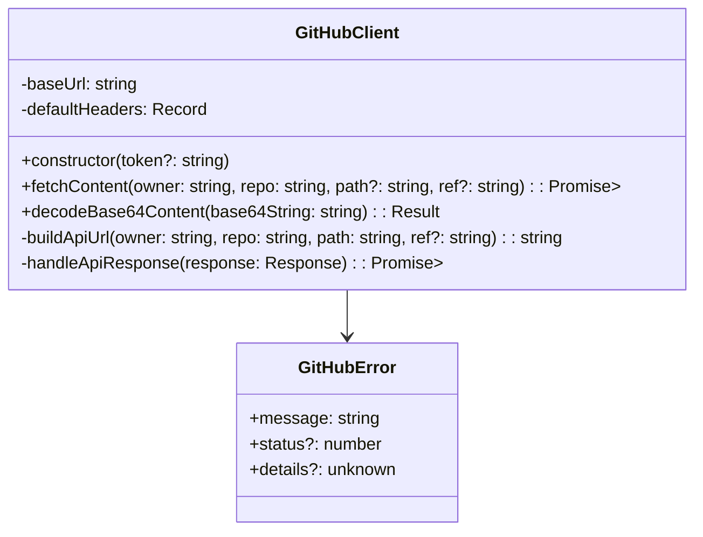

# GitHubClientクラスリファクタリング設計書

## 概要

`frontend/src/lib/github.ts` を関数ベースからクラスベースに変更し、neverthrowを使用したエラーハンドリングを実装する。

## 現在の課題

1. 関数ベースの実装で例外をthrowする形になっている
2. neverthrowのResult型を使用していない
3. エラーハンドリングが他のAPIクライアント（HttpClient、ChatApiClient）と一貫していない

## 設計方針

### 1. シンプルなエラー型

```typescript
export interface GitHubError {
  message: string;
  status?: number;
  details?: unknown;
}
```

- エラーの種類は細かく分けず、メッセージで判断できるようにする
- 必要に応じてHTTPステータスコードを含める

### 2. GitHubClientクラス

```typescript
export class GitHubClient {
  private readonly baseUrl = 'https://api.github.com';
  private readonly defaultHeaders: Record<string, string>;

  constructor(token?: string) {
    this.defaultHeaders = {
      'Accept': 'application/vnd.github.v3+json',
      ...(token && { 'Authorization': `token ${token}` })
    };
  }

  async fetchContent(
    owner: string,
    repo: string,
    path = "",
    ref?: string
  ): Promise<Result<GitHubFile | GitHubDirectoryItem[], GitHubError>>

  decodeBase64Content(base64String: string): Result<string, GitHubError>
}
```

### 3. 主要な機能

- **認証トークンのサポート**: コンストラクタでオプショナルなトークンを受け取り
- **Result型の使用**: すべてのメソッドでneverthrowのResult型を返却
- **一貫したエラーハンドリング**: 他のAPIクライアントと同様の形式

## クラス図



## 実装の流れ

### Phase 1: 新しいGitHubClientクラスの実装

1. GitHubError型の定義
2. GitHubClientクラスの実装
3. fetchContentメソッドの実装（Result型を返す）
4. decodeBase64Contentメソッドの実装（Result型を返す）

### Phase 2: 既存コードの更新

1. `contentStore.ts`での使用箇所を更新
2. テストファイル`github.test.ts`の更新
3. 他の使用箇所があれば更新

## 使用例の比較

### 現在の使用方法（例外ベース）

```typescript
try {
  const content = await fetchGitHubContent(owner, repo, path);
  // 処理...
} catch (error) {
  // エラーハンドリング
}
```

### 新しい使用方法（Result型ベース - 早期リターンパターン）

```typescript
const client = new GitHubClient();
const result = await client.fetchContent(owner, repo, path);

if (result.isErr()) {
  const error = result.error;
  console.error(`GitHub API Error: ${error.message}`);
  return; // 早期リターン
}

const content = result.value;
// 正常な処理を続行...
```

## 既存コードへの影響

### contentStore.ts

- `fetchGitHubContent`の呼び出し箇所をGitHubClientクラスの使用に変更
- try-catch文をResult型の早期リターンパターンに変更
- エラー時は早期リターンでエラー状態を設定

### github.test.ts

- テストケースをResult型に対応するよう更新
- エラーケースのテストを例外からResult.Errに変更

## メリット

1. **一貫性**: 他のAPIクライアントと同じパターンでエラーハンドリング
2. **型安全性**: neverthrowによる型安全なエラーハンドリング
3. **拡張性**: クラスベースで将来的な機能追加が容易
4. **テスタビリティ**: モックやスタブが作りやすい

## 実装スケジュール

1. GitHubClientクラスの実装
2. 既存コードの更新
3. テストの更新
4. 動作確認

この設計で実装を進めます。
