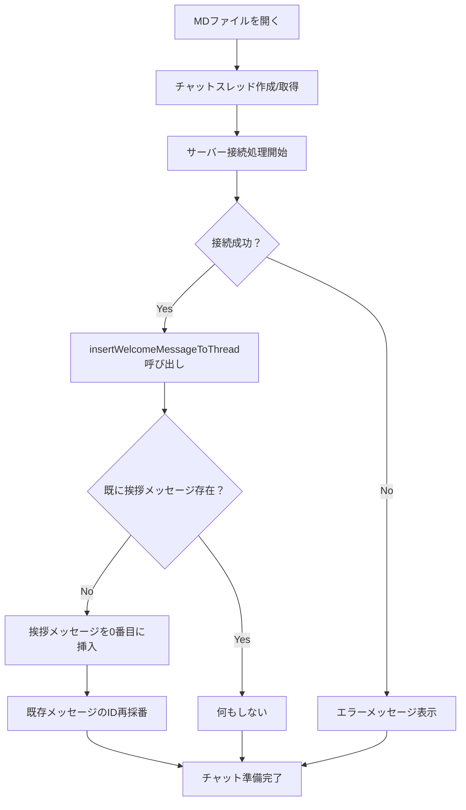

# チャット挨拶メッセージ実装計画

## 概要
すべての会話セッションの1件目にAIの挨拶メッセージを自動挿入する機能を実装する。

## 要件
- **挨拶メッセージ**: 「こんにちは。私はこのドキュメントについて、要約したり、変更提案を受け付けるAIです。何か気になることはありますか？」
- **挿入タイミング**: MDファイルを開いてサーバーに接続が完了した時
- **挿入位置**: 既存チャットメッセージの0番目（先頭）
- **重複防止**: 既に挨拶メッセージが存在する場合は追加しない

## 現在のコード分析

### ChatPanel.tsx の関連箇所
1. **チャットスレッド作成**: `useEffect`でMDファイルがアクティブになった時に`createChatThread()`を呼び出し
2. **サーバー接続処理**: `initializeConnection()`で自動接続を実行
3. **接続完了時の処理**: 現在は「サーバーに自動接続しました。」メッセージを追加

### contentStore.ts の関連箇所
1. **チャットスレッド管理**: `chatThreads`でファイルパス毎にスレッドを管理
2. **メッセージ追加**: `addMessageToThread()`でメッセージを末尾に追加
3. **メッセージID管理**: `nextMessageId`で連番を管理

## 実装設計

### 1. contentStore.ts の拡張

#### 新しいアクション追加
```typescript
insertWelcomeMessageToThread: (path: string) => void;
```

#### 実装詳細
- 指定されたパスのチャットスレッドの先頭に挨拶メッセージを挿入
- 既存メッセージのIDを再採番（1から連番で振り直し）
- 挨拶メッセージの重複チェック機能

#### 挨拶メッセージ判定ロジック
```typescript
const isWelcomeMessage = (text: string): boolean => {
  return text.includes("こんにちは。私はこのドキュメントについて");
};
```

### 2. ChatPanel.tsx の修正

#### initializeConnection関数の変更
- 接続成功時に`insertWelcomeMessageToThread()`を呼び出し
- 既存の「サーバーに自動接続しました。」メッセージは削除

#### 手動接続ボタンの変更
- 手動接続成功時も挨拶メッセージを挿入
- 既存の「手動接続に成功しました。」メッセージは削除

## 実装フロー



## 実装手順

### Step 1: contentStore.ts の拡張
1. `insertWelcomeMessageToThread`アクションを追加
2. 挨拶メッセージ判定関数を実装
3. メッセージID再採番ロジックを実装

### Step 2: ChatPanel.tsx の修正
1. `initializeConnection`関数内の接続成功時処理を修正
2. 手動接続ボタンのクリックハンドラーを修正
3. 既存の接続メッセージを削除

### Step 3: テスト
1. 新規MDファイルを開いた時の動作確認
2. 既存チャットがあるMDファイルを開いた時の動作確認
3. 手動接続時の動作確認

## 変更対象ファイル

1. **frontend/src/store/contentStore.ts**
   - `insertWelcomeMessageToThread`アクションの追加
   - インターface `ContentState`の更新

2. **frontend/src/components/chat/ChatPanel.tsx**
   - `initializeConnection`関数の修正
   - 手動接続ボタンのイベントハンドラー修正

## 注意点

1. **メッセージID整合性**: 挨拶メッセージ挿入時に既存メッセージのIDを適切に再採番
2. **重複防止**: 同じスレッドに複数回挨拶メッセージが追加されないよう制御
3. **エラーハンドリング**: 接続失敗時は挨拶メッセージを追加しない
4. **パフォーマンス**: メッセージ挿入処理が重くならないよう最適化

## 期待される動作

### 新規MDファイルを開いた場合
1. チャットスレッドが作成される
2. サーバー接続が完了する
3. 挨拶メッセージが自動的に表示される

### 既存チャットがあるMDファイルを開いた場合
1. 既存のチャットスレッドを取得
2. サーバー接続が完了する
3. 挨拶メッセージが先頭に挿入される（まだない場合のみ）
4. 既存メッセージは挨拶メッセージの後に表示される
