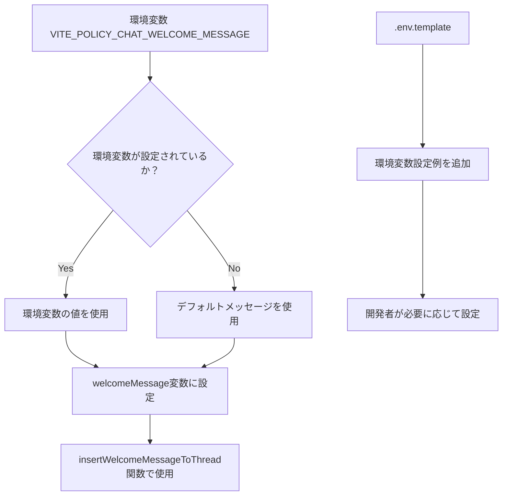

# チャット挨拶メッセージ環境変数対応実装計画

## 概要
`policy-edit/frontend/src/store/contentStore.ts`のwelcomeMessageを環境変数`VITE_POLICY_CHAT_WELCOME_MESSAGE`から取得できるように変更し、現在のメッセージをデフォルト値として保持する。

## 現状分析
現在、`policy-edit/frontend/src/store/contentStore.ts`の215行目で、チャットの挨拶メッセージがハードコーディングされている：

```typescript
const welcomeMessage = "こんにちは。私はこのドキュメントについて、要約したり、変更提案を受け付けるAIです。何か気になることはありますか？";
```

## 実装詳細

### 処理フロー


### 変更ファイル

1. **policy-edit/frontend/src/store/contentStore.ts**
   - 215行目のwelcomeMessage定義を環境変数対応に変更

2. **.env.template**
   - `VITE_POLICY_CHAT_WELCOME_MESSAGE`の設定例を追加

## 実装コード

### contentStore.tsの変更（215行目）
```typescript
// 変更前
const welcomeMessage = "こんにちは。私はこのドキュメントについて、要約したり、変更提案を受け付けるAIです。何か気になることはありますか？";

// 変更後
const welcomeMessage = import.meta.env.VITE_POLICY_CHAT_WELCOME_MESSAGE || "こんにちは。私はこのドキュメントについて、要約したり、変更提案を受け付けるAIです。何か気になることはありますか？";
```

### .env.templateへの追加
```bash
# Policy Chat Welcome Message Configuration
# ポリシー編集画面のチャット開始時に表示される挨拶メッセージをカスタマイズできます
# 設定しない場合は、デフォルトメッセージが使用されます
VITE_POLICY_CHAT_WELCOME_MESSAGE="こんにちは。私はこのドキュメントについて、要約したり、変更提案を受け付けるAIです。何か気になることはありますか？"
```

## 技術仕様

- **環境変数名**: `VITE_POLICY_CHAT_WELCOME_MESSAGE`
- **デフォルト値**: 現在のハードコーディングされたメッセージ
- **取得方法**: `import.meta.env.VITE_POLICY_CHAT_WELCOME_MESSAGE`
- **フォールバック**: 環境変数が未設定の場合、デフォルトメッセージを使用

## メリット

1. **後方互換性**: 既存の動作を変更せず、環境変数が未設定でも正常動作
2. **柔軟性**: 環境ごとに異なるメッセージを設定可能
3. **保守性**: メッセージ変更時にコードの再ビルドが不要
4. **明確性**: `POLICY`プレフィックスにより、どのアプリケーション用かが明確

## 考慮事項

- Viteの環境変数は`VITE_`プレフィックスが必要（フロントエンドで使用するため）
- 環境変数の値は文字列として扱われる
- 改行やHTMLタグが含まれる場合の処理は現在の実装に依存

## 実装手順

1. `policy-edit/frontend/src/store/contentStore.ts`の215行目を修正
2. `.env.template`に環境変数設定例を追加
3. 動作確認
   - 環境変数未設定時：デフォルトメッセージが表示されること
   - 環境変数設定時：設定したメッセージが表示されること

## 作成日時
2025年6月14日 21:48
