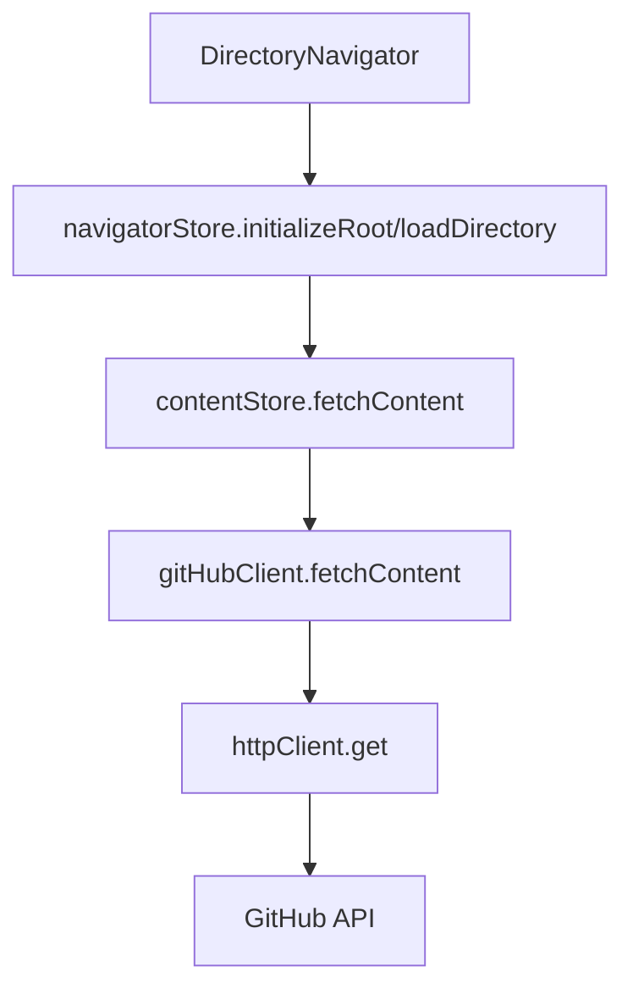

# DirectoryNavigator APIキャッシュ機能実装設計書

**作成日時**: 2025年6月14日 23:09
**対象コンポーネント**: `policy-edit/frontend/src/components/layout/menu/DirectoryNavigator.tsx`
**目的**: 同じAPIリクエストを何度もしないようにキャッシュする仕組みを実装（キャッシュ保持期間: 1時間）

## 現在の構造分析

### APIリクエストフロー



### 現在のファイル構成

- `DirectoryNavigator.tsx`: UIコンポーネント
- `navigatorStore.ts`: ツリー状態管理（Zustand）
- `contentStore.ts`: コンテンツ取得・管理（Zustand）
- `GitHubClient.ts`: GitHub API通信クライアント
- `api.ts`: クライアントインスタンス作成

## キャッシュ実装方針

### 実装レベル選択

**GitHubClientレベル（最も内側）**でキャッシュを実装する理由：

1. **透明性**: 上位レイヤー（contentStore、navigatorStore）は変更不要
2. **一元管理**: 全てのGitHub APIリクエストが自動的にキャッシュされる
3. **効率性**: キャッシュロジックが一箇所に集約される
4. **保守性**: キャッシュ機能の追加・変更が容易

### キャッシュ戦略

- **キャッシュ期間**: 1時間（3,600,000ミリ秒）
- **キャッシュキー**: `owner/repo/path?ref=branch` 形式
- **クリーンアップ**: 10分間隔で期限切れエントリを自動削除
- **メモリ管理**: 期限切れエントリの自動削除

## 詳細設計

### 1. キャッシュデータ構造

```typescript
interface CacheEntry<T> {
  data: T;                    // キャッシュされたデータ
  timestamp: number;          // 作成時刻（ミリ秒）
  expiresAt: number;         // 有効期限（ミリ秒）
}

interface GitHubClientCache {
  [key: string]: CacheEntry<GitHubFile | GitHubDirectoryItem[]>;
}
```

### 2. キャッシュキー生成

```typescript
function generateCacheKey(owner: string, repo: string, path: string, ref?: string): string {
  const basePath = `${owner}/${repo}/${path}`;
  return ref ? `${basePath}?ref=${ref}` : basePath;
}
```

**キー例**:
- `owner/repo/` (ルートディレクトリ)
- `owner/repo/src/components` (サブディレクトリ)
- `owner/repo/README.md?ref=feature-branch` (ブランチ指定)

### 3. CachedGitHubClient実装

```typescript
export class CachedGitHubClient extends GitHubClient {
  private cache: GitHubClientCache = {};
  private readonly CACHE_DURATION = 60 * 60 * 1000; // 1時間
  private cleanupInterval: number | null = null;
  private readonly CLEANUP_INTERVAL = 10 * 60 * 1000; // 10分間隔

  constructor(token?: string) {
    super(token);
    this.startCleanupTimer();
  }

  async fetchContent(
    owner: string,
    repo: string,
    path = "",
    ref?: string
  ): Promise<Result<GitHubFile | GitHubDirectoryItem[], HttpError>> {
    const cacheKey = this.generateCacheKey(owner, repo, path, ref);

    // キャッシュチェック
    const cachedEntry = this.getCachedEntry(cacheKey);
    if (cachedEntry) {
      console.log(`Cache hit for: ${cacheKey}`);
      return ok(cachedEntry.data);
    }

    // キャッシュミス - 親クラスのfetchContentを呼び出し
    console.log(`Cache miss for: ${cacheKey}`);
    const result = await super.fetchContent(owner, repo, path, ref);

    // 成功時のみキャッシュに保存
    if (result.isOk()) {
      this.setCacheEntry(cacheKey, result.value);
    }

    return result;
  }

  private generateCacheKey(owner: string, repo: string, path: string, ref?: string): string {
    const basePath = `${owner}/${repo}/${path}`;
    return ref ? `${basePath}?ref=${ref}` : basePath;
  }

  private getCachedEntry(key: string): CacheEntry<GitHubFile | GitHubDirectoryItem[]> | null {
    const entry = this.cache[key];
    if (!entry) return null;

    const now = Date.now();
    if (now > entry.expiresAt) {
      // 期限切れエントリを削除
      delete this.cache[key];
      return null;
    }

    return entry;
  }

  private setCacheEntry(key: string, data: GitHubFile | GitHubDirectoryItem[]): void {
    const now = Date.now();
    this.cache[key] = {
      data,
      timestamp: now,
      expiresAt: now + this.CACHE_DURATION
    };
  }

  private startCleanupTimer(): void {
    this.cleanupInterval = window.setInterval(() => {
      this.clearExpiredCache();
    }, this.CLEANUP_INTERVAL);
  }

  // キャッシュ管理メソッド
  public clearCache(): void {
    this.cache = {};
  }

  public clearExpiredCache(): void {
    const now = Date.now();
    Object.keys(this.cache).forEach(key => {
      if (now > this.cache[key].expiresAt) {
        delete this.cache[key];
      }
    });
  }

  public getCacheStats(): { totalEntries: number; expiredEntries: number } {
    const now = Date.now();
    const totalEntries = Object.keys(this.cache).length;
    const expiredEntries = Object.values(this.cache).filter(
      entry => now > entry.expiresAt
    ).length;

    return { totalEntries, expiredEntries };
  }

  public destroy(): void {
    if (this.cleanupInterval) {
      clearInterval(this.cleanupInterval);
      this.cleanupInterval = null;
    }
    this.clearCache();
  }
}
```

### 4. 型定義ファイル

```typescript
// lib/github/types.ts
export interface CacheEntry<T> {
  data: T;
  timestamp: number;
  expiresAt: number;
}

export interface GitHubClientCache {
  [key: string]: CacheEntry<GitHubFile | GitHubDirectoryItem[]>;
}

export interface CacheStats {
  totalEntries: number;
  expiredEntries: number;
}
```

### 5. ファクトリー関数更新

```typescript
// lib/github/factory.ts
import { CachedGitHubClient } from "./CachedGitHubClient";
import type { IGitHubClient } from "./IGitHubClient";

export function createGitHubClient(token?: string): IGitHubClient {
  const githubToken = token || import.meta.env.VITE_GITHUB_TOKEN;
  return new CachedGitHubClient(githubToken);
}
```

## 実装ファイル構成

```
policy-edit/frontend/src/lib/github/
├── IGitHubClient.ts (既存)
├── GitHubClient.ts (既存)
├── CachedGitHubClient.ts (新規)
├── factory.ts (更新)
├── types.ts (新規)
└── index.ts (既存)
```

## 実装手順

### Phase 1: 基盤実装
1. `lib/github/types.ts` - キャッシュ関連型定義作成
2. `lib/github/CachedGitHubClient.ts` - キャッシュ機能付きクライアント実装

### Phase 2: 統合
3. `lib/github/factory.ts` - ファクトリー関数更新
4. 既存コードとの統合テスト

### Phase 3: 検証
5. キャッシュ動作確認
6. メモリリーク確認
7. パフォーマンス測定

## 期待される効果

### パフォーマンス向上
- **初回アクセス後**: 同じディレクトリへの再アクセスが即座に完了
- **ネットワーク負荷軽減**: 1時間以内の重複リクエストを削減
- **ユーザー体験向上**: ディレクトリ展開の応答速度向上

### 具体的なシナリオ
1. ユーザーがディレクトリAを展開 → GitHub APIリクエスト + キャッシュ保存
2. ディレクトリAを閉じて再展開 → キャッシュから即座に表示
3. 1時間後の再展開 → キャッシュ期限切れのため新しいAPIリクエスト

## 注意点・制約

### メモリ使用量
- 大量のディレクトリをキャッシュする場合のメモリ消費
- 定期的なクリーンアップで軽減

### データ整合性
- キャッシュ期間中にGitHub上でファイルが変更された場合、古いデータが表示される可能性
- 1時間という期間は実用性と整合性のバランスを考慮

### エラーハンドリング
- キャッシュ操作中のエラーは上位レイヤーに影響しない設計
- キャッシュ失敗時は通常のAPIリクエストにフォールバック

## デバッグ・監視

### ログ出力
- キャッシュヒット/ミスの情報をコンソールに出力
- 開発時のデバッグに活用

### 統計情報
- `getCacheStats()` メソッドでキャッシュ状況を監視
- 総エントリ数と期限切れエントリ数を取得可能

## まとめ

この設計により、DirectoryNavigatorコンポーネントは一切変更することなく、1時間のキャッシュ機能を実現できます。GitHubClientレベルでの実装により、透明性と保守性を両立した効率的なキャッシュシステムを構築します。
