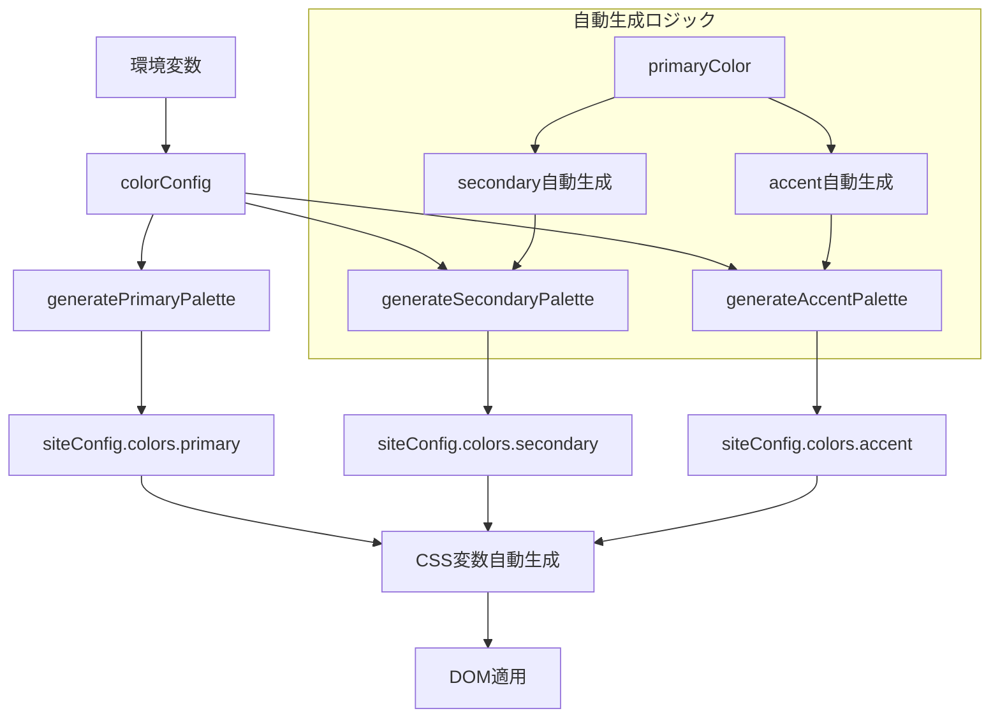

# カラーシステム統合実装計画書

## 概要

現在の2つの異なるカラー管理システムを統合し、`siteConfig.colors`をメインシステムとして使用する。

## 現在の問題点

### 重複するカラー管理システム
1. **CSS変数ベースシステム** (`initializeColorPalette`)
   - 個別のCSS変数を設定
   - `--color-primary`, `--color-accent`, `--color-accent-light` など

2. **siteConfigベースシステム** (`siteConfig.colors`)
   - 11段階のカラーパレット（50-950）
   - Tailwindの標準的な命名規則

## 統合後の仕様

### カラーパレット構成
- **primary**: 11段階（50-950） - 必須
- **secondary**: 11段階（50-950） - オプショナル（primaryから自動生成可能）
- **accent**: 4段階（200, 400, 600, 800） - オプショナル（primaryから自動生成可能）

### 環境変数設定
```bash
# 必須
VITE_COLOR_PRIMARY="#089781"

# オプショナル（未設定時は自動生成）
VITE_COLOR_SECONDARY="#e2f6f3"     # secondaryのベース色
VITE_COLOR_ACCENT="#30bca7"        # accentのベース色
VITE_COLOR_ACCENT_LIGHT="#64d8c6"  # accent-light
VITE_COLOR_ACCENT_SUPER_LIGHT="#bcecd3"  # accent-super-light
VITE_COLOR_ACCENT_DARK="#0f8472"   # accent-dark
```

## アーキテクチャ設計



## 実装手順

### 1. 型定義の更新

#### `src/types/siteConfig.ts`
```typescript
// 新規追加
export interface AccentPalette {
  light: string;      // accent-light
  default: string;    // accent
  superLight: string; // accent-super-light
  dark: string;       // accent-dark
}

// 既存のSiteConfigを更新
export interface SiteConfig {
  siteName: string;
  logoUrl: string;
  colors: {
    primary: ColorPalette;
    secondary: ColorPalette;
    accent: AccentPalette;  // 変更: ColorPalette → AccentPalette
  };
}

// CSS変数生成用の新しいインターフェース
export interface ColorSystemConfig {
  primary: string;
  secondary?: string;
  accent?: string;
  accentLight?: string;
  accentSuperLight?: string;
  accentDark?: string;
}
```

### 2. カラー生成関数の更新

#### `src/utils/colorUtils.ts`
```typescript
// 新規追加: secondaryカラーの動的生成
export function generateSecondaryPalette(baseColor?: string): ColorPalette {
  if (baseColor) {
    // カスタムsecondaryカラーから生成
    return generatePrimaryPalette(baseColor);
  }

  // デフォルトのグレースケール
  return getFixedSecondaryPalette();
}

// 新規追加: accentカラーの4段階生成
export function generateAccentPalette(config: {
  accent?: string;
  accentLight?: string;
  accentSuperLight?: string;
  accentDark?: string;
  primaryColor?: string;
}): AccentPalette {
  const { accent, accentLight, accentSuperLight, accentDark, primaryColor } = config;

  let accentBase: string;
  if (accent) {
    accentBase = accent;
  } else if (primaryColor) {
    // primaryから補色系のaccentを自動生成
    accentBase = generateComplementaryColor(primaryColor);
  } else {
    // デフォルトのaccent色
    accentBase = "#30bca7";
  }

  return {
    default: accent || accentBase,
    light: accentLight || chroma(accentBase).brighten(0.5).hex(),
    superLight: accentSuperLight || chroma(accentBase).brighten(1.2).hex(),
    dark: accentDark || chroma(accentBase).darken(0.8).hex(),
  };
}

// 新規追加: 補色生成
function generateComplementaryColor(baseColor: string): string {
  const hsl = chroma(baseColor).hsl();
  const complementaryHue = (hsl[0] + 180) % 360;
  return chroma.hsl(complementaryHue, hsl[1], hsl[2]).hex();
}
```

### 3. CSS変数自動生成システム

#### `src/utils/cssVariableManager.ts`
```typescript
// 新規追加: siteConfigからCSS変数を自動生成
export function generateCSSVariablesFromSiteConfig(colors: SiteConfig['colors']): Record<string, string> {
  const variables: Record<string, string> = {};

  // Primary (11段階)
  Object.entries(colors.primary).forEach(([key, value]) => {
    variables[`--color-primary-${key}`] = value;
  });

  // Secondary (11段階)
  Object.entries(colors.secondary).forEach(([key, value]) => {
    variables[`--color-secondary-${key}`] = value;
  });

  // Accent (4段階)
  variables['--color-accent'] = colors.accent.default;
  variables['--color-accent-light'] = colors.accent.light;
  variables['--color-accent-super-light'] = colors.accent.superLight;
  variables['--color-accent-dark'] = colors.accent.dark;

  return variables;
}

// 新規追加: siteConfigベースの初期化
export function initializeColorSystem(config: ColorSystemConfig): SiteConfig['colors'] {
  const colors = {
    primary: generatePrimaryPalette(config.primary),
    secondary: generateSecondaryPalette(config.secondary),
    accent: generateAccentPalette({
      accent: config.accent,
      accentLight: config.accentLight,
      accentSuperLight: config.accentSuperLight,
      accentDark: config.accentDark,
      primaryColor: config.primary,
    }),
  };

  // CSS変数を自動適用
  const cssVariables = generateCSSVariablesFromSiteConfig(colors);
  applyCSSVariables(cssVariables);

  return colors;
}
```

### 4. siteConfig.tsの統合

#### `src/config/siteConfig.ts`
```typescript
import type { SiteConfig } from "../types/siteConfig";
import { initializeColorSystem } from "../utils/cssVariableManager";

const DEFAULT_SITE_NAME = "いどばた政策";
const DEFAULT_LOGO_URL = "";
const DEFAULT_PRIMARY_COLOR = "#089781";

const colorConfig = {
  primary: import.meta.env.VITE_COLOR_PRIMARY || DEFAULT_PRIMARY_COLOR,
  secondary: import.meta.env.VITE_COLOR_SECONDARY,           // オプショナル
  accent: import.meta.env.VITE_COLOR_ACCENT,                 // オプショナル
  accentLight: import.meta.env.VITE_COLOR_ACCENT_LIGHT,      // オプショナル
  accentSuperLight: import.meta.env.VITE_COLOR_ACCENT_SUPER_LIGHT, // オプショナル
  accentDark: import.meta.env.VITE_COLOR_ACCENT_DARK,        // オプショナル
};

// 統合されたカラーシステムの初期化
const colors = initializeColorSystem(colorConfig);

export const siteConfig: SiteConfig = {
  siteName: import.meta.env.VITE_SITE_NAME || DEFAULT_SITE_NAME,
  logoUrl: import.meta.env.VITE_SITE_LOGO_URL || DEFAULT_LOGO_URL,
  colors,
};
```

### 5. 削除対象

#### 不要になるコード
- `initializeColorPalette` 関数の呼び出し
- `getFixedAccentPalette` 関数（accentが動的生成になるため）
- `generateCSSColorVariables` 関数（新しいシステムに置き換え）
- 古いCSS変数関連の環境変数
  - `VITE_COLOR_BG_SUB`
  - `VITE_COLOR_ACCENT_LIGHT`
  - `VITE_COLOR_ACCENT_SUPER_LIGHT`
  - `VITE_COLOR_ACCENT_DARK`

## CSS変数の命名規則

### 生成されるCSS変数
```css
/* Primary (11段階) */
--color-primary-50: #f0f9ff;
--color-primary-100: #e0f2fe;
--color-primary-200: #bae6fd;
--color-primary-300: #7dd3fc;
--color-primary-400: #38bdf8;
--color-primary-500: #0ea5e9;
--color-primary-600: #0284c7;
--color-primary-700: #0369a1;
--color-primary-800: #075985;
--color-primary-900: #0c4a6e;
--color-primary-950: #082f49;

/* Secondary (11段階) */
--color-secondary-50: #f9fafb;
--color-secondary-100: #f3f4f6;
/* ... */
--color-secondary-950: #030712;

/* Accent (4段階) */
--color-accent-200: #a7f3d0;
--color-accent-400: #34d399;
--color-accent-600: #059669;
--color-accent-800: #065f46;
```

### Tailwindでの使用例
```css
.btn-primary {
  @apply bg-primary-500 hover:bg-primary-600 text-white;
}

.btn-accent {
  @apply bg-accent-400 hover:bg-accent-600 text-white;
}

.text-secondary {
  @apply text-secondary-600;
}
```

## 移行手順

1. **型定義の更新** - `AccentPalette`インターフェースの追加
2. **カラー生成関数の実装** - 新しい生成ロジックの追加
3. **CSS変数システムの実装** - 自動生成システムの構築
4. **siteConfig.tsの更新** - 統合されたシステムへの移行
5. **不要コードの削除** - 古いシステムのクリーンアップ
6. **テストとバリデーション** - 動作確認

## 利点

1. **一元管理**: 単一のカラーシステムで管理
2. **柔軟性**: 必須はprimaryのみ、他はオプショナル
3. **Tailwind準拠**: 標準的な命名規則
4. **自動生成**: primaryから調和の取れた色を自動生成
5. **カスタマイズ性**: 環境変数で細かく設定可能

## 注意点

- 既存のCSS変数を使用している箇所は新しい命名規則に更新が必要
- Tailwindの設定ファイルも新しいCSS変数に対応させる必要がある
- 移行期間中は両システムが並行稼働する可能性がある
