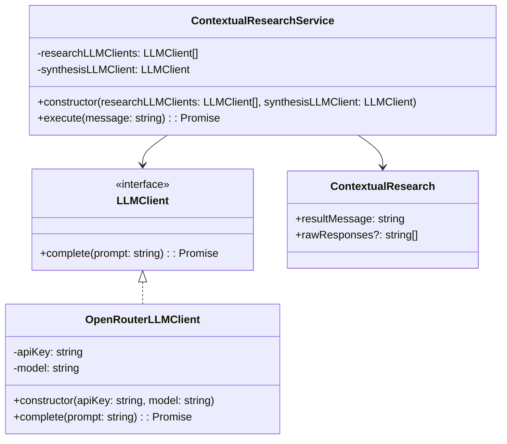

# Detailed Implementation Plan for ContextualResearchService

## 1. Architecture Overview



## 2. Component Specifications

### 2.1 LLMClient Interface

This interface defines the contract for all LLM clients:

```typescript
interface LLMClient {
  complete(prompt: string): Promise<string>;
}
```

### 2.2 OpenRouterLLMClient Implementation

This class implements the LLMClient interface using OpenRouter:

```typescript
class OpenRouterLLMClient implements LLMClient {
  constructor(
    private apiKey: string,
    private model: string = "google/gemini-2.5-pro-preview-03-25"
  ) {}

  async complete(prompt: string): Promise<string> {
    // Implementation using OpenRouter API
  }
}
```

### 2.3 ContextualResearch Class

This class represents the result of the contextual research:

```typescript
class ContextualResearch {
  constructor(
    public resultMessage: string,
    public rawResponses?: string[]
  ) {}
}
```

### 2.4 ContextualResearchService

This service coordinates the research process:

```typescript
class ContextualResearchService {
  constructor(
    private researchLLMClients: LLMClient[],
    private synthesisLLMClient: LLMClient
  ) {}

  async execute(message: string): Promise<ContextualResearch> {
    // Implementation details
  }
}
```

## 3. Implementation Details

### 3.1 LLMClient Interface

Create a new file `src/services/llm/LLMClient.ts`:

```typescript
export interface LLMClient {
  /**
   * Completes a prompt using an LLM
   * @param prompt The prompt to complete
   * @returns A promise that resolves to the completion text
   */
  complete(prompt: string): Promise<string>;
}
```

### 3.2 OpenRouterLLMClient Implementation

Create a new file `src/services/llm/OpenRouterLLMClient.ts`:

```typescript
import { LLMClient } from './LLMClient';
import OpenAI from 'openai';
import { logger } from '../../utils/logger';

export class OpenRouterLLMClient implements LLMClient {
  private openai: OpenAI;

  /**
   * Creates a new OpenRouterLLMClient
   * @param apiKey The OpenRouter API key
   * @param model The model to use (defaults to Gemini Pro)
   */
  constructor(
    private apiKey: string,
    private model: string = "google/gemini-2.5-pro-preview-03-25"
  ) {
    this.openai = new OpenAI({
      baseURL: "https://openrouter.ai/api/v1",
      apiKey: this.apiKey,
    });
  }

  /**
   * Completes a prompt using the configured model via OpenRouter
   * @param prompt The prompt to complete
   * @returns The completion text
   */
  async complete(prompt: string): Promise<string> {
    try {
      const response = await this.openai.chat.completions.create({
        model: this.model,
        messages: [{ role: "user", content: prompt }],
        max_tokens: 2000,
      });

      if (!response.choices || response.choices.length === 0) {
        throw new Error("No completion choices returned");
      }

      return response.choices[0].message.content || "";
    } catch (error) {
      logger.error(`Error completing prompt with OpenRouter: ${error}`);
      throw error;
    }
  }
}
```

### 3.3 ContextualResearch Class

Create a new file `src/services/research/ContextualResearch.ts`:

```typescript
/**
 * Represents the result of a contextual research operation
 */
export class ContextualResearch {
  /**
   * Creates a new ContextualResearch result
   * @param resultMessage The synthesized research result
   * @param rawResponses Optional array of raw responses from individual LLMs
   */
  constructor(
    public resultMessage: string,
    public rawResponses?: string[]
  ) {}
}
```

### 3.4 ContextualResearchService

Create a new file `src/services/research/ContextualResearchService.ts`:

```typescript
import { LLMClient } from '../llm/LLMClient';
import { ContextualResearch } from './ContextualResearch';
import { logger } from '../../utils/logger';

/**
 * Service for performing contextual research using multiple LLMs
 */
export class ContextualResearchService {
  /**
   * Creates a new ContextualResearchService
   * @param researchLLMClients Array of LLM clients to use for research
   * @param synthesisLLMClient LLM client to use for synthesizing results
   */
  constructor(
    private researchLLMClients: LLMClient[],
    private synthesisLLMClient: LLMClient
  ) {
    if (researchLLMClients.length === 0) {
      throw new Error("At least one research LLM client is required");
    }
  }

  /**
   * Executes contextual research on the provided message
   * @param message The message to research
   * @returns A promise that resolves to a ContextualResearch object
   */
  async execute(message: string): Promise<ContextualResearch> {
    try {
      logger.info(`Starting contextual research for message: ${message.substring(0, 50)}...`);

      // 1. Send the message to all research LLMs in parallel
      const researchPromises = this.researchLLMClients.map(client =>
        client.complete(`Please research and verify the following statement, providing evidence for or against it: "${message}"`)
      );

      const rawResponses = await Promise.all(researchPromises);

      logger.info(`Received ${rawResponses.length} research responses`);

      // 2. Synthesize the results using the synthesis LLM
      const synthesisPrompt = this.createSynthesisPrompt(message, rawResponses);
      const synthesizedResult = await this.synthesisLLMClient.complete(synthesisPrompt);

      logger.info(`Synthesized research results`);

      // 3. Return the final result
      return new ContextualResearch(synthesizedResult, rawResponses);
    } catch (error) {
      logger.error(`Error executing contextual research: ${error}`);
      throw error;
    }
  }

  /**
   * Creates a prompt for synthesizing research results
   * @param originalMessage The original message that was researched
   * @param researchResults Array of research results from different LLMs
   * @returns A synthesis prompt
   */
  private createSynthesisPrompt(originalMessage: string, researchResults: string[]): string {
    return `
I need you to synthesize multiple research results about the following statement:

"${originalMessage}"

Here are the research results from different sources:

${researchResults.map((result, index) => `Source ${index + 1}:\n${result}\n`).join('\n')}

Please analyze these research results and provide a comprehensive synthesis that:
1. Evaluates the factual accuracy of the original statement
2. Identifies areas of agreement and disagreement between sources
3. Provides a final assessment of the statement's validity
4. Cites specific evidence from the research results

Your synthesis should be well-structured, balanced, and focused on the evidence provided.
`;
  }
}
```

## 4. Unit Testing

Create a new file `src/services/research/ContextualResearchService.test.ts` for testing the service:

```typescript
import { ContextualResearchService } from './ContextualResearchService';
import { LLMClient } from '../llm/LLMClient';
import { ContextualResearch } from './ContextualResearch';

// Mock LLMClient implementation for testing
class MockLLMClient implements LLMClient {
  constructor(private response: string) {}

  async complete(_prompt: string): Promise<string> {
    return this.response;
  }
}

describe('ContextualResearchService', () => {
  it('should throw an error if no research LLM clients are provided', () => {
    const synthesisLLM = new MockLLMClient('synthesis result');

    expect(() => {
      new ContextualResearchService([], synthesisLLM);
    }).toThrow('At least one research LLM client is required');
  });

  it('should execute research and return synthesized results', async () => {
    // Arrange
    const researchLLM1 = new MockLLMClient('Research result 1');
    const researchLLM2 = new MockLLMClient('Research result 2');
    const synthesisLLM = new MockLLMClient('Synthesized research result');

    const service = new ContextualResearchService(
      [researchLLM1, researchLLM2],
      synthesisLLM
    );

    // Act
    const result = await service.execute('Test message');

    // Assert
    expect(result).toBeInstanceOf(ContextualResearch);
    expect(result.resultMessage).toBe('Synthesized research result');
    expect(result.rawResponses).toHaveLength(2);
    expect(result.rawResponses).toContain('Research result 1');
    expect(result.rawResponses).toContain('Research result 2');
  });
});
```

## 5. Manual Testing Script

Create a new file `src/scripts/testContextualResearch.ts` for manual testing:

```typescript
import { OpenRouterLLMClient } from '../services/llm/OpenRouterLLMClient';
import { ContextualResearchService } from '../services/research/ContextualResearchService';
import { OPENROUTER_API_KEY } from '../config';
import { logger } from '../utils/logger';

async function testContextualResearch() {
  if (!OPENROUTER_API_KEY) {
    logger.error('OPENROUTER_API_KEY is not set');
    process.exit(1);
  }

  // Create LLM clients with different models
  const researchLLM1 = new OpenRouterLLMClient(
    OPENROUTER_API_KEY,
    'google/gemini-2.5-pro-preview-03-25'
  );

  const researchLLM2 = new OpenRouterLLMClient(
    OPENROUTER_API_KEY,
    'anthropic/claude-3-5-sonnet-20240620'
  );

  const synthesisLLM = new OpenRouterLLMClient(
    OPENROUTER_API_KEY,
    'anthropic/claude-3-opus-20240229'
  );

  // Create the research service
  const researchService = new ContextualResearchService(
    [researchLLM1, researchLLM2],
    synthesisLLM
  );

  // Test statements to research
  const testStatements = [
    "The Earth is flat.",
    "Drinking lemon water every morning boosts your immune system.",
    "The Great Wall of China is visible from space with the naked eye."
  ];

  // Execute research for each test statement
  for (const statement of testStatements) {
    logger.info(`Researching: "${statement}"`);

    try {
      const result = await researchService.execute(statement);

      logger.info('Research complete!');
      logger.info('Synthesized result:');
      logger.info(result.resultMessage);

      logger.info('\nRaw responses:');
      result.rawResponses?.forEach((response, index) => {
        logger.info(`\nLLM ${index + 1} response:`);
        logger.info(response);
      });

      logger.info('\n-----------------------------------\n');
    } catch (error) {
      logger.error(`Error researching statement: ${error}`);
    }
  }
}

// Run the test
testContextualResearch().catch(error => {
  logger.error('Unhandled error:', error);
  process.exit(1);
});
```

## 6. Integration with Existing Codebase

### 6.1 Update Configuration

Update `src/config.ts` to include any new configuration values:

```typescript
// Add any new configuration values needed for the research service
export const RESEARCH_DEFAULT_MODEL = process.env.RESEARCH_DEFAULT_MODEL || "google/gemini-2.5-pro-preview-03-25";
export const SYNTHESIS_DEFAULT_MODEL = process.env.SYNTHESIS_DEFAULT_MODEL || "anthropic/claude-3-opus-20240229";
```

### 6.2 Factory for Creating LLM Clients

Create a new file `src/services/llm/LLMClientFactory.ts`:

```typescript
import { OpenRouterLLMClient } from './OpenRouterLLMClient';
import { LLMClient } from './LLMClient';
import { OPENROUTER_API_KEY, RESEARCH_DEFAULT_MODEL, SYNTHESIS_DEFAULT_MODEL } from '../../config';

/**
 * Factory for creating LLM clients
 */
export class LLMClientFactory {
  /**
   * Creates a research LLM client
   * @param model Optional model to use (defaults to config value)
   * @returns A new LLM client
   */
  static createResearchLLMClient(model?: string): LLMClient {
    if (!OPENROUTER_API_KEY) {
      throw new Error('OPENROUTER_API_KEY is not set');
    }

    return new OpenRouterLLMClient(
      OPENROUTER_API_KEY,
      model || RESEARCH_DEFAULT_MODEL
    );
  }

  /**
   * Creates a synthesis LLM client
   * @param model Optional model to use (defaults to config value)
   * @returns A new LLM client
   */
  static createSynthesisLLMClient(model?: string): LLMClient {
    if (!OPENROUTER_API_KEY) {
      throw new Error('OPENROUTER_API_KEY is not set');
    }

    return new OpenRouterLLMClient(
      OPENROUTER_API_KEY,
      model || SYNTHESIS_DEFAULT_MODEL
    );
  }

  /**
   * Creates multiple research LLM clients with different models
   * @param models Array of models to use
   * @returns Array of LLM clients
   */
  static createMultipleResearchLLMClients(models: string[]): LLMClient[] {
    return models.map(model => this.createResearchLLMClient(model));
  }
}
```

## 7. Future Endpoint Integration

While endpoint integration is not needed at this stage, here's a sketch of how it could be implemented in the future:

```typescript
// In a future controller file (e.g., researchController.ts)
import { Request, Response } from 'express';
import { ContextualResearchService } from '../services/research/ContextualResearchService';
import { LLMClientFactory } from '../services/llm/LLMClientFactory';

export const researchController = {
  /**
   * Performs contextual research on a message
   */
  async researchMessage(req: Request, res: Response): Promise<void> {
    try {
      const { message } = req.body;

      if (!message || typeof message !== 'string') {
        res.status(400).json({ error: 'Message is required and must be a string' });
        return;
      }

      // Create LLM clients
      const researchLLMs = LLMClientFactory.createMultipleResearchLLMClients([
        'google/gemini-2.5-pro-preview-03-25',
        'anthropic/claude-3-5-sonnet-20240620'
      ]);

      const synthesisLLM = LLMClientFactory.createSynthesisLLMClient();

      // Create research service
      const researchService = new ContextualResearchService(
        researchLLMs,
        synthesisLLM
      );

      // Execute research
      const result = await researchService.execute(message);

      // Return result
      res.json({
        result: result.resultMessage,
        rawResponses: result.rawResponses
      });
    } catch (error) {
      res.status(500).json({
        error: 'Failed to perform research',
        details: error instanceof Error ? error.message : 'Unknown error'
      });
    }
  }
};
```

## 8. Project Structure

After implementing all the components, your project structure will look like this:

```
policy-edit/backend/
├── src/
│   ├── services/
│   │   ├── llm/
│   │   │   ├── LLMClient.ts
│   │   │   ├── OpenRouterLLMClient.ts
│   │   │   └── LLMClientFactory.ts
│   │   └── research/
│   │       ├── ContextualResearch.ts
│   │       ├── ContextualResearchService.ts
│   │       └── ContextualResearchService.test.ts
│   ├── scripts/
│   │   └── testContextualResearch.ts
│   └── config.ts (updated)
```

## 9. Implementation Timeline

1. **Day 1**: Create the LLMClient interface and OpenRouterLLMClient implementation
2. **Day 2**: Implement the ContextualResearchService and ContextualResearch class
3. **Day 3**: Write unit tests and the manual testing script
4. **Day 4**: Integration testing and documentation

## 10. Testing Strategy

1. **Unit Tests**: Test each component in isolation using mock implementations
2. **Integration Tests**: Test the complete flow with real LLM clients
3. **Manual Testing**: Use the test script to verify the service with real-world examples
