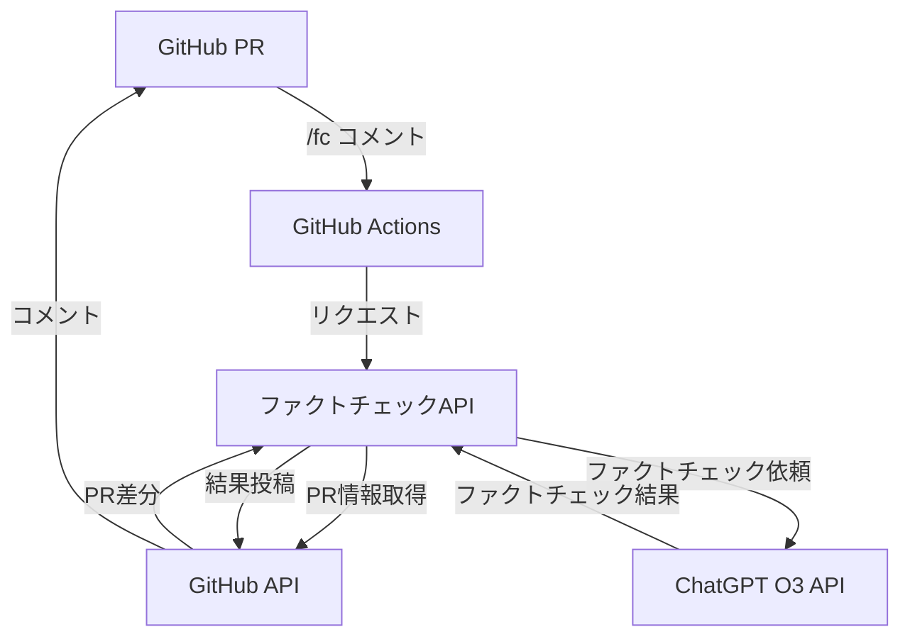
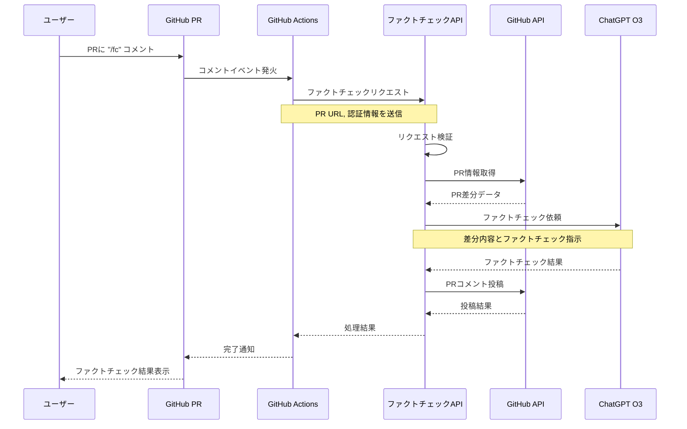

# GitHub PR ファクトチェック機能 実装計画

## 1. 機能概要

GitHub Actionsを経由して呼び出される、政策変更提案（PR）に対するファクトチェック機能を実装します。PRに `/fc` とコメントするだけで、その変更提案に対するファクトチェックが自動的に実行され、結果がPRコメントとして投稿されます。

### 主な機能要件

- PRリンクを受け取り、その内容（差分）を取得する
- 取得した差分をChatGPT O3（インターネット利用可能モード）に送信してファクトチェックを実行
- ファクトチェック結果をマークダウン形式でPRにコメントとして投稿
- 不正利用防止のための認証機能
- ユーザーフレンドリーなエラーメッセージ

## 2. システム構成



## 3. 処理フロー詳細



## 4. API設計

### エンドポイント

```
POST /api/factcheck
```

### リクエストパラメータ

```json
{
  "prUrl": "https://github.com/owner/repo/pull/123",
  "credential": "xxxx-xxxx-xxxx-xxxx"
}
```

### レスポンス

成功時:
```json
{
  "success": true,
  "commentUrl": "https://github.com/owner/repo/pull/123#issuecomment-123456789"
}
```

エラー時:
```json
{
  "success": false,
  "error": {
    "code": "INVALID_PR_URL",
    "message": "PRのURLが正しくありません。'https://github.com/owner/repo/pull/数字' の形式で指定してください。"
  }
}
```

## 5. 実装コンポーネント（ユースケースパターン）

### 1. ファクトチェックルート

```typescript
// src/routes/factcheck.ts
import express from "express";
import { FactCheckUseCase } from "../services/factcheck/FactCheckUseCase.js";
import { createFactCheckUseCase } from "../services/factcheck/factcheckFactory.js";
import { logger } from "../utils/logger.js";

const router = express.Router();

// POST /api/factcheck - ファクトチェックリクエスト処理
router.post("/", async (req, res) => {
  try {
    const { prUrl, credential } = req.body;

    if (!prUrl || typeof prUrl !== "string") {
      return res
        .status(400)
        .json({
          success: false,
          error: {
            code: "INVALID_PR_URL",
            message: "PRのURLが正しくありません。'https://github.com/owner/repo/pull/数字' の形式で指定してください。"
          }
        });
    }

    if (!credential || typeof credential !== "string") {
      return res
        .status(400)
        .json({
          success: false,
          error: {
            code: "INVALID_CREDENTIAL",
            message: "認証情報が正しくありません。"
          }
        });
    }

    // ユースケースの作成と実行
    const factCheckUseCase = createFactCheckUseCase();
    const result = await factCheckUseCase.execute({ prUrl, credential });

    return res.json(result);
  } catch (error) {
    logger.error("Error processing factcheck request:", error);
    return res.status(500).json({
      success: false,
      error: {
        code: "INTERNAL_SERVER_ERROR",
        message: "ファクトチェック処理中にエラーが発生しました。"
      }
    });
  }
});

export default router;
```

### 2. ファクトチェックユースケース

```typescript
// src/services/factcheck/FactCheckUseCase.ts
import { Octokit } from "@octokit/rest";
import OpenAI from "openai";
import { logger } from "../../utils/logger.js";
import { formatFactCheckResult } from "./resultFormatter.js";

export class FactCheckUseCase {
  constructor(
    private readonly octokit: Octokit,
    private readonly openaiClient: OpenAI,
    private readonly validCredential: string,
    private readonly logger: typeof logger
  ) {}

  // 唯一のpublicメソッド
  public async execute(params: FactCheckParams): Promise<FactCheckResult | FactCheckErrorResult> {
    try {
      // 1. 認証
      await this.validateCredential(params.credential);

      // 2. PRリンクの検証
      const prInfo = this.validateAndParsePrUrl(params.prUrl);

      // 3. PR差分の取得
      const prDiff = await this.fetchPrDiff(prInfo);

      // 4. ファクトチェックの実行
      const factCheckResult = await this.performFactCheck(prDiff);

      // 5. 結果のコメント投稿
      const commentUrl = await this.postComment(prInfo, factCheckResult);

      return {
        success: true,
        commentUrl
      };
    } catch (error) {
      return this.handleError(error);
    }
  }

  // 以下privateメソッド
  private async validateCredential(credential: string): Promise<void> {
    if (credential !== this.validCredential) {
      throw new FactCheckError("AUTHENTICATION_FAILED", "認証に失敗しました。有効な認証情報を指定してください。");
    }
  }

  private validateAndParsePrUrl(prUrl: string): PrInfo {
    // PRリンクの検証と解析
    const prRegex = /^https:\/\/github\.com\/([^\/]+)\/([^\/]+)\/pull\/(\d+)$/;
    const match = prUrl.match(prRegex);

    if (!match) {
      throw new FactCheckError(
        "INVALID_PR_URL",
        "PRのURLが正しくありません。'https://github.com/owner/repo/pull/数字' の形式で指定してください。"
      );
    }

    return {
      owner: match[1],
      repo: match[2],
      prNumber: parseInt(match[3], 10)
    };
  }

  private async fetchPrDiff(prInfo: PrInfo): Promise<PrDiff> {
    try {
      // PR情報の取得
      const { data: pr } = await this.octokit.rest.pulls.get({
        owner: prInfo.owner,
        repo: prInfo.repo,
        pull_number: prInfo.prNumber
      });

      // PR差分の取得
      const { data: diff } = await this.octokit.rest.pulls.get({
        owner: prInfo.owner,
        repo: prInfo.repo,
        pull_number: prInfo.prNumber,
        mediaType: {
          format: "diff"
        }
      });

      return {
        title: pr.title,
        description: pr.body || "",
        changes: diff
      };
    } catch (error) {
      if (error.status === 404) {
        throw new FactCheckError(
          "PR_NOT_FOUND",
          "指定されたPRが見つかりませんでした。PRが存在するか、アクセス権があるか確認してください。"
        );
      }
      throw error;
    }
  }

  private async performFactCheck(prDiff: PrDiff): Promise<FactCheckAnalysis> {
    try {
      const response = await this.openaiClient.chat.completions.create({
        model: "gpt-4o",
        messages: [
          {
            role: "system",
            content: `あなたは政策文書のファクトチェックを行う専門家です。以下の政策変更提案（PR）の差分を分析し、事実と異なる記述や誤解を招く表現を特定してください。
            インターネット検索を活用して、最新の情報や統計データと照らし合わせて検証を行ってください。
            結果は以下の形式で返してください：

            1. 概要：主な問題点の要約
            2. 詳細分析：各問題点について、元の記述、事実確認結果、正しい情報、参考情報源を明記
            3. 結論：全体的な評価

            マークダウン形式で返答し、事実と異なる箇所を明確にハイライトしてください。`
          },
          {
            role: "user",
            content: `以下のPR差分をファクトチェックしてください：

            タイトル: ${prDiff.title}

            説明:
            ${prDiff.description}

            変更内容:
            \`\`\`diff
            ${prDiff.changes}
            \`\`\``
          }
        ],
        temperature: 0.7,
        max_tokens: 4000,
        tools: [
          {
            type: "web_search",
            web_search: {}
          }
        ],
        tool_choice: "auto"
      });

      const content = response.choices[0]?.message?.content;
      if (!content) {
        throw new FactCheckError(
          "LLM_API_ERROR",
          "ファクトチェック結果の取得に失敗しました。"
        );
      }

      return this.parseFactCheckResponse(content);
    } catch (error) {
      this.logger.error("Error performing fact check:", error);
      throw new FactCheckError(
        "LLM_API_ERROR",
        "ファクトチェック処理中にエラーが発生しました。しばらく経ってから再試行してください。"
      );
    }
  }

  private parseFactCheckResponse(content: string): FactCheckAnalysis {
    // LLMの応答を解析して構造化データに変換
    // 実際の実装では、正規表現やマークダウンパーサーを使用して
    // 応答を解析することになります

    return {
      summary: "解析された概要",
      details: [],
      conclusion: "解析された結論"
    };
  }

  private async postComment(prInfo: PrInfo, result: FactCheckAnalysis): Promise<string> {
    try {
      // マークダウン形式でコメントを整形
      const commentBody = formatFactCheckResult(result);

      // PRにコメントを投稿
      const { data: comment } = await this.octokit.rest.issues.createComment({
        owner: prInfo.owner,
        repo: prInfo.repo,
        issue_number: prInfo.prNumber,
        body: commentBody
      });

      return comment.html_url;
    } catch (error) {
      this.logger.error("Error posting comment:", error);
      throw new FactCheckError(
        "COMMENT_FAILED",
        "ファクトチェック結果の投稿に失敗しました。GitHubの権限設定を確認してください。"
      );
    }
  }

  private handleError(error: any): FactCheckErrorResult {
    if (error instanceof FactCheckError) {
      return {
        success: false,
        error: {
          code: error.code,
          message: error.message
        }
      };
    }

    this.logger.error("Unexpected error in FactCheckUseCase:", error);
    return {
      success: false,
      error: {
        code: "INTERNAL_SERVER_ERROR",
        message: "予期しないエラーが発生しました。"
      }
    };
  }
}

// カスタムエラークラス
class FactCheckError extends Error {
  constructor(public code: string, message: string) {
    super(message);
    this.name = "FactCheckError";
  }
}
```

### 3. ファクトチェックファクトリー

```typescript
// src/services/factcheck/factcheckFactory.ts
import { Octokit } from "@octokit/rest";
import OpenAI from "openai";
import config from "../../config.js";
import { getAuthenticatedOctokit } from "../../mcp/github/client.js";
import { logger } from "../../utils/logger.js";
import { FactCheckUseCase } from "./FactCheckUseCase.js";

export function createFactCheckUseCase(): FactCheckUseCase {
  const octokit = getAuthenticatedOctokit();

  const openaiClient = new OpenAI({
    baseURL: "https://openrouter.ai/api/v1",
    apiKey: config.OPENROUTER_API_KEY,
  });

  const validCredential = config.FACTCHECK_CREDENTIAL;

  return new FactCheckUseCase(
    octokit,
    openaiClient,
    validCredential,
    logger
  );
}
```

### 4. 結果フォーマッター

```typescript
// src/services/factcheck/resultFormatter.ts
export function formatFactCheckResult(analysis: FactCheckAnalysis): string {
  const timestamp = new Date().toLocaleString("ja-JP", {
    timeZone: "Asia/Tokyo",
    year: "numeric",
    month: "numeric",
    day: "numeric",
    hour: "numeric",
    minute: "numeric"
  });

  let markdown = `# 🔍 ファクトチェック結果\n\n`;
  markdown += `**実施日時**: ${timestamp} JST\n\n`;

  markdown += `## 📋 概要\n\n${analysis.summary}\n\n`;

  markdown += `## 📊 詳細分析\n\n`;

  analysis.details.forEach((detail, index) => {
    markdown += `### ${index + 1}. ${detail.topic}\n\n`;
    markdown += `> ${detail.claim}\n\n`;
    markdown += `**✓ 事実確認**: ${detail.isFactual ? "正確です" : "**不正確** です"}。${detail.correction}\n\n`;

    if (detail.sources && detail.sources.length > 0) {
      markdown += `**参考**:\n`;
      detail.sources.forEach(source => {
        markdown += `- [${source.title}](${source.url})\n`;
      });
      markdown += `\n`;
    }
  });

  markdown += `## 🏁 結論\n\n${analysis.conclusion}\n`;

  return markdown;
}
```

### 5. MCP Tool登録

```typescript
// src/mcp/factcheckTool.ts
import { z } from "zod";
import { McpServer } from "@modelcontextprotocol/sdk/server/mcp.js";
import { createFactCheckUseCase } from "../services/factcheck/factcheckFactory.js";
import logger from "../logger.js";

export const factcheckSchema = z.object({
  prUrl: z.string().url(),
  credential: z.string()
});

export function registerFactCheckTool(server: McpServer): void {
  server.tool(
    "factcheck",
    factcheckSchema.shape,
    async (params) => {
      try {
        logger.info("Handling factcheck request for PR:", params.prUrl);

        const factCheckUseCase = createFactCheckUseCase();
        const result = await factCheckUseCase.execute(params);

        if (result.success) {
          return {
            content: [
              {
                type: "text",
                text: `ファクトチェックが完了しました。結果はこちらで確認できます: ${result.commentUrl}`
              }
            ]
          };
        } else {
          return {
            isError: true,
            content: [
              {
                type: "text",
                text: `ファクトチェックに失敗しました: ${result.error.message}`
              }
            ]
          };
        }
      } catch (error) {
        logger.error("Error in factcheck tool:", error);
        return {
          isError: true,
          content: [
            {
              type: "text",
              text: `ファクトチェック処理中にエラーが発生しました: ${error.message || "不明なエラー"}`
            }
          ]
        };
      }
    }
  );

  logger.info("Factcheck tool registered");
}
```

### 6. 型定義

```typescript
// src/services/factcheck/types.ts
export type PrInfo = {
  owner: string;
  repo: string;
  prNumber: number;
};

export type PrDiff = {
  title: string;
  description: string;
  changes: string;
};

export type FactCheckAnalysis = {
  summary: string;
  details: FactCheckDetail[];
  conclusion: string;
};

export type FactCheckDetail = {
  topic: string;
  claim: string;
  isFactual: boolean;
  correction: string;
  sources?: {
    title: string;
    url: string;
  }[];
};

export type FactCheckParams = {
  prUrl: string;
  credential: string;
};

export type FactCheckResult = {
  success: true;
  commentUrl: string;
};

export type FactCheckErrorResult = {
  success: false;
  error: {
    code: string;
    message: string;
  };
};
```

### 7. index.ts への追加

```typescript
// src/index.ts の修正部分
import factcheckRoutes from "./routes/factcheck.js";
import { registerFactCheckTool } from "./mcp/factcheckTool.js";

// 既存のコード...

// Routes
app.use("/chat", chatRoutes);
app.use("/factcheck", factcheckRoutes); // 追加

// 既存のコード...

// MCPサーバーへの接続後にファクトチェックツールを登録
// 適切な場所に以下のコードを追加
registerFactCheckTool(server);
```

### 8. config.ts への追加

```typescript
// src/config.ts への追加
export const FACTCHECK_CREDENTIAL = process.env.FACTCHECK_CREDENTIAL;

// 環境変数のバリデーションに追加
if (!FACTCHECK_CREDENTIAL) {
  console.warn(
    "FACTCHECK_CREDENTIAL is not set. The factcheck feature will not function properly."
  );
}
```

## 6. エラーハンドリング設計

ユーザーフレンドリーなエラーメッセージを提供するため、以下のエラーケースを考慮します：

| エラーケース | エラーコード | エラーメッセージ | 対処方法 |
|------------|------------|--------------|---------|
| 無効なPR URL | INVALID_PR_URL | PRのURLが正しくありません。'https://github.com/owner/repo/pull/数字' の形式で指定してください。 | 正しい形式のURLを指定してください。 |
| PR取得失敗 | PR_NOT_FOUND | 指定されたPRが見つかりませんでした。PRが存在するか、アクセス権があるか確認してください。 | PRの存在とアクセス権を確認してください。 |
| 認証失敗 | AUTHENTICATION_FAILED | 認証に失敗しました。有効な認証情報を指定してください。 | GitHub Secretsに正しい認証情報が設定されているか確認してください。 |
| LLM API失敗 | LLM_API_ERROR | ファクトチェック処理中にエラーが発生しました。しばらく経ってから再試行してください。 | しばらく待ってから再度コマンドを実行してください。 |
| コメント投稿失敗 | COMMENT_FAILED | ファクトチェック結果の投稿に失敗しました。GitHubの権限設定を確認してください。 | GitHub Appの権限設定を確認してください。 |

## 7. ファクトチェック結果フォーマット

マークダウン形式で、以下の要素を含めます：

1. ヘッダー（ファクトチェック実施日時、対象PR情報）
2. 概要（主な問題点のサマリー）
3. 詳細分析（差分の各部分に対する事実確認）
   - 事実と異なる箇所を明確にハイライト
   - 正しい情報の提示
   - 参考リンク/ソースの提供
4. 結論

例：
```markdown
# 🔍 ファクトチェック結果

**実施日時**: 2025年5月19日 12:45 JST
**対象PR**: [#123 政策Aの改定案](https://github.com/owner/repo/pull/123)

## 📋 概要

このPRには **3箇所の事実誤認** が含まれています。主な問題点は統計データの解釈と法的枠組みの記述に関するものです。

## 📊 詳細分析

### 1. 統計データについて

> 「2024年の調査では、この政策に対する国民の支持率は85%に達している」

**✓ 事実確認**: この統計は **不正確** です。2024年の内閣府調査によると、実際の支持率は67%です。

**参考**: [内閣府世論調査結果 2024年版](https://example.gov/survey2024)

### 2. 法的枠組みについて

...（以下省略）...
```

## 8. セキュリティ対策

1. **認証機能**:
   - GitHub Secretsに保存された認証情報を使用
   - 固定のAPIキーによる認証
   - リクエスト元のIPアドレス検証（オプション）

2. **レート制限**:
   - 同一PRに対するファクトチェック頻度の制限
   - 短時間での大量リクエスト防止

3. **データ検証**:
   - 入力値の厳格な検証
   - PRサイズ制限（大きすぎるPRの処理拒否）

## 9. 実装手順

1. 必要なパッケージのインストール
2. 型定義の作成
3. 結果フォーマッターの実装
4. ファクトチェックユースケースの実装
5. ファクトチェックルートの実装
6. MCPツール登録
7. 設定の追加
8. テスト
9. ドキュメント作成

## 10. 必要なパッケージ

- `@octokit/rest` - GitHub API操作
- `openai` - ChatGPT API操作
- `zod` - 入力検証
- その他既存のパッケージ（Express, MCP SDKなど）

## 11. ディレクトリ構造

```
policy-edit/backend/src/
├── config.ts (既存ファイル、設定を追加)
├── index.ts (既存ファイル、ルートとツール登録を追加)
├── routes/
│   ├── chat.ts (既存ファイル)
│   └── factcheck.ts (新規ファイル)
├── services/
│   └── factcheck/
│       ├── FactCheckUseCase.ts
│       ├── factcheckFactory.ts
│       ├── resultFormatter.ts
│       └── types.ts
├── mcp/
│   ├── client.ts (既存ファイル)
│   └── factcheckTool.ts (新規ファイル)
└── utils/
    └── logger.ts (既存ファイル)
```

この実装計画は、既存のbackend構成に則りつつ、必要に応じてディレクトリを追加する形で設計されています。ユースケースパターンを採用し、依存性注入を使用してコンポーネント間の結合度を低減しています。これにより、コードの保守性とテスト容易性が向上します。
